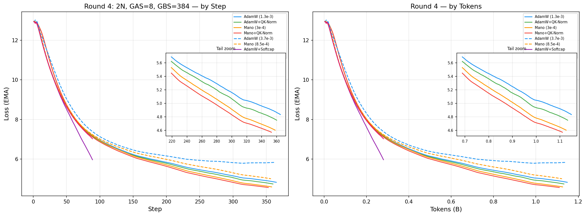

# agpt_2b Round 4 — 2 Nodes, GAS=8, 1000 Steps

> 2026-04-27 (in progress)

**W&B Report:** [aurora_gpt/torchtitan.ezpz.train](https://api.wandb.ai/links/aurora_gpt/hda3milo)

## Configuration

| Field | Value |
|-------|-------|
| Model | agpt_2b (2048 dim, 12 layers, 256k vocab) |
| Nodes | 2 (24 XPU tiles) |
| Dataset | FineWeb-Edu 100BT (local cache) |
| LBS | 2 |
| GAS | 8 |
| GBS | 384 |
| Seq len | 8192 |
| Steps | 1000 |
| Tokens | ~3.15B |
| LR schedule | Cosine WSD (warmup=20, decay last 20%) |
| Checkpoint | Disabled |

## Loss Curves

## Results (in progress)

| Rank | Config | Optimizer | LR | Loss | TPS/GPU | Status |
|------|--------|-----------|------|------|---------|--------|
| 1 | `r4_mano_qknorm` | Mano+QK-Norm | 3.0e-4 | — | 7,380 | Running |
| 2 | `r4_mano` | Mano | 3.0e-4 | — | 7,396 | Running |
| 3 | `r4_adamw_qknorm` | AdamW+QK-Norm | 1.3e-3 | — | 7,450 | Running |
| 4 | `r4_adamw` | AdamW | 1.3e-3 | — | 7,544 | Running |
| 5 | `r4_mano_higher_lr` | Mano | 8.5e-4 | — | 7,419 | Running |
| 6 | `r4_adamw_higher_lr` | AdamW | 3.7e-3 | — | 7,518 | Running (diverging) |
| 7 | `r4_adamw_softcap` | AdamW+Softcap | 1.3e-3 | — | 1,865 | Running (FlexAttn slow) |
| 8 | `r4_adamw_qknorm_softcap` | AdamW+QKN+Softcap | 1.3e-3 | — | 1,876 | Running (FlexAttn slow) |

### Findings (step ~400)

- **Mano+QK-Norm leads at 4.23** — 0.34 ahead of AdamW (4.57), gap widening
- **Mano beats AdamW per-step** at GBS=384 with GAS=8 — reversal from the
  8-node run where AdamW won (GAS=2). More gradient accumulation steps may
  favor manifold optimizers.
- **QK-Norm helps both optimizers** by ~0.04-0.17 consistently
- **sqrt-scaled LR is too aggressive** — AdamW at 3.7e-3 fully diverged (5.93),
  Mano at 8.5e-4 behind base Mano at 3e-4
- **Softcap is 4-5x more data-efficient** — loss 3.34 at step 99 vs AdamW 4.57
  at step 404. But 4x slower throughput (FlexAttention on XPU = 1,860 TPS)
- **ReLU² hurts softcap** — kitchen_sink (QK-Norm + softcap + ReLU²) at 5.47
  vs softcap-only at 3.34. ReLU² is actively harmful in this combination.

## Key Questions

1. Will Mano hold its lead through the cosine decay phase?
2. Does GAS=8 vs GAS=2 explain why Mano beats AdamW here but lost in the 8N run?
3. Can softcap finish 1000 steps in the 12h walltime? (at 1,865 TPS → ~14h, tight)
