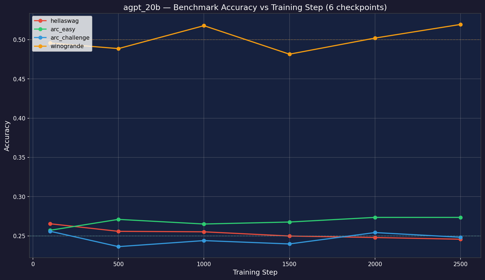

# Evaluation Results — agpt 20B

> **Living document** — updated as new eval results come in.
>
> Last updated: 2026-04-27

## Setup

| Field | Value |
|-------|-------|
| Model | agpt_20b (20.7B params) |
| Tokenizer | google/gemma-7b (vocab_size=256128) |
| Training data | olmo-mix-1124 (4.67T tokens) |
| Training config | 256N, GBS=3072, SophiaG LR=2.28e-5 |
| Eval tasks | hellaswag, arc_easy, arc_challenge, winogrande |
| Eval backend | lm-eval 0.4.10, HF backend, XPU, dtype=bfloat16 |
| Checkpoints | DCP → HF safetensors via `eval/convert_to_hf.py` |

## Benchmark Accuracy vs Training Step

## Results

| Step | Tokens | Loss | HellaSwag | ARC-Easy | ARC-Chall | Winogrande |
|------|--------|------|-----------|----------|-----------|------------|
| 100 | 2.5B | 11.84 | 26.50 | 25.71 | 25.60 | 49.57 |
| 500 | 13B | 7.35 | 25.62 | 27.12 | 23.55 | 48.86 |
| 1,000 | 25B | 5.73 | 25.49 | 26.47 | 24.40 | 51.78 |
| 1,500 | 38B | 5.25 | 25.05 | 26.81 | 23.98 | 48.07 |
| 2,000 | 50B | 5.03 | 24.80 | 27.40 | 25.43 | 50.20 |
| 2,500 | 63B | 4.85 | 24.62 | 27.36 | 24.83 | 51.93 |
| 3,000+ | — | 4.59 | *pending continuation* | | | |

**Notes:**
- All HF checkpoints converted (6 total)
- Eval job submitted (8452582), results incoming
- 20B model trains at ~2 steps/min on 256N — fewer checkpoints but each
  represents more effective compute than the 2B equivalents
- Tokens = step × GBS(3072) × seq_len(8192)
