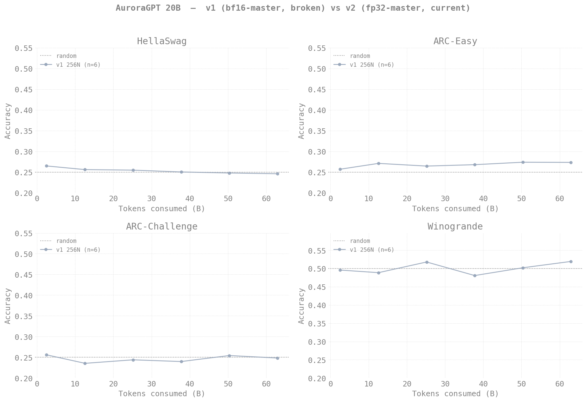

# Evaluation Results — agpt 20B

> **Living document** — updated as new eval results come in.
>
> Last updated: 2026-05-03
>
> **Note:** the eval results below are from the bf16-tainted 20B 256N
> SophiaG run (steps 100-2,500), where RMSNorm.weight was frozen at 1.0
> due to sub-ULP master-weight updates (see
> [`docs/guides/training-dtype-bf16-norm-freeze.md`](../../../guides/training-dtype-bf16-norm-freeze.md)).
> All scores hover near random — this is consistent with the model
> having no trainable normalization. The fp32-master v2 run
> (`agpt-20b-v2`, 512N, step 148+ at writing) is the one that should
> show real benchmark progression, but it's still too early in
> training to meaningfully eval.

## Setup

| Field | Value |
|-------|-------|
| Model | agpt_20b (20.7B params) |
| Tokenizer | google/gemma-7b (vocab_size=256128) |
| Training data | olmo-mix-1124 (4.67T tokens) |
| Training config | 256N, GBS=3072, SophiaG LR=2.28e-5 |
| Eval tasks | hellaswag, arc_easy, arc_challenge, winogrande |
| Eval backend | lm-eval 0.4.10, HF backend, XPU, dtype=bfloat16 |
| Checkpoints | DCP → HF safetensors via `eval/convert_to_hf.py` |

## v1 vs v2 — benchmark accuracy

The v1 (bf16-master) and v2 (fp32-master) 20B runs share the same
architecture, optimizer, and dataset; the only difference is the
master-weight dtype. v1 hovers within ~1pp of the random baseline on
every task (frozen RMSNorm), while v2 — once it has enough tokens
under its belt — should descend visibly. Re-render with new v2
ckpts as they become available:

```bash
python3 torchtitan/experiments/ezpz/docs/evals/agpt/20b/plot_v1_vs_v2.py
```



<details>
<summary><strong>v1 detailed results (bf16-tainted, kept for record) — click to expand</strong></summary>

### Benchmark Accuracy vs Training Step (v1)


### Results (v1)

| Step | Tokens | Loss | HellaSwag | ARC-Easy | ARC-Chall | Winogrande |
|------|--------|------|-----------|----------|-----------|------------|
| 100 | 2.5B | 11.84 | 26.50 | 25.71 | 25.60 | 49.57 |
| 500 | 13B | 7.35 | 25.62 | 27.12 | 23.55 | 48.86 |
| 1,000 | 25B | 5.73 | 25.49 | 26.47 | 24.40 | 51.78 |
| 1,500 | 38B | 5.25 | 25.05 | 26.81 | 23.98 | 48.07 |
| 2,000 | 50B | 5.03 | 24.80 | 27.40 | 25.43 | 50.20 |
| 2,500 | 63B | 4.85 | 24.62 | 27.36 | 24.83 | 51.93 |
| 3,000+ | — | 4.59 | *pending continuation* | | | |

**Notes:**
- All HF checkpoints converted (6 total)
- Eval job submitted (8452582), results incoming
- 20B model trains at ~2 steps/min on 256N — fewer checkpoints but each
  represents more effective compute than the 2B equivalents
- Tokens = step × GBS(3072) × seq_len(8192)

</details>
