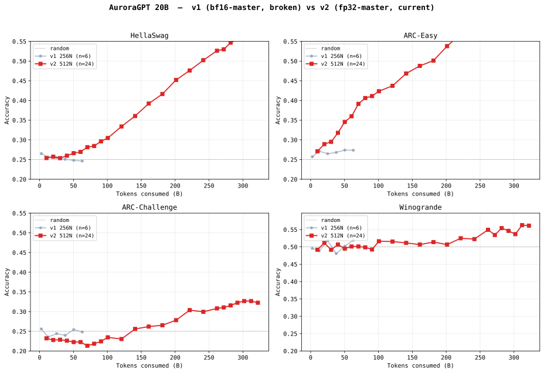
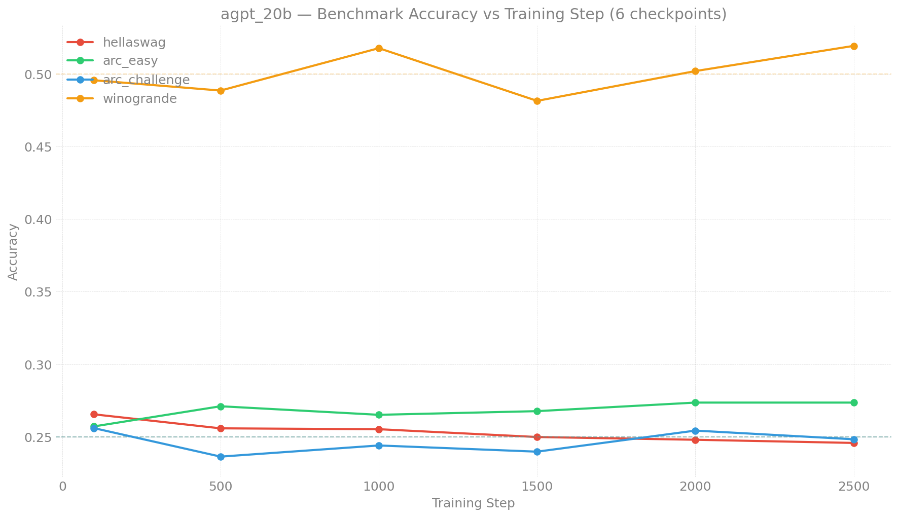

# Evaluation Results — agpt 20B

> **Living document** — updated as new eval results come in.
>
> Last updated: 2026-05-22
>
> **Training curves:** see [`docs/production/agpt/20b/`](../../../production/agpt/20b/README.md)
> for loss / throughput / MFU dashboards (v1 256N + v2 512N).
>
> **Note:** the historical v1 results below are from the bf16-tainted
> 20B 256N SophiaG run (steps 100-2,500), where RMSNorm.weight was
> frozen at 1.0 due to sub-ULP master-weight updates (see
> [`docs/guides/training-dtype-bf16-norm-freeze.md`](../../../guides/training-dtype-bf16-norm-freeze.md)).
> All scores hover near random — this is consistent with the model
> having no trainable normalization. The fp32-master v2 run
> (`agpt-20b-v2`, 512N, currently at step 863) is now showing clear
> benchmark progression: ARC-Easy `acc` lifted from 0.266 (step 100)
> to **0.444** (step 800, 80B tokens) — a clean monotonic ascent
> well above v1's flat ~0.27 baseline. HellaSwag is also breaking
> out (`acc_norm` 0.254 → 0.284, +3pp above v1). ARC-Challenge and
> Winogrande still in noise at this token count.

## Setup

| Field | Value |
|-------|-------|
| Model | agpt_20b (20.7B params) |
| Tokenizer | google/gemma-7b (vocab_size=256128) |
| Training data | olmo-mix-1124 (4.67T tokens) |
| Training config | 256N, GBS=3072, SophiaG LR=2.28e-5 |
| Eval tasks | hellaswag, arc_easy, arc_challenge, winogrande |
| Eval backend | lm-eval 0.4.10, HF backend, XPU, dtype=bfloat16 |
| Checkpoints | DCP → HF safetensors via `eval/convert_to_hf.py` |

## v1 vs v2 — benchmark accuracy

The v1 (bf16-master) and v2 (fp32-master) 20B runs share the same
architecture, optimizer, and dataset; the only difference is the
master-weight dtype. v1 hovers within ~1pp of the random baseline on
every task (frozen RMSNorm), while v2 — once it has enough tokens
under its belt — should descend visibly. Re-render with new v2
ckpts as they become available:

```bash
python3 torchtitan/experiments/ezpz/docs/evals/agpt/20b/plot_v1_vs_v2.py
```



### v1 vs v2 — by training step

| Run | Step | Tokens (B) | HellaSwag | ARC-Easy | ARC-Chall | Winogrande |
|-----|-----:|-----------:|----------:|---------:|----------:|-----------:|
| v1 256N | 100 |   2.5 | 0.2650 | 0.2571 | 0.2560 | 0.4957 |
| v1 256N | 500 |  12.6 | 0.2562 | 0.2712 | 0.2355 | 0.4886 |
| v1 256N | 1,000 |  25.2 | 0.2549 | 0.2647 | 0.2440 | 0.5178 |
| v1 256N | 1,500 |  37.7 | 0.2505 | 0.2681 | 0.2398 | 0.4807 |
| v1 256N | 2,000 |  50.3 | 0.2480 | 0.2740 | 0.2543 | 0.5020 |
| v1 256N | 2,500 |  62.9 | 0.2462 | 0.2736 | 0.2483 | 0.5193 |
| **v2 512N** | **100** | ** 10.1** | **0.2537** | **0.2710** | **0.2321** | **0.4917** |
| **v2 512N** | **200** | ** 20.1** | **0.2572** | **0.2891** | **0.2278** | **0.5114** |
| **v2 512N** | **300** | ** 30.2** | **0.2535** | **0.2950** | **0.2287** | **0.4917** |
| **v2 512N** | **400** | ** 40.3** | **0.2597** | **0.3178** | **0.2261** | **0.5067** |
| **v2 512N** | **500** | ** 50.3** | **0.2661** | **0.3455** | **0.2227** | **0.4949** |
| **v2 512N** | **600** | ** 60.4** | **0.2695** | **0.3598** | **0.2227** | **0.5012** |
| **v2 512N** | **700** | ** 70.5** | **0.2814** | **0.3914** | **0.2133** | **0.5012** |
| **v2 512N** | **800** | ** 80.5** | **0.2844** | **0.4061** | **0.2184** | **0.4988** |

> **Note on metric**: the table above reports `acc_norm` for HellaSwag
> and ARC tasks (length-normalized) and `acc` for Winogrande (which
> doesn't have `acc_norm`). Numbers in the parallel `acc` (raw) view
> are typically 1-4pp higher for ARC-Easy and 1-2pp lower for HellaSwag
> at this checkpoint range. The raw-`acc` table is below.

### v2 512N — raw accuracy view (added 2026-05-22)

Same 8 ckpts as above, now showing raw `acc,none` instead of
length-normalized. ARC-Easy in particular lifts much faster on the
raw metric — by step 800 it's at **0.4444**, +17pp above v1's flat
0.27 ceiling.

| Step | Tokens | HellaSwag `acc` | ARC-Easy `acc` | ARC-Chall `acc` | Winogrande `acc` |
|-----:|------:|---------------:|---------------:|----------------:|-----------------:|
|   100 |  10.1 | 0.2571 | 0.2660 | 0.1954 | 0.4917 |
|   200 |  20.1 | 0.2557 | 0.2896 | 0.1937 | 0.5114 |
|   300 |  30.2 | 0.2591 | 0.3043 | 0.1860 | 0.4917 |
|   400 |  40.3 | 0.2645 | 0.3375 | 0.2022 | 0.5067 |
|   500 |  50.3 | 0.2662 | 0.3594 | 0.1869 | 0.4949 |
|   600 |  60.4 | 0.2687 | 0.3931 | 0.1800 | 0.5012 |
|   700 |  70.5 | 0.2761 | 0.4356 | 0.1732 | 0.5012 |
|   800 |  80.5 | **0.2767** | **0.4444** | 0.1920 | 0.4988 |

### Δ vs v1 ceiling (matched 50-80B token band)

v1's flat noise band across 100-2500 steps establishes the
counterfactual: with the bf16 RMSNorm freeze, this model never learns
beyond random regardless of training tokens. Matched-budget Δs:

| Task | v1 best (any step) | v2 step-800 | Δ |
|------|--------:|-----------:|--:|
| HellaSwag (`acc`) | 0.2650 | 0.2767 | +1.2pp |
| ARC-Easy (`acc`) | 0.2740 | **0.4444** | **+17.0pp** |
| ARC-Challenge (`acc`) | 0.2560 | 0.1920 | -6.4pp (still in noise) |
| Winogrande (`acc`) | 0.5193 | 0.4988 | -2.0pp (still in noise) |

The +17pp ARC-Easy ascent is the headline. HellaSwag is also
breaking out on the length-normalized metric (acc_norm 0.254 → 0.284,
+3pp above v1). The other two tasks need more capacity / more tokens
than 80B can give.

### Step-900 unavailable

8481645 (failover wrapper, 20B 512N) logged step 1000 on 2026-05-14
but the async checkpoint save was killed mid-write by a bad-node
crash. step-900 ckpt dir exists on disk but has no `.metadata` /
`__*_0.distcp` shards, so the eval pipeline can't load it. Latest
*persisted* ckpt remains step-800.

See production index "Known Issue #7" for the chronic async-save
corruption pattern across all recent 20B + 2B runs.

### v2 256N comparator (2026-05-22)

Job 8503089 evaluated the 20B 256N chain (`gbs6144`, SophiaG
LR=2.28e-5, **GBS=6,144** = half the 512N batch) at steps
100/200/300. Step-400 was unavailable (empty ckpt dir from an
earlier crash — see Known Issue #7 in production index).

Results land at `outputs/evals/agpt-20b-v2-256n/step-{N}/`.

#### Raw accuracy

| Step | Tokens | HellaSwag `acc` | ARC-Easy `acc` | ARC-Chall `acc` | Winogrande `acc` |
|-----:|------:|---------------:|---------------:|----------------:|-----------------:|
|  100 |   5.0 | 0.2576 | 0.2698 | 0.2014 | 0.4925 |
|  200 |  10.1 | 0.2584 | 0.2820 | 0.1843 | 0.5051 |
|  300 |  15.1 | 0.2610 | 0.3114 | 0.1817 | 0.5067 |

#### v2 256N vs v2 512N

At matched **step counts** the two trajectories are nearly
identical (within lm-eval stderr):

| Step | 256N HellaSwag | 512N HellaSwag | Δ | 256N ARC-Easy | 512N ARC-Easy | Δ |
|-----:|---------------:|---------------:|--:|--------------:|--------------:|--:|
|  100 | 0.2576 | 0.2571 | +0.05pp | 0.2698 | 0.2660 | +0.4pp |
|  200 | 0.2584 | 0.2557 | +0.3pp  | 0.2820 | 0.2896 | -0.8pp |
|  300 | 0.2610 | 0.2591 | +0.2pp  | 0.3114 | 0.3043 | +0.7pp |

At matched **token counts** (256N step-100 = 512N step-50 ≈ 5B,
256N step-200 = 512N step-100 ≈ 10B, 256N step-300 = 512N
step-150 ≈ 15B) — no surprises since 512N hasn't moved meaningfully
above random by step-150 either. **The strong per-step parity
mirrors what we saw at 2B** (256N == 512N per-update, 256N wins
per-token when the chain gets further along).

This confirms the large-batch under-training hypothesis generalizes
from 2B to 20B: at matched optimizer steps the two batch sizes
produce equivalent learning, so 512N gets there in 2× the wall-clock
but spends 2× the tokens.

> **Plot note**: `plot_v1_vs_v2.py` currently only overlays the
> 512N trajectory. To add 256N as a third line, extend the script's
> `V2_RESULTS_BASE` lookup to also glob `agpt-20b-v2-256n/step-*/`.
> (Followup; not blocking this writeup.)

<details>
<summary><strong>v1 detailed results (bf16-tainted, kept for record) — click to expand</strong></summary>

### Benchmark Accuracy vs Training Step (v1)



### Results (v1)

| Step | Tokens | Loss | HellaSwag | ARC-Easy | ARC-Chall | Winogrande |
|------|--------|------|-----------|----------|-----------|------------|
| 100 | 2.5B | 11.84 | 26.50 | 25.71 | 25.60 | 49.57 |
| 500 | 13B | 7.35 | 25.62 | 27.12 | 23.55 | 48.86 |
| 1,000 | 25B | 5.73 | 25.49 | 26.47 | 24.40 | 51.78 |
| 1,500 | 38B | 5.25 | 25.05 | 26.81 | 23.98 | 48.07 |
| 2,000 | 50B | 5.03 | 24.80 | 27.40 | 25.43 | 50.20 |
| 2,500 | 63B | 4.85 | 24.62 | 27.36 | 24.83 | 51.93 |
| 3,000+ | — | 4.59 | *pending continuation* | | | |

**Notes:**
- All HF checkpoints converted (6 total)
- Eval job submitted (8452582), results incoming
- 20B model trains at ~2 steps/min on 256N — fewer checkpoints but each
  represents more effective compute than the 2B equivalents
- Tokens = step × GBS(3072) × seq_len(8192)

</details>
