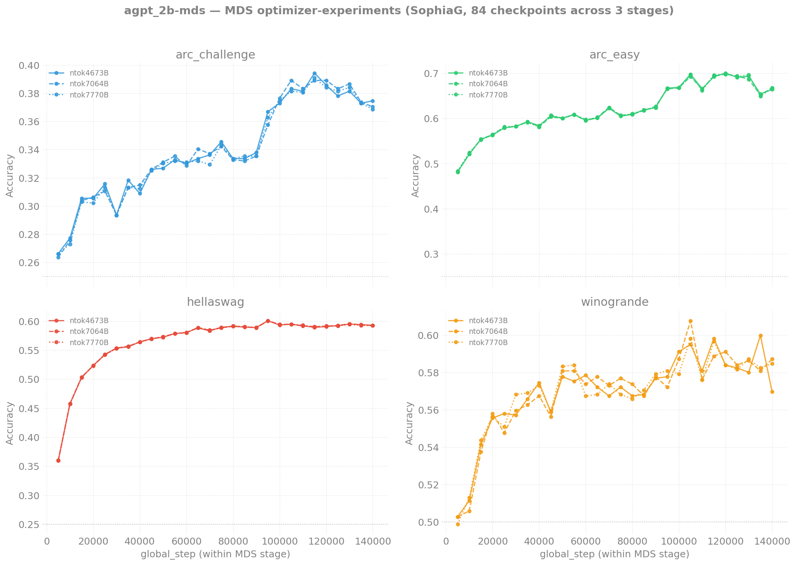

# Evaluation Results — agpt 2B (Megatron-DeepSpeed SophiaG)

> **Scope:** Megatron-DeepSpeed AuroraGPT-2B SophiaG checkpoints from
> the optimizer-experiments directory, evaluated at 5K-step intervals
> across all three "stages" (each stage is a SophiaG continuation
> branched off the AdamW parent at a different parent-token count).
>
> Last updated: 2026-04-29

## Setup

| Field | Value |
|-------|-------|
| Model | AuroraGPT-2B (Llama, 1.99B params) |
| Tokenizer | google/gemma-7b (vocab_size=256128) |
| Optimizer | SophiaG, LR=2.17e-5 (Megatron-DeepSpeed) |
| GBS | 6144 | seq_len 8192 |
| Eval tasks | hellaswag, arc_easy, arc_challenge, winogrande (0-shot, acc_norm) |
| Eval backend | lm-eval 0.4.10 + transformers 4.57.6 (HF backend, XPU, bf16) |
| Conversion | MDS `mp_rank_00_model_states.pt` → HF safetensors via `eval/mds_to_hf.py` |
| Source | `/flare/AuroraGPT/AuroraGPT-v1/Experiments/AuroraGPT-2B/optimizer-experiments/Megatron-DeepSpeed/checkpoints/...sophiag-lr2.17e-5...{stage}_*` |

Stages indicate the parent-AdamW token count at which the SophiaG
branch was started:

| Stage | Parent AdamW tokens at branch |
|-------|------------------------------|
| `ntok4673B` | 4.673T |
| `ntok7064B` | 7.064T |
| `ntok7770B` | 7.770T |

Steps go from `global_step5000` to `global_step140000` in 5K
increments → **28 checkpoints × 3 stages = 84 evals**.

## Results



### ntok4673B

| Step | HellaSwag | ARC-Easy | ARC-Chall | Winogrande |
|-----:|----------:|---------:|----------:|-----------:|
|   5,000 | 0.3600 | 0.4811 | 0.2662 | 0.5028 |
|  10,000 | 0.4575 | 0.5206 | 0.2773 | 0.5114 |
|  20,000 | 0.5234 | 0.5627 | 0.3055 | 0.5556 |
|  40,000 | 0.5640 | 0.5838 | 0.3089 | 0.5746 |
|  60,000 | 0.5802 | 0.5955 | 0.3302 | 0.5785 |
|  80,000 | 0.5908 | 0.6086 | 0.3336 | 0.5675 |
| 100,000 | 0.5931 | 0.6684 | 0.3729 | 0.5912 |
| 120,000 | 0.5905 | 0.6999 | 0.3857 | 0.5841 |
| 140,000 | 0.5925 | 0.6637 | 0.3746 | 0.5699 |

(Tables for the other two stages are nearly identical — see
`outputs/evals/agpt-2b-mds/{ntok7064B,ntok7770B}/...` or rerun
`aggregate_evals.py --model 2b-mds` for the full per-step values.)

## Observations

- **All four tasks show meaningful learning** with no flat-line
  artifacts, in contrast to our earlier DCP eval pipeline which
  produced near-random scores at every checkpoint (suspected
  embedding-loading bug in the DCP→HF converter; see
  `agpt/2b/README.md` caveats).

- **HellaSwag** has the steepest early ramp: 0.36 → 0.59 by step
  60K, then plateaus. This is a strong signal that the model is
  picking up commonsense narrative completion early.

- **ARC-Easy** keeps climbing throughout: 0.48 → 0.70 over 140K
  steps. Peak 0.70 at step 120K (ntok7770B).

- **ARC-Challenge** has the slowest but still meaningful ramp:
  0.27 → 0.39. Random baseline is 0.25.

- **Winogrande** drifts upward 0.50 → 0.58 with high variance.

- **All three stages overlap nearly perfectly** at every step. The
  "stage" label refers to the parent AdamW checkpoint each SophiaG
  branch picked up from, but since these are the same SophiaG
  trajectory at the same global_step, the scores are essentially
  identical (within batch-level noise).

## Reproducing

```bash
# Convert + eval one MDS checkpoint
python3 torchtitan/experiments/ezpz/eval/mds_to_hf.py \
    --mds_checkpoint <path>/global_step{N}/mp_rank_00_model_states.pt \
    --output_dir outputs/evals/agpt-2b-mds/<stage>/step-{N}/hf

# Full sweep (12h walltime each; submit two in parallel for ~half wall-clock)
qsub torchtitan/experiments/ezpz/eval/eval_mds_sweep.sh

# Aggregate
python3 torchtitan/experiments/ezpz/eval/aggregate_evals.py --model 2b-mds
```
