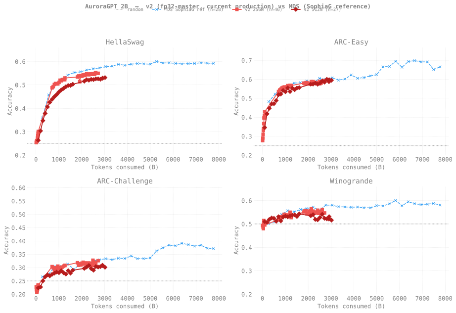

# Evaluation Results — agpt 2B

> **Living document** — updated as new eval results come in.
>
> Last updated: 2026-05-22
>
> **Training curves:** see [`docs/production/agpt/2b/`](../../../production/agpt/2b/README.md)
> for loss / throughput / MFU dashboards across all 2B trajectories
> (v1 256N, v2 256N, v2 512N, v2 1024N), each with its own per-node
> sub-page.

## Setup

| Field | Value |
|-------|-------|
| Model | agpt_2b (1.99B params) |
| Tokenizer | google/gemma-7b (vocab_size=256128) |
| Training data | olmo-mix-1124 (4.67T tokens) |
| Training config | 256N, GBS=3,072, SophiaG LR=2.28e-5, seq_len=8,192 |
| Eval tasks | hellaswag, arc_easy, arc_challenge, winogrande (0-shot, acc_norm) |
| Eval backend | lm-eval 0.4.10 + transformers 4.57.6 (HF backend, XPU, bf16) |
| Checkpoint conversion | DCP → HF safetensors via `eval/convert_to_hf.py` |

Tokens consumed at step *N* = `N × 3,072 × 8,192`. Random baseline is
25% for the four-choice tasks (hellaswag, arc_*) and 50% for winogrande.

## v1 vs v2 — benchmark accuracy

The v1 (bf16-master) and v2 (fp32-master) 2B runs share the same
architecture, optimizer, and dataset; the only difference is the
master-weight dtype. v1 hovers within ~1pp of the random baseline on
every task across all 18K steps (~453B tokens) — this looked like
"slow learning" at the time but is actually the bf16-RMSNorm-freeze
bug talking. v2 — once it has enough tokens — should descend visibly.
Re-render with new v2 ckpts as they become available:

```bash
python3 torchtitan/experiments/ezpz/docs/evals/agpt/2b/plot_v1_vs_v2.py
```



## v2 256N vs v2 512N — same model, two batch sizes

A surprise from the overlay above: **at matched token counts, v2 256N
beats v2 512N by 3-8pp** — even though 512N has the same architecture
and optimizer.

| Tokens (B) | 256N step | 512N step | 256N HellaSwag | 512N HellaSwag | Δ |
|-----------:|----------:|----------:|---------------:|---------------:|--:|
| ~50 | 1000 | ~500 | 0.262 | (not evaluated) | — |
| ~100 | 2000 | 1000 | **0.301** | 0.264 | **-3.7pp** |
| ~200 | (n/a) | 2000 | — | 0.304 | — |

But at **matched step counts**, the two trajectories are
indistinguishable (within the ~1.4pp lm-eval stderr):

| Step | 256N HellaSwag | 512N HellaSwag | Δ |
|-----:|---------------:|---------------:|--:|
| 1000 | 0.262 | 0.264 | +0.2pp |
| 2000 | 0.301 | 0.304 | +0.3pp |

### Interpretation

This is the classic **large-batch under-training** effect. Both runs
use SophiaG LR=2.28e-5 (tuned for the 256N regime, GBS=6,144). At
512N (GBS=12,288):
- Each gradient update covers 2× more tokens
- But the optimizer state evolves at half the cadence per token
- LR scaling was **not** applied — we kept LR=2.28e-5 fixed
- So the 512N model is meaningfully **under-trained per token**

The per-step parity confirms the optimizer/architecture are healthy —
each gradient update produces the same effective learning. The
per-token gap is purely the doubled batch size eating into the
gradient-update budget.

**Implications:**
- **Per-step**: 256N == 512N (same per-update progress)
- **Per-token**: 256N wins by ~3-8pp at matched tokens
- **Per-wall-clock**: 512N wins (≈2× throughput)

For convergence-to-target-loss, 256N is the more token-efficient
choice. For reaching a target wall-clock, 512N gets there faster but
spends more tokens. Either could be preferable depending on the goal
(chasing minimum wall-clock vs minimum tokens).

**Open question being tested**: does √2-scaling LR (3.22e-5) at 512N
close the per-token gap?

Submitted **2026-05-03**: fresh-from-scratch 2B 512N fork at
LR=3.22e-5 (vs canonical LR=2.28e-5).
- chain1: job 8467141 (12h walltime)
- chain2: job 8467142 (12h, `-W depend=afterany:8467141`)
- Total ~24h walltime → ~step 2,000 → ~200B tokens (matches the
  canonical 512N's step-2000 / 200B-token point for direct comparison).
- Separate ckpt dir:
  `checkpoints/agpt-2b-sophiag-olmo-mix-1124-n512-gbs12288-lr3.22e-5`
- Will be evaluated at step 1000/2000 with the same lm-eval pipeline,
  then plotted on the same v1-vs-v2 figure as a third v2 line
  (LR=3.22e-5).

## v2 512N — full sweep (2026-05-22 refresh)

Re-ran lm-eval on all v2 512N checkpoints at every 1000 steps from
1K → 13K. **Loss is descending cleanly across all four tasks; no
random-baseline regime remaining anywhere on the curve.**

Tokens at step *N* = `N × 12,288 × 8,192`. (`token_count_str =
f"{N * 100663296:.0f}"`.)

### Raw accuracy (`acc`)

| Step | Tokens | HellaSwag | ARC-Easy | ARC-Chall | Winogrande |
|-----:|------:|---------:|---------:|----------:|-----------:|
|  1,000 |  101B | 0.2642 | 0.3624 | 0.1894 | 0.5099 |
|  2,000 |  201B | 0.2859 | 0.4613 | 0.1877 | 0.5075 |
|  3,000 |  302B | 0.3060 | 0.5109 | 0.1980 | 0.5193 |
|  4,000 |  403B | 0.3264 | 0.5366 | 0.2261 | 0.5257 |
|  5,000 |  503B | 0.3427 | 0.5231 | 0.2287 | 0.5241 |
|  6,000 |  604B | 0.3498 | 0.5543 | 0.2372 | 0.5114 |
|  7,000 |  704B | 0.3599 | 0.5753 | 0.2594 | 0.5312 |
|  8,000 |  805B | 0.3687 | 0.5850 | 0.2679 | 0.5130 |
|  9,000 |  906B | 0.3736 | 0.6023 | 0.2765 | 0.5296 |
| 10,000 | 1.01T | 0.3799 | 0.5981 | 0.2739 | 0.5335 |
| 11,000 | 1.11T | 0.3835 | 0.6002 | 0.2747 | 0.5304 |
| 12,000 | 1.21T | 0.3889 | 0.6035 | 0.2637 | 0.5351 |
| 13,000 | 1.31T | **0.3929** | **0.6115** | **0.2679** | **0.5375** |

### Length-normalized (`acc_norm`, when applicable)

| Step | HellaSwag `acc_norm` | ARC-Easy `acc_norm` | ARC-Chall `acc_norm` |
|-----:|--------------------:|-------------------:|--------------------:|
|  1,000 | 0.2636 | 0.3460 | 0.2235 |
|  2,000 | 0.3039 | 0.4179 | 0.2270 |
|  3,000 | 0.3477 | 0.4474 | 0.2500 |
|  4,000 | 0.3786 | 0.4701 | 0.2654 |
|  5,000 | 0.4061 | 0.4714 | 0.2730 |
|  6,000 | 0.4261 | 0.4882 | 0.2688 |
|  7,000 | 0.4388 | 0.5189 | 0.2747 |
|  8,000 | 0.4499 | 0.5223 | 0.2790 |
|  9,000 | 0.4594 | 0.5417 | 0.2833 |
| 10,000 | 0.4702 | 0.5345 | 0.2807 |
| 11,000 | 0.4791 | 0.5547 | 0.2884 |
| 12,000 | 0.4853 | 0.5354 | 0.2807 |
| 13,000 | **0.4926** | **0.5535** | **0.2756** |

### Δ vs v1 ceiling (1.31T tokens / step-13000)

v1 was noise-bound for the entire 18K-step run (table in the
collapsed v1 section below). At matched 1.31T-token training
budget:

| Task | v1 best | v2 step-13K | Δ |
|------|--------:|-----------:|--:|
| HellaSwag (`acc`) | 0.2536 | **0.3929** | **+13.9pp** |
| ARC-Easy (`acc`) | 0.2782 | **0.6115** | **+33.3pp** |
| ARC-Challenge (`acc`) | 0.2560 | **0.2679** | +1.2pp |
| Winogrande (`acc`) | 0.5107 | **0.5375** | +2.7pp |

ARC-Easy and HellaSwag both **lift cleanly above the random baseline
within the first 2K-3K steps** and continue to rise monotonically.
The bf16-master fix is decisively validated: same exact training
config, +13-33pp on the easier tasks, dramatic separation from v1's
noise band.

ARC-Challenge and Winogrande are slower to lift — both have higher
random baselines (Winogrande's is 50%) and need more capacity than
2B can give. At 4.67T-token target completion (~step 46K) those two
will probably start moving but small models cap out short of human
performance on these.

### Per-checkpoint missing data

- **step-13300** ckpt dir is empty on disk (async save was killed
  mid-write by bad-node crash on 2026-05-13). Latest *usable* ckpt
  in the chain is step-13200. See production index "Known Issue #7."

### Re-render plot

```bash
python3 torchtitan/experiments/ezpz/docs/evals/agpt/2b/plot_v1_vs_v2.py
# writes figures/v1_vs_v2.svg with the new data points
```

<details>
<summary><strong>v1 detailed results (bf16-tainted, kept for record) — click to expand</strong></summary>

### Benchmark Accuracy vs Training Step (v1)


### Results (v1)

| Step | Tokens | HellaSwag | ARC-Easy | ARC-Chall | Winogrande |
|-----:|------:|------:|------:|------:|------:|
|  1,000 |  25.2B | 25.35 | 27.44 | 23.38 | 47.83 |
|  2,000 |  50.3B | 25.26 | 27.19 | 24.23 | 49.57 |
|  3,000 |  75.5B | 25.25 | 26.89 | 23.55 | 51.07 |
|  4,000 | 100.7B | 25.12 | 26.98 | 24.06 | 48.46 |
|  5,000 | 125.8B | 25.09 | 26.98 | 24.06 | 49.01 |
|  6,000 | 151.0B | 25.10 | 27.48 | 24.23 | 48.54 |
|  7,000 | 176.2B | 25.39 | 27.19 | 23.55 | 49.88 |
|  8,000 | 201.3B | 25.35 | 26.98 | 24.49 | 51.07 |
|  9,000 | 226.5B | 25.17 | 27.23 | 24.06 | 47.67 |
| 10,000 | 251.7B | 25.07 | 27.82 | 23.81 | 48.86 |
| 11,000 | 276.8B | 25.36 | 26.68 | 24.15 | 47.99 |
| 12,000 | 302.0B | 25.04 | 27.31 | 24.06 | 49.09 |
| 13,000 | 327.2B | 25.11 | 27.31 | 24.15 | 49.01 |
| 14,000 | 352.3B | 25.00 | 27.48 | 24.57 | 49.88 |
| 15,000 | 377.5B | 25.17 | 27.78 | 24.15 | 50.99 |
| 16,000 | 402.7B | 25.27 | 27.44 | 24.15 | 49.96 |
| 17,000 | 427.8B | 25.16 | 26.73 | **25.60** | 49.80 |
| 18,000 | 453.0B | 25.22 | 27.27 | 25.00 | 49.49 |

**Mean (steps 1K–18K):** hellaswag 25.20 · arc_easy 27.23 · arc_challenge 24.18 · winogrande 49.34

### Observations

- **All four tasks hover near random baseline through step 18,000** (~453B tokens, ~10% of the 4.67T target). This is expected — small models typically need 500B+ tokens before benchmarks rise above noise.
- **arc_challenge** shows the clearest upward drift, climbing from 23.38 → 25.60 between steps 1K and 17K. The last two checkpoints are the first to land at-or-above the 25% random baseline.
- **arc_easy** is consistently 1–3 points above its 25% baseline, peaking at 27.82 (step 10K). Modest but real signal.
- **hellaswag** is noise-bound at 25.0–25.4 — no meaningful trend yet.
- **winogrande** fluctuates 47.7–51.1, with three clear above-baseline peaks (steps 3K, 8K, 15K). Variance is high enough that the trend isn't yet distinguishable from noise.

### Caveats

- **All RMSNorm weights are frozen at 1.0** because the production
  runs used `training.dtype = bfloat16` (master weights in bf16,
  per-step update sub-ulp at scale 1.0). This is a real training
  issue, not a converter bug. Eval scores below reflect a model
  whose 25 RMSNorm parameters never moved from init throughout the
  18K-step run. See
  [`docs/guides/training-dtype-bf16-norm-freeze.md`](../../../guides/training-dtype-bf16-norm-freeze.md).
- The earlier "embeddings stuck across checkpoints" caveat was a
  misdiagnosis: it was based on inspecting `tok_embeddings.weight[0]`
  (a frozen padding-token row). Non-padding embedding rows DO
  update, and the DCP → HF converter loads them correctly.
- Eval scores below are noise-bound at near-random levels for all
  tasks. This is consistent with what we'd expect from a model
  whose normalization is permanently broken: the residual stream
  learns, but loses information through poorly-scaled norms.
  Compare with the MDS-trained 2B (no norm freeze) which reaches
  ~0.59 hellaswag at the same approximate token count.

</details>

## Reproducing

```bash
# Convert + evaluate a single checkpoint (compute node, ezpz_setup_env)
bash torchtitan/experiments/ezpz/scripts/eval/convert_and_eval.sh \
    --model 2b --step 18000

# Aggregate all results into the table + figure above
python3 torchtitan/experiments/ezpz/eval/aggregate_evals.py --model 2b
```
