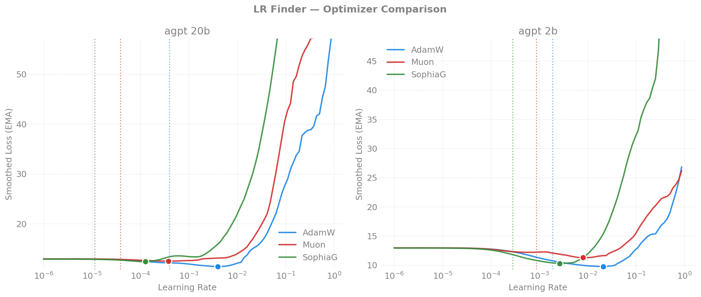
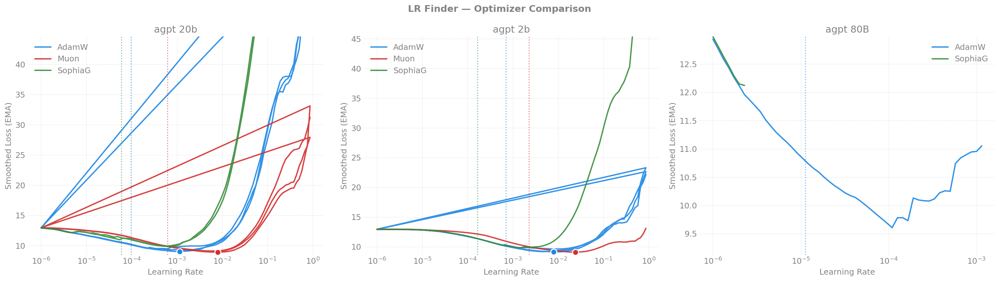
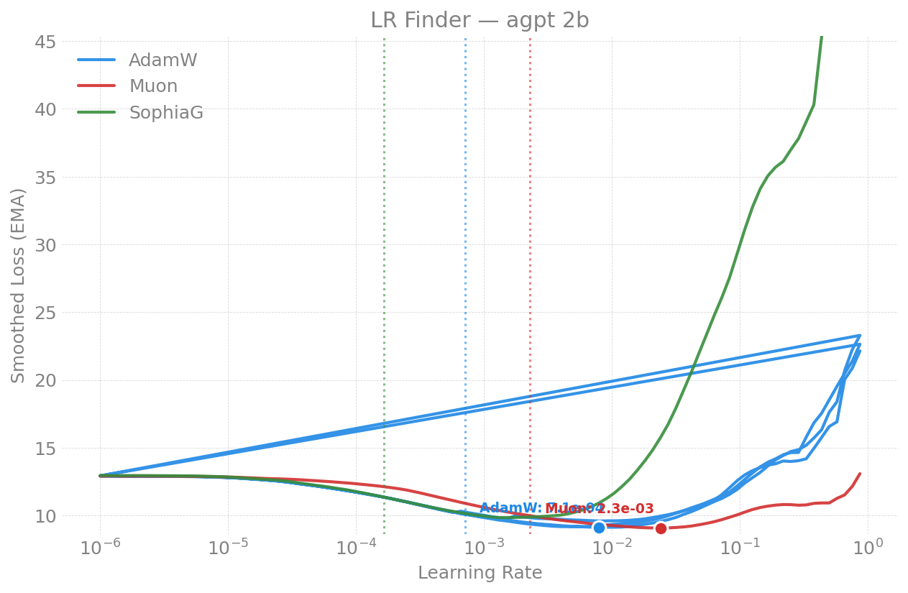
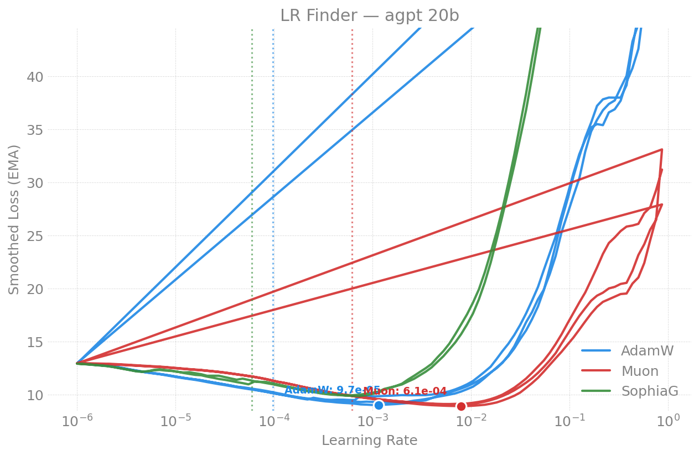
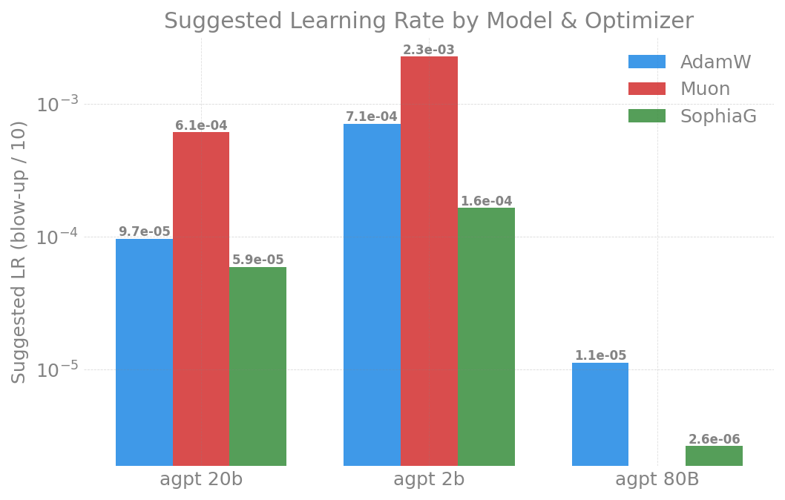
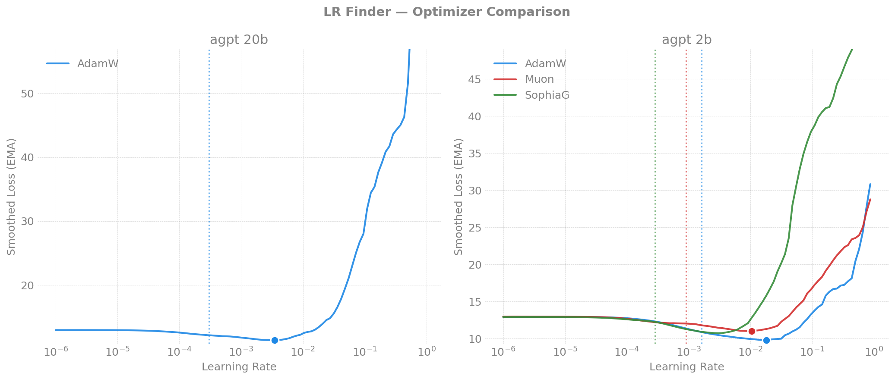
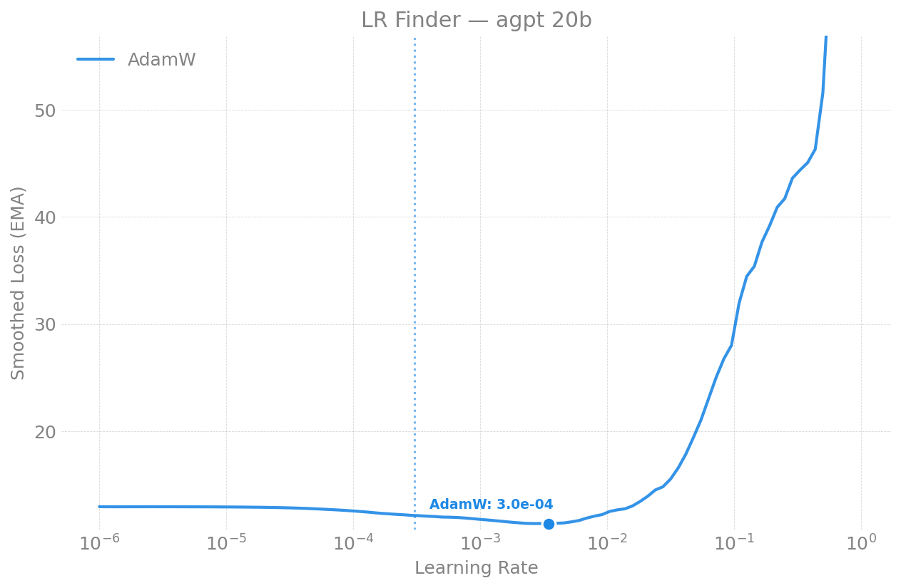

# Learning Rate Finder

## How It Works

The learning rate finder identifies the optimal learning rate for a given
model and optimizer by running a short sweep of exponentially increasing
learning rates while monitoring training loss.

### Algorithm

Based on [Smith 2015](https://arxiv.org/abs/1506.01186) and
[Gugger's implementation](https://sgugger.github.io/how-do-you-find-a-good-learning-rate.html),
ported from [argonne-lcf/Megatron-DeepSpeed](https://github.com/argonne-lcf/Megatron-DeepSpeed).

1. Set `N = fraction * training.steps` (default: 10% of total steps)
2. Compute multiplicative factor: `mult = (max_lr / init_lr) ^ (1/N)`
3. For each step `i` in `1..N`:
   - Run one full training step (forward + backward + optimizer)
   - Record the loss
   - Compute EMA-smoothed loss: `avg = beta * avg + (1 - beta) * loss`
   - Apply bias correction: `smoothed = avg / (1 - beta^i)`
   - Update learning rate: `lr *= mult`
4. Analyze curve with derivative-based blow-up detection (`find_optimal_lr()`)
5. Save results (CSV, NPZ, plot) and exit

### The LR-vs-Loss Curve

The sweep produces a characteristic curve with three regions:

```
Loss
  |  ___________
  | /           \        <- flat (LR too small to affect loss)
  |/             \       <- descent (optimal region)
  |               \___   <- blow-up (LR too large, divergence)
  +-----|-----|--------> LR (log scale)
     init_lr  optimal  max_lr
```

### Selecting the Optimal LR

Two heuristics (both implemented):

1. **Blow-up point / 10**: `find_optimal_lr()` detects where the smoothed
   loss derivative crosses from negative to positive, then divides by 10.
   Conservative, safe for production.
2. **Steepest descent**: Pick the LR at the steepest part of the loss curve.
   More aggressive, potentially faster convergence.

### Knobs to Tune

| Parameter | Effect | When to change |
|-----------|--------|---------------|
| `init_lr` | Starting LR | Lower if the flat region is too short |
| `max_lr` | Ending LR | Raise if blow-up isn't reached |
| `fraction` | Sweep length | Increase for smoother curves (more steps) |
| `beta` | EMA smoothing | Lower (0.9) for noisier curves, higher (0.99) for smoother |
| `warmup_fraction` | Hold at init_lr before sweep | Set 0.05-0.1 to let model settle |
| `smooth_frac` | Derivative smoothing window | Increase (0.1+) for noisy/short curves |
| `training.steps` | Base for fraction | Set to 1000+ for 100+ finder steps |

### Important Notes

- The finder **bypasses the normal LR scheduler** — it directly sets
  `param_group["lr"]` on all optimizer param groups after each step
- The model is **not saved** after the sweep — it's meant for LR
  selection, not training
- Results are **distributed-aware** — loss is reduced across all ranks
  before recording
- The sweep runs the **full training step** including gradient clipping,
  so the curve reflects realistic training dynamics

---

## Results

### Recommended Learning Rates

Latest results using `sqrt(2/(5*d))` weight init and 5% warmup (Sunspot 2026-04-14).

| Model | AdamW   | Muon    | SophiaG |
|-------|---------|---------|---------|
| 2B    | **1.3e-3**| **2.4e-3**| **3.1e-4**|
| 20B   | **4.0e-4**| **1.7e-4**| **1.8e-5**|
| 80B   | **1.1e-5** | N/A† | N/A† |

†80B Muon/SophiaG broken: bf16 overflow in Newton-Schulz (Muon) and Hessian
estimate (SophiaG) on 9216-dim matrices. See [2026-04-21 report](agpt/sunspot/20260421-lr-finder-80b-n2.md).

### Cross-Machine Comparison — agpt 2B

| Optimizer | Aurora (std=0.02) | Sunspot (sqrt(2/5d)) | Polaris (std=0.02) |
|-----------|--------|---------|---------|
| **AdamW** suggested LR | 2e-3 | 1.3e-3 | 2e-3 |
| **Muon** suggested LR | 8e-4 | **2.4e-3** | 1e-3 |
| **SophiaG** suggested LR | 3e-4 | 3.1e-4 | 3e-4 |

### Cross-Machine Comparison — agpt 20B

| Optimizer | Aurora (std=0.02) | Sunspot (sqrt(2/5d)) | Polaris (std=0.02) |
|-----------|--------|---------|---------|
| **AdamW** suggested LR | 4e-4 | 4.0e-4 | 4e-4 |
| **Muon** suggested LR | 4e-5 | **1.7e-4** | — |
| **SophiaG** suggested LR | 1e-5 | 1.8e-5 | — |

**Takeaway:** AdamW and SophiaG are robust to weight init changes. Muon is
sensitive — `sqrt(2/(5*d))` init allows 3-10x higher LRs vs fixed `std=0.02`.
This is because Muon's orthogonal momentum amplifies gradient scale differences.

### Key Findings

1. **Optimizer sensitivity:** `AdamW (most tolerant) > Muon > SophiaG (most sensitive)`
2. **Model scaling:** Larger models need lower LRs. Muon/SophiaG scale more
   aggressively (~N^-0.5) than AdamW (~N^-0.25)
3. **Blow-up severity:** SophiaG diverges catastrophically (loss 7,000+) vs
   gradual blow-up for AdamW (loss ~60). SophiaG requires tighter LR scheduling
4. **Cross-hardware consistency:** Suggested LRs match within 2x across Intel
   XPU (Aurora, Sunspot) and NVIDIA A100 (Polaris)

### LR Finder Curves

#### Aurora (Intel Max 1550, 2 nodes / 24 XPUs)



| | |
|---|---|
|  |  |
|  | |

#### Sunspot (Intel Max 1550, 2 nodes / 24 XPUs)



| | |
|---|---|
|  |  |
|  | |

#### Polaris (NVIDIA A100-40GB, 2 nodes / 8 GPUs)



| | |
|---|---|
|  |  |
|  | |

---

## Comparison with Megatron-DeepSpeed

Our LR finder is ported from
[argonne-lcf/Megatron-DeepSpeed](https://github.com/saforem2/Megatron-DeepSpeed/blob/updates-and-model-card/ALCF/notes/large_batch_optimizers_settings.md).

### Methodology — same approach

Both implementations follow Smith 2015 / Gugger:
- Exponential LR sweep with power-law increase
- EMA-smoothed loss tracking
- "Blow-up point / 10" heuristic
- Same output format (CSV + NPZ + plots)

### What we adopted from Megatron-DeepSpeed

| Feature | Megatron-DeepSpeed | torchtitan-ezpz |
|---------|-------------------|-----------------|
| `find_all_minima_lrs()` | Derivative-based analysis with smoothing | Ported as `find_optimal_lr()` with closest-to-min selection |
| Weight init | `std = sqrt(2/(5*d))` | Adopted in agpt `_linear_init(dim)` |
| GAS support | `GRAD_ACC_STEPS=16` | Configurable via `--training.gradient_accumulation_steps` |
| Warmup | Not implemented | Added `warmup_fraction` config |

### Key differences

| | Megatron-DeepSpeed | torchtitan-ezpz |
|---|---|---|
| Default LR | 0.0002 (Muon) | 8e-4 (config default) |
| Sequence length | 4096 | 8192 (agpt), 4096 (moe) |
| Weight init | `sqrt(2/(5*d))` | `sqrt(2/(5*d))` (adopted) |
| Optimizers tested | AdamW, Muon, dShampoo, LAMB | AdamW, Muon, SophiaG |
| Schedulers | constant+cooldown, cosine, infinite | cosine, linear |
| Machines | Aurora, Sunspot | Aurora, Sunspot, Polaris |
| Models | AuroraGPT (Megatron arch) | AuroraGPT (torchtitan arch) |

### LR values — consistent

Megatron-DeepSpeed uses `LR=0.0002` as the default for Muon training,
which aligns with our 20B Muon finding of ~2-4e-5 (suggested, i.e.
conservative). The blow-up point itself is ~2e-4, matching their default.

Our data on optimizer sensitivity ordering (AdamW > Muon > SophiaG) and
the scaling law (larger models need lower LRs) extends beyond what's
documented in the Megatron-DeepSpeed notes.

---

## Reports

### agpt (Dense)

| Date | Report | Models | Optimizers | Nodes | Machine | Key Result |
|------|--------|--------|-----------|-------|---------|------------|
| 2026-04-12 | [LR Finder](agpt/aurora/20260412-144400-lr-finder-n2.md) | 2B, 20B | AdamW, Muon, SophiaG | 2 | Aurora | AdamW most tolerant; SophiaG 10x lower LR |
| 2026-04-12 | [LR Finder](agpt/sunspot/20260412-lr-finder-n2.md) | 2B, 20B | AdamW, Muon, SophiaG | 2 | Sunspot | All 6 sweeps; SophiaG 20B blow-up at 7,145 |
| 2026-04-13 | [LR Finder](agpt/polaris/20260413-015510-lr-finder-n2.md) | 2B, 20B | AdamW, Muon, SophiaG | 2 | Polaris | Reproduces Aurora; cross-hardware LR consistency |

### moe (Sparse)

*No LR finder runs yet.*

---

## Usage

### Running the LR finder

Add `--lr_finder.enable` to any training command:

```bash
ezpz launch python3 -m torchtitan.experiments.ezpz.train \
  --module ezpz.agpt --config agpt_2b \
  --training.steps 1000 \
  --checkpoint.no_enable \
  --lr_finder.enable
```

The finder runs for 10% of `training.steps` (e.g. 100 steps for 1000), sweeping
LR exponentially from `init_lr` to `max_lr`.

### Configuration

| Flag | Default | Description |
|------|---------|-------------|
| `--lr_finder.enable` | false | Run LR finder instead of training |
| `--lr_finder.init_lr` | 1e-6 | Starting learning rate |
| `--lr_finder.max_lr` | 1.0 | Maximum learning rate |
| `--lr_finder.fraction` | 0.1 | Fraction of training.steps to sweep |
| `--lr_finder.beta` | 0.98 | EMA smoothing factor |
| `--lr_finder.warmup_fraction` | 0.0 | Hold at init_lr before sweep |
| `--lr_finder.smooth_frac` | 0.05 | Derivative smoothing window |

### With different optimizers

```bash
# AdamW (default)
ezpz launch python3 -m torchtitan.experiments.ezpz.train \
  --module ezpz.agpt --config agpt_20b \
  --training.steps 1000 --checkpoint.no_enable --lr_finder.enable

# Muon
ezpz launch python3 -m torchtitan.experiments.ezpz.train \
  --module ezpz.agpt --config agpt_20b \
  --training.steps 1000 --checkpoint.no_enable --lr_finder.enable \
  --optimizer muon

# SophiaG
ezpz launch python3 -m torchtitan.experiments.ezpz.train \
  --module ezpz.agpt --config agpt_20b \
  --training.steps 1000 --checkpoint.no_enable --lr_finder.enable \
  --optimizer sophiag
```

### Output

Results are saved to `outputs/lr_finder/ezpz/<module>/<flavor>/<optimizer>/`:

- `lr_finder_data.csv` — two columns: learning_rate, loss
- `lr_finder_data.npz` — numpy arrays for programmatic analysis
- `lr_vs_loss.png` — log-scale plot with minimum and suggested LR marked

### Reproducing the experiments

```bash
# All 6 sweeps (2B+20B x 3 optimizers):
LRF_MODELS="2b 20b" LRF_OPTIMIZERS="adamw muon sophiag" \
    bash torchtitan/experiments/ezpz/scripts/run_lr_finder_sweep.sh
```

### Generating plots

```bash
# From repo root:
python3 torchtitan/experiments/ezpz/utils/plot_lr_finder.py \
    --data-dir outputs/lr_finder/ezpz/ezpz.agpt \
    --output-dir torchtitan/experiments/ezpz/docs/experiments/lr-finder/agpt/sunspot/figures
```

## References

- Smith, L.N. (2015). [Cyclical Learning Rates for Training Neural Networks](https://arxiv.org/abs/1506.01186)
- Gugger, S. [How Do You Find A Good Learning Rate](https://sgugger.github.io/how-do-you-find-a-good-learning-rate.html)
- [Megatron-DeepSpeed LR Finder](https://github.com/saforem2/Megatron-DeepSpeed/blob/updates-and-model-card/ALCF/notes/large_batch_optimizers_settings.md#learning-rate) (argonne-lcf)
- Yang et al. (2023). [Tensor Programs VI: Feature Learning in Infinite-Depth Neural Networks](https://arxiv.org/abs/2312.16903) — weight init `sqrt(2/(5*d))`
