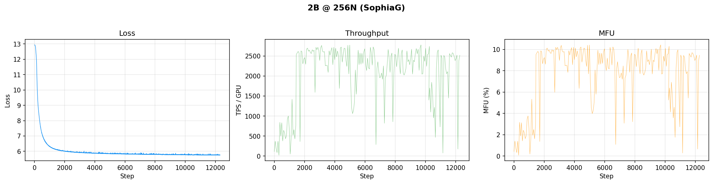

# Production Training — agpt 2B

## 2B @ 256N — SophiaG LR=2.28e-5

| Field | Value |
|-------|-------|
| Model | agpt_2b (1.99B params) |
| Nodes / GPUs | 256 / 3,072 |
| Parallelism | TP=1, FSDP=3072 |
| Compile | on |
| Optimizer | SophiaG, LR=2.28e-5 |
| GBS | 3,072 (LBS=1) |
| Total steps | 185,718 |
| Total tokens | 4.67T |
| Seq len | 8,192 |
| Checkpoint dir | `outputs/checkpoints/agpt-2b-sophiag-olmo-mix-1124-n256-gbs3072` |
| Checkpoint interval | 100 steps |

### Loss / Throughput / MFU



### Progress

| Job ID | Steps | Loss (start → end) | TPS/GPU | MFU | Memory | Status |
|--------|-------|---------------------|---------|-----|--------|--------|
| 8444122 | 1–1431 | 12.94 → 6.13 | 489 | 1.8% | 47.12 GiB | Complete (walltime) |
| 8446337 | 1401–9876 | 6.13 → 5.78 | 1,794 | 6.7% | — | Complete (walltime) |
| 8446338 | 9876–12295+ | 5.78 → 5.76 | 2,485 | 9.3% | — | **Running** |
| 8446339 | cont. | — | — | — | — | Held (dep) |

**W&B:** [pjanidnw](https://wandb.ai/aurora_gpt/torchtitan.ezpz.train/runs/pjanidnw) (job 8444122), [4u9w23p9](https://wandb.ai/aurora_gpt/torchtitan.ezpz.train/runs/4u9w23p9) (job 8446337)

**Latest checkpoint:** step-12200

**Tokens consumed:** 12295 × 3072 × 8192 = **309.5B tokens** (6.6% of target)

---

## 2B @ 512N — SophiaG LR=2.28e-5 (no compile)

| Field | Value |
|-------|-------|
| Model | agpt_2b (1.99B params) |
| Nodes / GPUs | 512 / 6,144 |
| Parallelism | TP=1, FSDP=6144 |
| Compile | **off** (OOM at 512N) |
| Optimizer | SophiaG, LR=2.28e-5 |
| GBS | 6,144 (LBS=1) |
| Total steps | 92,859 |
| Total tokens | 4.67T |
| Checkpoint dir | `outputs/checkpoints/agpt-2b-sophiag-olmo-mix-1124-n512-gbs6144` |

### Progress

| Job ID | Steps | Loss | TPS/GPU | MFU | Memory | Status |
|--------|-------|------|---------|-----|--------|--------|
| 8443818 | 0 | — | — | — | — | OOM (compile) |
| 8446349 | 0 | — | — | — | — | Segfault (signal 11) |
| 8446350 | — | — | — | — | — | Queued |

### Job Chains

```
2B-256N (torch 2.10, LBS=1): 8446337 → 8446338 → 8446339 → 8451750 → 8451752
2B-512N (torch 2.10, LBS=1): 8446349 → 8446350
2B-512N (torch 2.13, LBS=2): 8451723 → 8451724
```
