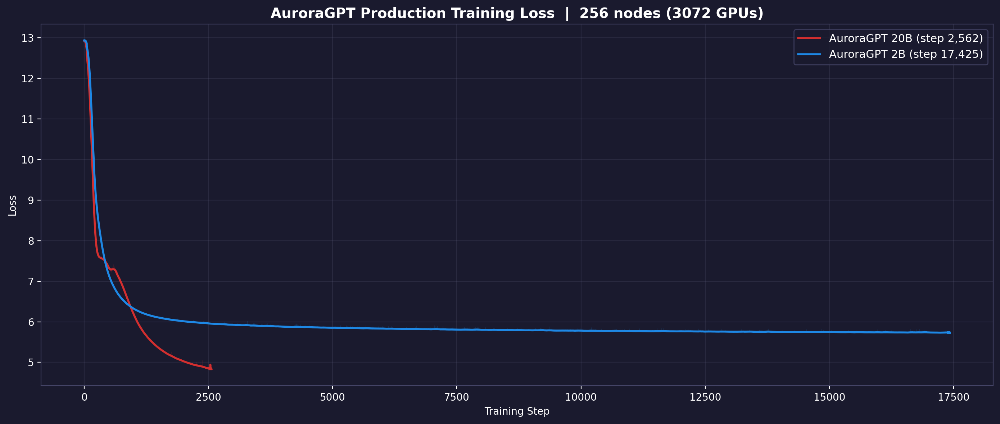

# Production Training Runs — Aurora

> **Living document** — updated as jobs complete and new runs are submitted.
>
> Last updated: 2026-04-28

## Scaling Performance

See [scaling-performance.md](scaling-performance.md) for the detailed
experiment log from Apr 18-21 (compile scaling, 80B at 4-512N, interactive
workflow validation).

## Overview

Full-scale production training of AuroraGPT models on the
[olmo-mix-1124](https://huggingface.co/datasets/allenai/olmo-mix-1124) dataset
(4.67T tokens) across Aurora compute nodes.

## Loss Curves

## Tokens vs Wall Clock (256N runs)

| 2B | 20B |
|----|-----|
|  |  |

## Runs

### Dense (agpt)

| Run | Model | Nodes | Optimizer | LR | Compile | Steps Done | Loss | Tokens | Status |
|-----|-------|-------|-----------|------|---------|------------|------|--------|--------|
| [2B-256N](agpt/2b/) | 2B | 256 | SophiaG | 2.28e-5 | on | 33,740+ | 5.69 | 849.1B (18.2%) | **Running** |
| [2B-512N](agpt/2b/) | 2B | 512 | SophiaG | 2.28e-5 | off | 0 | — | — | Segfault |
| [2B-512N](agpt/2b/) | 2B | 512 | SophiaG | 2.28e-5 | — | 0 | — | — | Killed (yeet-env) |
| [20B-256N](agpt/20b/) | 20B | 256 | SophiaG | 2.28e-5 | on | 4,159+ | 4.59 | 104.7B (2.2%) | **Running** |
| [20B-512N](agpt/20b/) | 20B | 512 | SophiaG | 2.28e-5 | on | 458 | 7.09 | 23.1B | Segfault |
| [20B-512N](agpt/20b/) | 20B | 512 | SophiaG | 2.28e-5 | — | 0 | — | — | Killed (yeet-env) |
| [80B-256N](agpt/80b/) | 80B | 256 | AdamW | 1.1e-5 | on | 777 | NaN | — | NaN@138 (killed) |
| [80B-256N](agpt/80b/) | 80B | 256 | AdamW | 1e-6 | on | 51 | 12.91 | — | Crashed (bad node) |
| [80B-512N](agpt/80b/) | 80B | 512 | AdamW | 1.1e-5 | off | 495 | NaN | — | NaN@15 (killed) |
| [80B-512N](agpt/80b/) | 80B | 512 | AdamW | 1e-6 | — | 0 | — | — | Killed (yeet-env) |

### MoE

| Run | Model | Nodes | Status |
|-----|-------|-------|--------|
| [10B_2B EP=12](moe/10b_2b_sdpa_ep/) | 10B_2B_sdpa | TBD | Planned |

## Known Issues

1. **torch.compile OOM at 512N** — 2B OOMs on GPU, 80B OOMs on CPU. Use
   `--compile.no-enable` for 512N jobs.
2. **SophiaG/Muon broken at 80B** — bf16 overflow in Hessian/Newton-Schulz.
   Use AdamW only.
3. **80B AdamW LR=1.1e-5 → NaN** — loss diverges at step 138 (256N) and
   step 15 (512N). LR from LR finder (2-node, GBS=12) may be too high for
   production GBS (1536-3072). Need to re-run LR finder at production GBS
   or reduce LR to ~1e-6.
4. **Transient segfaults** — single bad nodes crash the whole job. Retry
   usually works. Both 512N jobs (2B and 20B) segfaulted on their first
   continuation attempt.
5. **Compile time at 256N** — ~7-15 min depending on model size. Eats into
   the 12h walltime.
6. **80B Gloo timeout on bad nodes** — 80B-256N AdamW LR=1e-6 (8451226)
   crashed at 11 min during dataloader init with `Gloo connectFullMesh
   failed ... No route to host`. Transient bad node. Needs resubmit.
7. **yeet-env saturates flare at 512N** — three concurrent 512N jobs
   rsyncing the same 8.6GB `.venv` to 1,536 nodes (~13TB total reads)
   saturated the Lustre filesystem for 2+ hours. Training TPS on co-running
   256N jobs dropped from ~2,400 to ~30. Even an 8-node job couldn't finish
   yeet-env in 2h. **Mitigation:** stagger venv submissions, use DAOS, or
   use tar+broadcast instead of per-node rsync.
