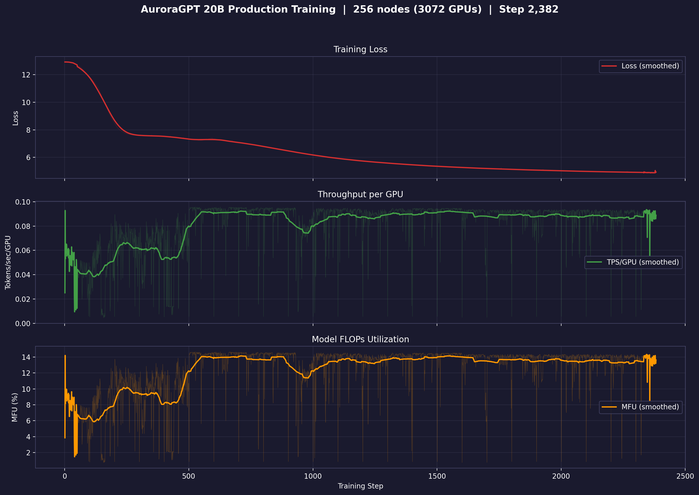

# Production Training — agpt 20B

## 20B @ 256N — SophiaG LR=2.28e-5

| Field | Value |
|-------|-------|
| Model | agpt_20b (20.7B params) |
| Nodes / GPUs | 256 / 3,072 |
| Parallelism | TP=1, FSDP=3072 |
| Compile | on |
| Optimizer | SophiaG, LR=2.28e-5 |
| GBS | 3,072 (LBS=1) |
| Total steps | 185,718 |
| Total tokens | 4.67T |
| Checkpoint dir | `outputs/checkpoints/agpt-20b-sophiag-olmo-mix-1124-n256-gbs3072` |

### Loss / Throughput / MFU (256N)



### Progress

| Job ID | Steps | Loss (start → end) | TPS/GPU | MFU | Memory | Status |
|--------|-------|---------------------|---------|-----|--------|--------|
| 8443212 | 1–100 | 12.93 → 11.84 | 280 | 14.0% | 40.95 GiB | Killed (qdel) |
| 8444123 | 100–581 | 11.84 → 7.35 | 248 | 12.4% | 43.95 GiB | Complete (walltime) |
| 8446340 | 501–1614 | 7.33 → 5.25 | 283 | 14.1% | — | Complete (walltime) |
| 8446341 | 1614–? | — | — | — | — | Complete |
| 8446342 | 1601–2375+ | 5.26 → 4.88 | 280 | 14.0% | 44.38 GiB | **Running** |

**W&B:** [q9oq5huj](https://wandb.ai/aurora_gpt/torchtitan.ezpz.train/runs/q9oq5huj) (job 8443212), [pnkaurba](https://wandb.ai/aurora_gpt/torchtitan.ezpz.train/runs/pnkaurba) (job 8444123), [lrlv3xsc](https://wandb.ai/aurora_gpt/torchtitan.ezpz.train/runs/lrlv3xsc) (job 8446340)

**Latest checkpoint:** step-2300

**Tokens consumed:** 2375 × 3072 × 8192 = **59.8B tokens** (1.3% of target)

---

## 20B @ 512N — SophiaG LR=2.28e-5

| Field | Value |
|-------|-------|
| Model | agpt_20b (20.7B params) |
| Nodes / GPUs | 512 / 6,144 |
| Parallelism | TP=1, FSDP=6144 |
| Compile | on |
| Optimizer | SophiaG, LR=2.28e-5 |
| GBS | 6,144 (LBS=1) |
| Total steps | 92,859 |
| Total tokens | 4.67T |
| Checkpoint dir | `outputs/checkpoints/agpt-20b-sophiag-olmo-mix-1124-n512-gbs6144` |

### Loss / Throughput / MFU (512N)


### Progress

| Job ID | Steps | Loss (start → end) | TPS/GPU | MFU | Memory | Status |
|--------|-------|---------------------|---------|-----|--------|--------|
| 8443819 | 1–458 | 12.94 → 7.09 | 41 | 2.1% | 54.14 GiB | Complete (walltime) |
| 8446343 | 0 | — | — | — | — | Segfault (signal 11) |
| 8446344 | — | — | — | — | — | Queued |

**W&B:** [8of5hse0](https://wandb.ai/aurora_gpt/torchtitan.ezpz.train/runs/8of5hse0)

**Latest checkpoint:** step-400

**Tokens consumed:** 458 × 6144 × 8192 = **23.1B tokens** (0.5% of target)

**Note:** Very low TPS (41) — compile took most of the 12h walltime.
512N continuation (8446343) segfaulted on a bad node. 8446344 will retry.

### Job Chains

```
20B-256N (torch 2.10, LBS=1): 8446340 → 8446341 → 8446342 → 8451749 → 8451751
20B-512N (torch 2.10, LBS=1): 8446343 → 8446344
20B-512N (torch 2.13, LBS=2): 8451725 → 8451726
```
