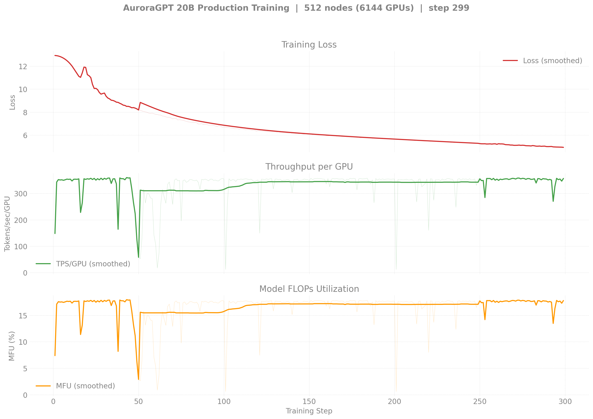
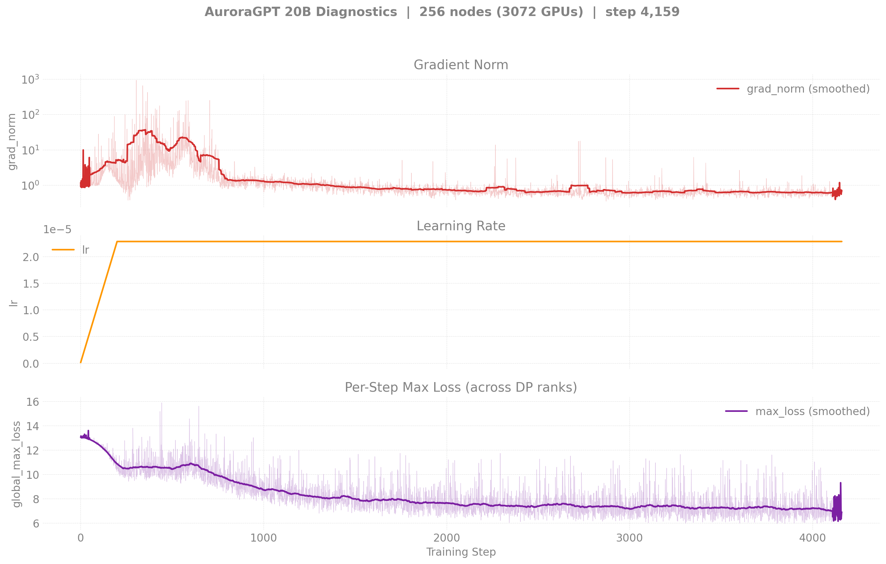
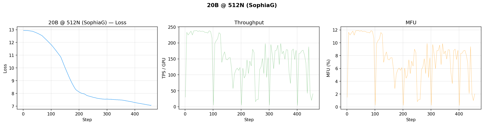

# Production Training — agpt 20B

> **2026-04-30 — restarted from scratch in `agpt-20b-v2/` clone.** Same
> bf16-master RMSNorm-freeze bug that affected the 2B and 80B runs.
> v2 below is the clean restart on `dtype=float32`. See
> [`docs/guides/training-dtype-bf16-norm-freeze.md`](../../../guides/training-dtype-bf16-norm-freeze.md).

## v1 vs v2 — overlay

v1 (gray, bf16 master, broken) reached 4,159 steps over 256 nodes;
v2 (red, fp32 master, current) is at ~200 steps over 512 nodes. The
v2 curve descends visibly faster on a per-step basis — partly the
data-mix shift, partly the frozen-norm overhead in v1, and partly v2's
LBS=2 (2× tokens per step vs LBS=1 in v1).


Generated by:
```bash
python3 torchtitan/experiments/ezpz/utils/plot_production_wandb.py --overlay 20b
```

## v2 — 20B @ 512N — SophiaG LR=2.28e-5 (fp32 master)

| Field | Value |
|-------|-------|
| Clone | `/flare/AuroraGPT/foremans/runs/agpt-20b-v2/torchtitan-ezpz/` |
| Stack | torch 2.13 venv (yeet-env tarball mode) |
| Optimizer | SophiaG, LR=2.28e-5 |
| Compile | off |
| GBS | 12,288 (LBS=2) |
| Total steps | 46,429 |
| Total tokens | 4.67T |
| Checkpoint dir | `outputs/checkpoints/agpt-20b-sophiag-olmo-mix-1124-n512-gbs12288` |
| W&B | [9tsyx5us](https://wandb.ai/aurora_gpt/torchtitan.ezpz.train/runs/9tsyx5us) |

### Loss / Throughput / MFU



### Diagnostics


### Progress (chain)

| Job ID | Walltime | Steps | Loss (start → end) | TPS/GPU | MFU | Status |
|--------|---------:|------:|-------------------:|--------:|----:|--------|
| 8460302 | 6h | 1–300 | 12.94 → 4.95 | ~355 | ~17.7% | Walltime hit (NODE_FAIL at end). 3 ckpts saved. |
| 8463628 | 12h | 300+ | (resuming) | — | — | **Running** (auto-resumes from step-300) |

**Latest checkpoint:** step-300 (244 GB on disk per ckpt)

**Cumulative steps:** 300 (more incoming as 8463628 progresses)

**Tokens consumed:** 300 × 12,288 × 8,192 = **30B tokens** (0.6% of 4.67T target)

**Latest checkpoint:** step-100 (244 GB on disk per ckpt)

**Tokens consumed:** 148 × 12288 × 8192 = **15B tokens** (0.32% of target)

---

## v1 — Historical (bf16-tainted, superseded by v2)

The runs below are kept for the record. They use `--training.dtype=bfloat16`
and have **frozen RMSNorm weights** — see the warning at the top of this
file. Don't draw conclusions from these loss curves.

## v1 — 20B @ 256N — SophiaG LR=2.28e-5 (bf16 master, BROKEN)

| Field | Value |
|-------|-------|
| Model | agpt_20b (20.7B params) |
| Nodes / GPUs | 256 / 3,072 |
| Parallelism | TP=1, FSDP=3072 |
| Compile | on |
| Optimizer | SophiaG, LR=2.28e-5 |
| GBS | 3,072 (LBS=1) |
| Total steps | 185,718 |
| Total tokens | 4.67T |
| Checkpoint dir | `outputs/checkpoints/agpt-20b-sophiag-olmo-mix-1124-n256-gbs3072` |

### Loss / Throughput / MFU (256N)


### Diagnostics (grad_norm / lr / max_loss)



### Tokens vs Wall Clock


> Diagnostic and tokens-vs-time figures are pulled from W&B by
> `torchtitan/experiments/ezpz/utils/plot_production_wandb.py`.

### Progress

| Job ID | Steps | Loss (start → end) | TPS/GPU | MFU | Memory | Status |
|--------|-------|---------------------|---------|-----|--------|--------|
| 8443212 | 1–100 | 12.93 → 11.84 | 280 | 14.0% | 40.95 GiB | Killed (qdel) |
| 8444123 | 100–581 | 11.84 → 7.35 | 248 | 12.4% | 43.95 GiB | Complete (walltime) |
| 8446340 | 501–1614 | 7.33 → 5.25 | 283 | 14.1% | — | Complete (walltime) |
| 8446341 | 1614–? | — | — | — | — | Complete |
| 8446342 | 1601–2562 | 5.26 → 4.83 | 280 | 14.0% | 44.38 GiB | Complete (walltime) |
| 8451749 | cont. | — | — | — | — | Queued |

**W&B:** [q9oq5huj](https://wandb.ai/aurora_gpt/torchtitan.ezpz.train/runs/q9oq5huj) (job 8443212), [pnkaurba](https://wandb.ai/aurora_gpt/torchtitan.ezpz.train/runs/pnkaurba) (job 8444123), [lrlv3xsc](https://wandb.ai/aurora_gpt/torchtitan.ezpz.train/runs/lrlv3xsc) (job 8446340)

**Latest checkpoint:** step-2500

**Tokens consumed:** 2562 × 3072 × 8192 = **64.5B tokens** (1.4% of target)

**Note:** TPS degraded to ~30-100 during final 2h due to concurrent 512N yeet-env
copies saturating the flare filesystem. Effective training time was ~8h of the 12h walltime.

---

## v1 — 20B @ 512N — SophiaG LR=2.28e-5 (bf16 master, BROKEN)

| Field | Value |
|-------|-------|
| Model | agpt_20b (20.7B params) |
| Nodes / GPUs | 512 / 6,144 |
| Parallelism | TP=1, FSDP=6144 |
| Compile | on |
| Optimizer | SophiaG, LR=2.28e-5 |
| GBS | 6,144 (LBS=1) |
| Total steps | 92,859 |
| Total tokens | 4.67T |
| Checkpoint dir | `outputs/checkpoints/agpt-20b-sophiag-olmo-mix-1124-n512-gbs6144` |

### Loss / Throughput / MFU (512N)



### Progress

| Job ID | Steps | Loss (start → end) | TPS/GPU | MFU | Memory | Status |
|--------|-------|---------------------|---------|-----|--------|--------|
| 8443819 | 1–458 | 12.94 → 7.09 | 41 | 2.1% | 54.14 GiB | Complete (walltime) |
| 8446343 | 0 | — | — | — | — | Segfault (signal 11) |
| 8446344 | — | — | — | — | — | Queued |

**W&B:** [8of5hse0](https://wandb.ai/aurora_gpt/torchtitan.ezpz.train/runs/8of5hse0)

**Latest checkpoint:** step-400

**Tokens consumed:** 458 × 6144 × 8192 = **23.1B tokens** (0.5% of target)

**Note:** Very low TPS (41) — compile took most of the 12h walltime.
512N continuation (8446343) segfaulted on a bad node. 8446344 will retry.

### Job Chains

```
20B-256N (torch 2.10, LBS=1): 8446340 → 8446341 → 8446342 → 8451749 → 8451751
20B-512N (torch 2.10, LBS=1): 8446343 → 8446344
20B-512N (torch 2.13, LBS=2): 8451725 → 8451726 (killed — yeet-env saturated flare)
```
