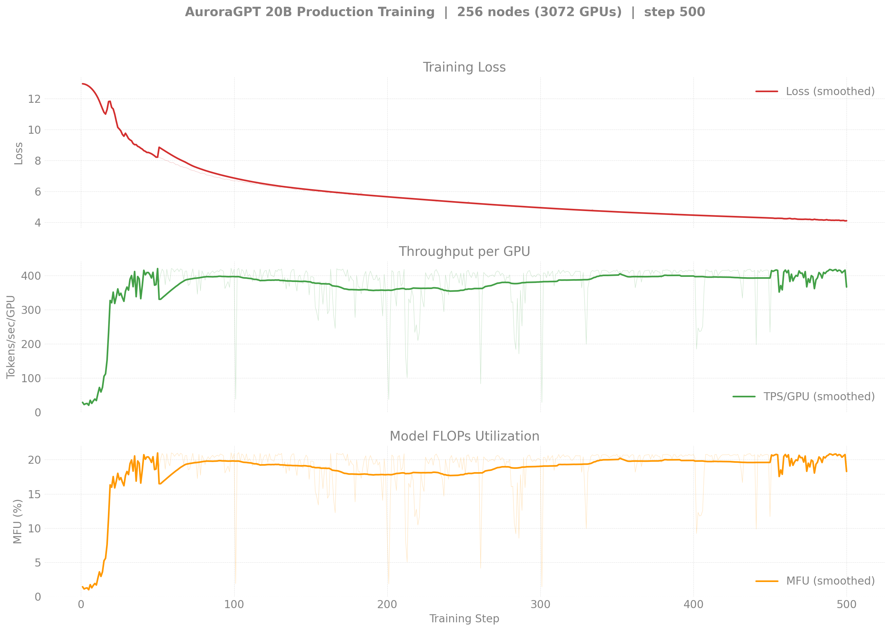
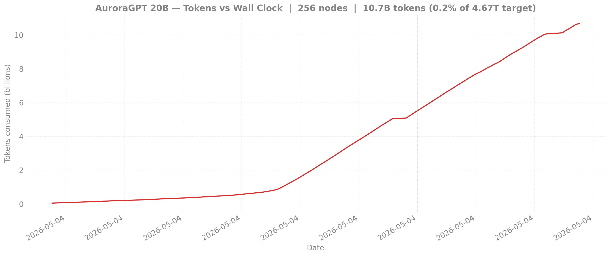

# Production Training — agpt 20B @ 256 nodes

> **Eval scores:** see [`docs/evals/agpt/20b/`](../../../../evals/agpt/20b/README.md)
> for the v1-vs-v2 lm-eval comparison (covers all 20B trajectories on
> shared axes).

## v2 — 20B @ 256N — SophiaG LR=2.28e-5 (fp32 master)

> Status: 8463659 ran for **9h walltime** then hit **NODE_FAIL** after
> step 364 (`shepherd died from signal 9` on node `x4406c6s7b0n0`,
> exit -20 — same recurring Aurora bad-node failure mode as 8459818
> and 8460301). step-300 ckpt saved cleanly; resumable. Throughput
> bounced between 21 and 410 TPS depending on concurrent flare
> bandwidth — when uncontested the run hit ~20% MFU; under contention
> (eval ckpt I/O, other yeet-env jobs) it dropped to ~1% MFU.
> Independent trajectory from the canonical 512N chain
> ([n512/](../n512/README.md)) — different ckpt dir
> (`gbs6144` vs `gbs12288`), starts fresh from step 0. Useful as a
> per-token comparator at the same optimizer state.

| Field | Value |
|-------|-------|
| Clone | `/flare/AuroraGPT/foremans/runs/agpt-20b-v2/torchtitan-ezpz/` |
| Submit script | [`scripts/submit_agpt_20b_aurora_venv.sh`](../../../../../scripts/submit_agpt_20b_aurora_venv.sh) (one script handles all v2 node counts via env vars) |
| Stack | torch 2.13 venv (yeet-env tarball mode) |
| Optimizer | SophiaG, LR=2.28e-5 |
| Compile | on |
| GBS | 6,144 (LBS=2) |
| Total steps | 92,859 |
| Total tokens | 4.67T |
| Checkpoint dir | `outputs/checkpoints/agpt-20b-sophiag-olmo-mix-1124-n256-gbs6144` |
| Checkpoint interval | 100 steps, keep_latest_k=0 (keep all) |
| W&B | [r1yyxbmt](https://wandb.ai/aurora_gpt/torchtitan.ezpz.train/runs/r1yyxbmt) |

### Loss / Throughput / MFU

### Diagnostics

### Tokens vs Wall Clock

### Progress

| Job ID | Walltime | Steps | Loss (start → end) | TPS/GPU | MFU | Status |
|--------|---------:|------:|-------------------:|--------:|----:|--------|
| 8463659 | 12h | 1–364 | 12.96 → **4.61** | 21-410 (variable) | 1-20% (variable) | **NODE_FAIL** after step 364 (`shepherd died from signal 9` on `x4406c6s7b0n0`, exit -20). step-100/200/300 ckpts saved. |

**Latest checkpoint:** step-300

**Tokens consumed:** 364 × 6,144 × 8,192 = **18.3B tokens** (0.39% of 4.67T target)

**Logs:**

- `8463659`: `/flare/AuroraGPT/foremans/runs/agpt-20b-v2/torchtitan-ezpz/agpt-20b-n256-v2.o8463659`

---

<strong>v1 — 20B @ 256N — SophiaG LR=2.28e-5 (bf16 master, BROKEN) — click to expand</strong>

This run is kept for the record. It uses `--training.dtype=bfloat16`
and has **frozen RMSNorm weights** — see
[`docs/guides/training-dtype-bf16-norm-freeze.md`](../../../../guides/training-dtype-bf16-norm-freeze.md).
Don't draw conclusions from these loss curves.

| Field | Value |
|-------|-------|
| Model | agpt_20b (20.7B params) |
| Submit script | [`submit/aurora/submit_agpt_20b.sh`](../../../../../submit/aurora/submit_agpt_20b.sh) (v1 torch 2.10 layout) |
| Nodes / GPUs | 256 / 3,072 |
| Parallelism | TP=1, FSDP=3072 |
| Compile | on |
| Optimizer | SophiaG, LR=2.28e-5 |
| GBS | 3,072 (LBS=1) |
| Total steps | 185,718 |
| Total tokens | 4.67T |
| Checkpoint dir | `outputs/checkpoints/agpt-20b-sophiag-olmo-mix-1124-n256-gbs3072` |

### Loss / Throughput / MFU (256N)

### Diagnostics (grad_norm / lr / max_loss)

### Tokens vs Wall Clock

> Diagnostic and tokens-vs-time figures are pulled from W&B by
> `torchtitan/experiments/ezpz/utils/plot_production_wandb.py`.

### Progress

| Job ID | Steps | Loss (start → end) | TPS/GPU | MFU | Memory | Status |
|--------|-------|---------------------|---------|-----|--------|--------|
| 8443212 | 1–100 | 12.93 → 11.84 | 280 | 14.0% | 40.95 GiB | Killed (qdel) |
| 8444123 | 100–581 | 11.84 → 7.35 | 248 | 12.4% | 43.95 GiB | Complete (walltime) |
| 8446340 | 501–1614 | 7.33 → 5.25 | 283 | 14.1% | — | Complete (walltime) |
| 8446341 | 1614–? | — | — | — | — | Complete |
| 8446342 | 1601–2562 | 5.26 → 4.83 | 280 | 14.0% | 44.38 GiB | Complete (walltime) |
| 8451749 | cont. | — | — | — | — | Queued |

**W&B:** [q9oq5huj](https://wandb.ai/aurora_gpt/torchtitan.ezpz.train/runs/q9oq5huj) (job 8443212), [pnkaurba](https://wandb.ai/aurora_gpt/torchtitan.ezpz.train/runs/pnkaurba) (job 8444123), [lrlv3xsc](https://wandb.ai/aurora_gpt/torchtitan.ezpz.train/runs/lrlv3xsc) (job 8446340)

**Latest checkpoint:** step-2500

**Tokens consumed:** 2562 × 3072 × 8192 = **64.5B tokens** (1.4% of target)

**Note:** TPS degraded to ~30-100 during final 2h due to concurrent 512N yeet-env
copies saturating the flare filesystem. Effective training time was ~8h of the 12h walltime.

**Logs:**

- `8443212`: `/lus/flare/projects/AuroraGPT/foremans/projects/saforem2/torchtitan-ezpz/agpt-20b-sophiag-n256.o8443212`
- `8444123`: `/lus/flare/projects/AuroraGPT/foremans/projects/saforem2/torchtitan-ezpz/agpt-20b-sophiag-n256.o8444123`
- `8446340`: `/lus/flare/projects/AuroraGPT/foremans/projects/saforem2/torchtitan-ezpz/agpt-20b-sophiag-n256.o8446340`
- `8446341`: `/lus/flare/projects/AuroraGPT/foremans/projects/saforem2/torchtitan-ezpz/agpt-20b-sophiag-n256.o8446341`
- `8446342`: `/lus/flare/projects/AuroraGPT/foremans/projects/saforem2/torchtitan-ezpz/agpt-20b-sophiag-n256.o8446342`
- `8451749`: `/lus/flare/projects/AuroraGPT/foremans/projects/saforem2/torchtitan-ezpz/agpt-20b-sophiag-olmo-mix-n256.o8451749`

