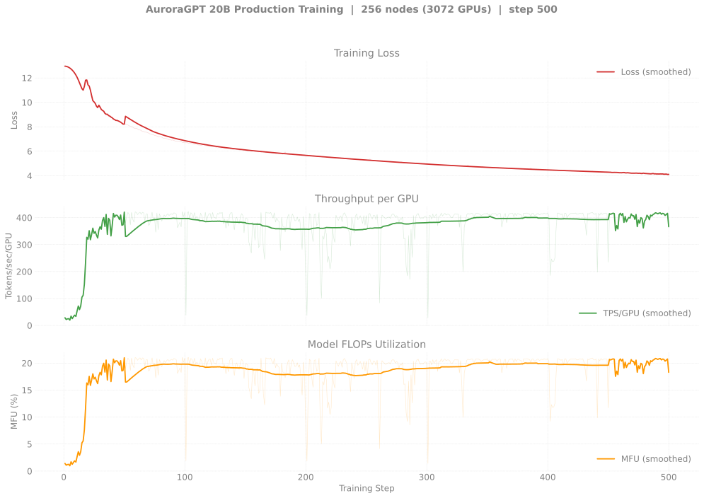
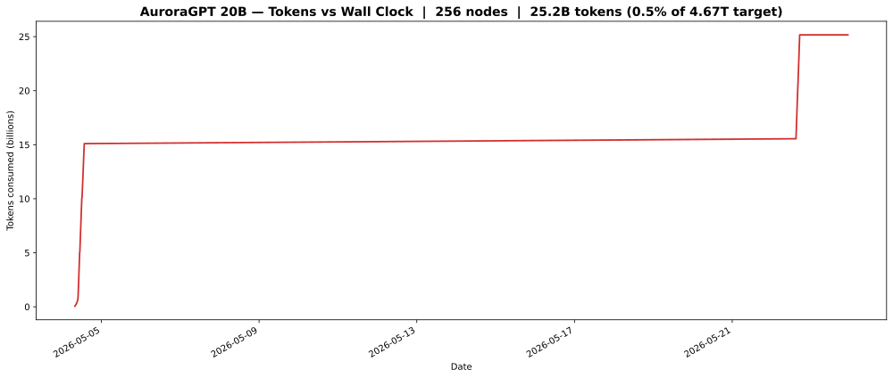

# Production Training — agpt 20B @ 256 nodes

> **Eval scores:** see [`docs/evals/agpt/20b/`](../../../../evals/agpt/20b/README.md)
> for the v2 lm-eval results.

## v2 — 20B @ 256N — SophiaG LR=2.28e-5 (fp32 master)

> Status (2026-05-11 evening): **Training again.** 8479581 (chain3
> retry) resumed from step-400 and is now at step **441, loss 4.30**
> (~2h22m elapsed). MFU bouncing 1.6–9.6% with flare contention but
> no crashes yet. Four runs so far: 8463659 NODE_FAIL @ 364
> (signal 9 on bad node), 8470102 + 8470103 chain both **gloo TCP
> timeouts at ~3h** (didn't reproduce on retry), then 8479581
> running cleanly. Independent trajectory from the canonical 512N
> chain ([n512/](../n512/README.md)) — different ckpt dir
> (`gbs6144` vs `gbs12288`), so it can't extend the chain — but
> useful as a per-token comparator at the same optimizer state.

| Field | Value |
|-------|-------|
| Clone | `/flare/AuroraGPT/foremans/runs/agpt-20b-n256/torchtitan-ezpz/` (relocated 2026-06-12 from `agpt-20b-v2/` to reduce Lustre dir-size pressure on the v2 subtree; `mv` was metadata-only on same FS, no data copy) |
| Submit script | [`scripts/submit_agpt_20b_aurora_venv_failover.sh`](../../../../../scripts/submit_agpt_20b_aurora_venv_failover.sh) (one script handles all v2 node counts via env vars) |
| Stack | torch 2.13 venv (yeet-env tarball mode; venv symlinked from `agpt-20b-v2/`) |
| Optimizer | SophiaG, LR=2.28e-5 |
| Compile | on |
| GBS | 6,144 (LBS=2) |
| Total steps | 92,859 |
| Total tokens | 4.67T |
| Checkpoint dir | `outputs/checkpoints/agpt-20b-sophiag-olmo-mix-1124-n256-gbs6144` (under new clone) |
| Checkpoint interval | 100 steps, keep_latest_k=0 (keep all) |
| W&B | [r1yyxbmt](https://wandb.ai/aurora_gpt/torchtitan.ezpz.train/runs/r1yyxbmt) |

### Loss / Throughput / MFU

### Diagnostics

### Tokens vs Wall Clock

### Progress

| Job ID | Date | Walltime | Steps | Loss (start → end) | TPS/GPU | MFU | Status |
|--------|------|---------:|------:|-------------------:|--------:|----:|--------|
| [`8463659`](#log-8463659) | 2026-05-04 | 12h | 1–364 | 12.96 → 4.61 | 21-410 (variable) | 1-20% (variable) | **NODE_FAIL** after step 364 (`shepherd died from signal 9` on `x4406c6s7b0n0`, exit -20). step-100/200/300 ckpts saved. |
| [`8470102`](#log-8470102) | 2026-05-08 | 12h | 300–~500 | 4.61 → ~5.5 | varies | varies | **Crashed** @ 3h15m (gloo TCP timeout `Connection closed by peer`, multiple ranks). step-400 ckpt saved. |
| [`8470103`](#log-8470103) | 2026-05-08 | 12h | 300–~500 | (resumed but) | — | — | **Crashed** @ 2h59m (also gloo TCP timeout). |
| [`8479581`](#log-8479581) | 2026-05-11 | 12h | 400–500 | (resumed) → 4.08 | 31-419 (variable) | 1.6-20.9% (variable) | **Crashed** @ 3h39m (also gloo TCP timeout, peer 10.115.83.2; exit 0). step-500 ckpt saved. |
| [`8479582`](#log-8479582) | 2026-05-11 | 12h | 500+ | — | — | — | Released, Q to resume from step-500 |
| [`8481646`](#log-8481646) | 2026-05-21 | 12h | 301-500 (logged) | 4.95 → 4.12 | ~405 (steady) | **~20%** | **Failover wrapper validated end-to-end**: attempt 1 ran 2h33m, hit gloo crash from `x4110c3s3b0n0`, wrapper auto-swapped in spare `x4114c7s4b0n0`. **No new ckpts persisted** — `step-400` ckpt dir is empty (May 8 stale from `8470102`) and `step-500` was never written (async save killed by walltime). Attempt 2 only had 98s of parent walltime left. The wrapper's swap+retry path is proven; the training-progress contribution is zero. See [failover writeup](../../../../experiments/agpt/aurora/20260521-failover-validated-8481646.md). |

**Latest *complete* checkpoint:** step-300 (8463659 era; `step-400` dir is empty, `step-500` doesn't exist)

**Cumulative *persisted* steps:** 300

**Tokens consumed (persisted):** 300 × 6,144 × 8,192 = **15B tokens** (0.32% of 4.67T target)

> 8479581 + 8470102 + 8481646 all *logged* steps past 300 (up to ~500
> across the runs), but **no async ckpt save past step-300 has
> successfully finalized on disk** — every crash has been mid-save.
> The continuation chain has been retracing the same 200-step
> window for three weeks. Track the persisted-vs-logged gap in
> the writeup.

### Logs

| Job ID | Path |
|--------|------|
| `8463659` | `/flare/AuroraGPT/foremans/runs/agpt-20b-v2/torchtitan-ezpz/agpt-20b-n256-v2.o8463659` |
| `8470102` | `/flare/AuroraGPT/foremans/runs/agpt-20b-v2/torchtitan-ezpz/agpt-20b-n256-v2-chain1.o8470102` |
| `8470103` | `/flare/AuroraGPT/foremans/runs/agpt-20b-v2/torchtitan-ezpz/agpt-20b-n256-v2-chain2.o8470103` |
| `8479581` | `/flare/AuroraGPT/foremans/runs/agpt-20b-v2/torchtitan-ezpz/agpt-20b-n256-v2-chain3.o8479581` |
| `8479582` | `/flare/AuroraGPT/foremans/runs/agpt-20b-v2/torchtitan-ezpz/agpt-20b-n256-v2-chain4.o8479582` |
| `8481646` | `/flare/AuroraGPT/foremans/runs/agpt-20b-v2/torchtitan-ezpz/agpt-20b-n256-v2-failover-chain1.o8481646` + `logs/failover-8481646/{attempt-1,attempt-2}.log` |
