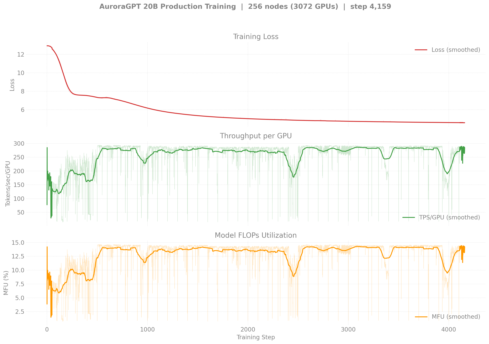
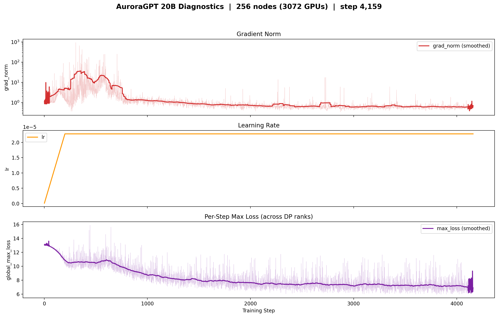
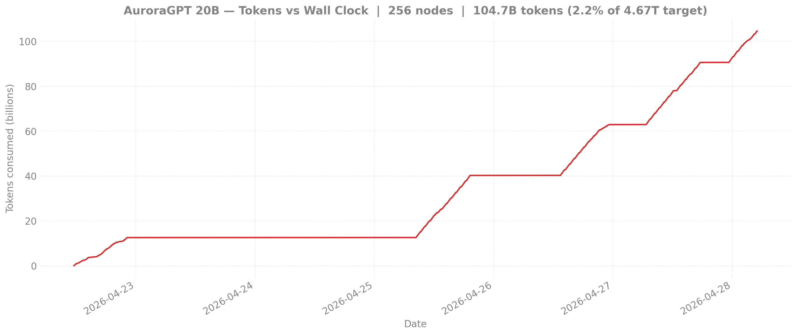

# Production Training — agpt 20B @ 256 nodes

> **No v2 data at 256N.** The v2 256N job (8463659) is queued at the
> time of writing — production at 20B is consolidated on the
> [n512 chain](../n512/README.md). Once 8463659 runs and saves
> checkpoints, this page will gain a v2 section above the historical
> v1 block.
>
> **Eval scores:** see [`docs/evals/agpt/20b/`](../../../../evals/agpt/20b/README.md)
> for the v1-vs-v2 lm-eval comparison.

<strong>v1 — 20B @ 256N — SophiaG LR=2.28e-5 (bf16 master, BROKEN)</strong>

This run is kept for the record. It uses `--training.dtype=bfloat16`
and has **frozen RMSNorm weights** — see
[`docs/guides/training-dtype-bf16-norm-freeze.md`](../../../../guides/training-dtype-bf16-norm-freeze.md).
Don't draw conclusions from these loss curves.

| Field | Value |
|-------|-------|
| Model | agpt_20b (20.7B params) |
| Nodes / GPUs | 256 / 3,072 |
| Parallelism | TP=1, FSDP=3072 |
| Compile | on |
| Optimizer | SophiaG, LR=2.28e-5 |
| GBS | 3,072 (LBS=1) |
| Total steps | 185,718 |
| Total tokens | 4.67T |
| Checkpoint dir | `outputs/checkpoints/agpt-20b-sophiag-olmo-mix-1124-n256-gbs3072` |

### Loss / Throughput / MFU (256N)

### Diagnostics (grad_norm / lr / max_loss)

### Tokens vs Wall Clock

> Diagnostic and tokens-vs-time figures are pulled from W&B by
> `torchtitan/experiments/ezpz/utils/plot_production_wandb.py`.

### Progress

| Job ID | Steps | Loss (start → end) | TPS/GPU | MFU | Memory | Status |
|--------|-------|---------------------|---------|-----|--------|--------|
| 8443212 | 1–100 | 12.93 → 11.84 | 280 | 14.0% | 40.95 GiB | Killed (qdel) |
| 8444123 | 100–581 | 11.84 → 7.35 | 248 | 12.4% | 43.95 GiB | Complete (walltime) |
| 8446340 | 501–1614 | 7.33 → 5.25 | 283 | 14.1% | — | Complete (walltime) |
| 8446341 | 1614–? | — | — | — | — | Complete |
| 8446342 | 1601–2562 | 5.26 → 4.83 | 280 | 14.0% | 44.38 GiB | Complete (walltime) |
| 8451749 | cont. | — | — | — | — | Queued |

**W&B:** [q9oq5huj](https://wandb.ai/aurora_gpt/torchtitan.ezpz.train/runs/q9oq5huj) (job 8443212), [pnkaurba](https://wandb.ai/aurora_gpt/torchtitan.ezpz.train/runs/pnkaurba) (job 8444123), [lrlv3xsc](https://wandb.ai/aurora_gpt/torchtitan.ezpz.train/runs/lrlv3xsc) (job 8446340)

**Latest checkpoint:** step-2500

**Tokens consumed:** 2562 × 3072 × 8192 = **64.5B tokens** (1.4% of target)

**Note:** TPS degraded to ~30-100 during final 2h due to concurrent 512N yeet-env
copies saturating the flare filesystem. Effective training time was ~8h of the 12h walltime.

