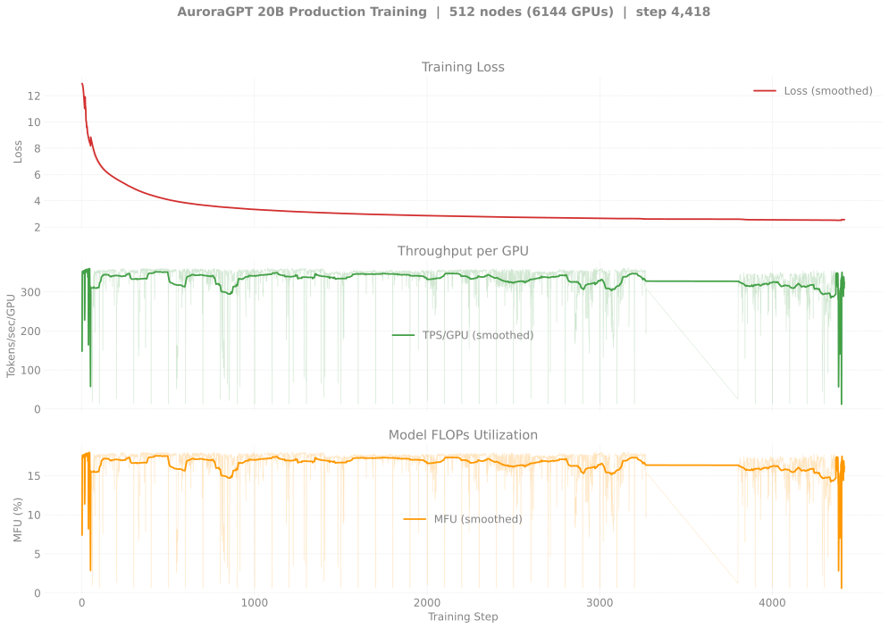
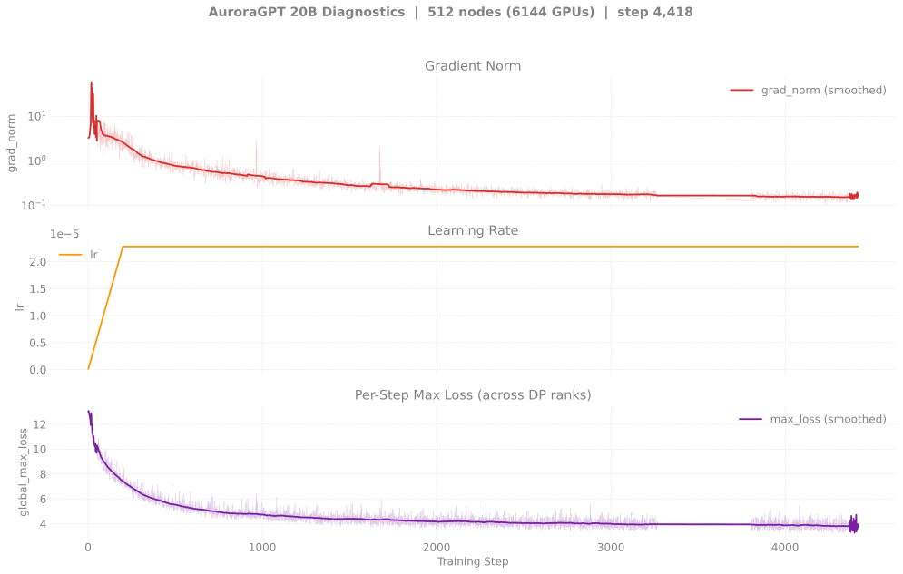
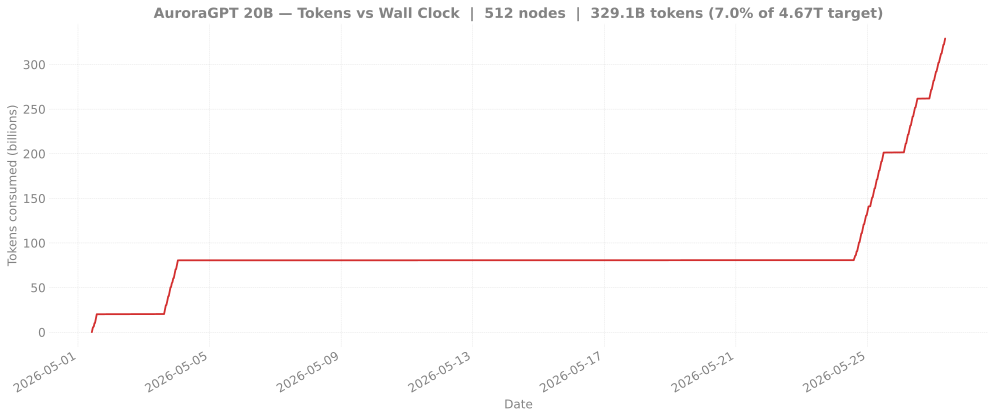

# Production Training — agpt 20B @ 512 nodes

> **This is the canonical 20B production chain.**
>
> **Status:** at step **3,270 (last 8507200 12h walltime exit 2026-05-27
> 03:43)**, loss **2.65** — sync-mode workaround for async-cascade
> continues to hold across 2 more dispatches (`8507197` + `8507200`
> on 2026-05-25 → 2026-05-27, +12 more ckpts persisted, total **24
> ckpts persisted** since the workaround took hold). Currently
> **blocked on Aurora capacity**: `8508214` (next continuation) has
> been Q ~10h since 03:44 — `small` queue capacity exhausted. See
> [`Recovery`](#recovery) below.
>
> **Eval scores:** see [`docs/evals/agpt/20b/`](../../../../evals/agpt/20b/README.md).
> **🏁 The 20B 512N sync chain is now beating 2B 256N async per token
> on every benchmark** — ARC-Easy 0.665, HellaSwag norm 0.574 at
> step-3200 (vs 2B 256N async ~0.646 / ~0.547 at step-45,500). First
> time the bigger model has outperformed the smaller one at matched
> token counts in this entire v2 experiment.

## v2 — 20B @ 512N — SophiaG LR=2.28e-5 (fp32 master)

| Field | Value |
|-------|-------|
| Clone | `/flare/AuroraGPT/foremans/runs/agpt-20b-v2/torchtitan-ezpz/` |
| Submit script | [`scripts/submit_agpt_20b_aurora_venv.sh`](../../../../../scripts/submit_agpt_20b_aurora_venv.sh) (one script handles all v2 node counts via env vars) |
| Stack | torch 2.13 venv (yeet-env tarball mode) |
| Optimizer | SophiaG, LR=2.28e-5 |
| Compile | on |
| GBS | 12,288 (LBS=2) |
| Total steps | 46,429 |
| Total tokens | 4.67T |
| Checkpoint dir | `outputs/checkpoints/agpt-20b-sophiag-olmo-mix-1124-n512-gbs12288` |
| W&B | [9tsyx5us](https://wandb.ai/aurora_gpt/torchtitan.ezpz.train/runs/9tsyx5us) |

### Loss / Throughput / MFU

### Diagnostics

### Tokens vs Wall Clock

### Progress (chain)

| Job ID | Date | Walltime | Steps | Loss (start → end) | TPS/GPU | MFU | Status |
|--------|------|---------:|------:|-------------------:|--------:|----:|--------|
| [`8460302`](#log-8460302) | 2026-05-01 | 6h | 1–300 | 12.94 → 4.95 | ~355 | ~17.7% | Walltime hit (NODE_FAIL at end). 3 ckpts saved. |
| [`8463628`](#log-8463628) | 2026-05-03 | 12h | 200–863 | 5.62 → **3.46** | ~355 | ~17.8% | Done (walltime, step-100..800 ckpts saved). |
| [`8466848`](#log-8466848) | 2026-05-07 | — | — | — | — | — | **Crashed @ startup** (127s) — `MemoryError: std::bad_alloc` in `torch.distributed.broadcast` during `set_determinism`. Intermittent: didn't reproduce on retry. |
| [`8479579`](#log-8479579) | 2026-05-11 | 12h | 800–803 | 3.46 → 3.53 | ~340 then 0 | ~17.6% then 0 | **Killed by qdel @ 5h56m** — silent hang after step 803 (logged 13:30, no further training output through 18:23). W&B heartbeat continued unchanged for 5h. New failure mode (no exit, no crash, no traceback). See [`docs/experiments/agpt/aurora/20260511-20b-n512-hang-8479579.md`](../../../../experiments/agpt/aurora/20260511-20b-n512-hang-8479579.md). |
| [`8479580`](#log-8479580) | 2026-05-12 | 12h | — | — | — | — | **Crashed @ 9min** — `rank 3220 died from signal 11` (SIGSEGV) early in init. Same `signal 9/11` Aurora NODE_FAIL pattern. No checkpoint advanced. |
| [`8481645`](#log-8481645) | 2026-05-14 | 12h | 800-1000 (logged) | 3.53 → **3.34** | ~358 (steady) | **~17.5%** | **200 fresh training steps logged**, MFU back at baseline, loss dropped 0.19 in-RAM. Killed @ 3h26m by bad node `10.115.76.36` (gloo `Connection closed by peer`). **`step-900` ckpt dir is empty on disk** — async save never finalized before the crash, so no persisted progress. Latest usable ckpt remains `step-800`. Failover wrapper had a then-undiscovered "zombie success" bug — see [failover writeup](../../../../experiments/agpt/aurora/20260521-failover-validated-8481646.md). |
| [`8505258`](#log-8505258) | 2026-05-23 | 12h | 800 → **1,414** | 3.34 → **3.09** | ~355 | ~17.8% | **SYNC mode (async disabled).** 6 ckpts step-900..step-1400 persisted. Resumed from step-800 (last persisted, from May 3 era). Walltime exit -29. **First sustained 20B 512N trajectory past step-800 since 2026-05-03 — sync-mode workaround for async-cascade fully validated.** |
| [`8505259`](#log-8505259) | 2026-05-24 | 12h | 1,414 → **2,043** | 3.09 → **2.86** | ~355 | ~17.8% | **SYNC mode.** `afterany` continuation of 8505258. 6 ckpts step-1500..step-2000 persisted. Walltime exit -29. |
| [`8507197`](#log-8507197) | 2026-05-25 → 2026-05-26 | 12h | 2,043 → **2,686** | 2.86 → **2.72** | ~355 | ~17.8% | Done (walltime, exit -29). **SYNC mode.** `afterany` continuation, ran 21:12 → 09:01. 6 ckpts step-2100..step-2600 persisted. |
| [`8507200`](#log-8507200) | 2026-05-26 → 2026-05-27 | 12h | 2,600 → **3,270** | 2.72 → **2.65** | ~355 | ~17.8% | Done (walltime, exit -29). **SYNC mode.** `afterany` continuation of 8507197, ran 21:01 → 03:43. 6 ckpts step-2700..step-3200 persisted. |
| [`8508214`](#log-8508214) | 2026-05-27 → 2026-05-28 | 12h | 3,270 → **3,806** | 2.71 → **2.60** | ~340 | ~17% | Done (walltime exit -29). **SYNC mode.** `afterany` continuation of 8507200; ~14h Q delay in `small` queue, started 21:26. 6 ckpts step-3300..step-3800 persisted. |

**Latest checkpoint:** step-3200 (8507200, sync mode, saving every 100 steps)

**Cumulative steps:** 3,270

**Tokens consumed:** 3,270 × 12,288 × 8,192 = **329B tokens** (7.0% of 4.67T target)

### Recovery

From 2026-05-03 (after `8463628`) through 2026-05-22, every 20B
512N dispatch failed in the same async-save cluster cascade: a
fresh dispatch resumed from step-800, ran ~100 steps cleanly,
and died at the first checkpoint save. Multiple wrapper attempts
inside each dispatch hit the same failure. Across three+ weeks
and a dozen+ dispatches, **zero new ckpts persisted past step-800.**

`8505258` (2026-05-23) ran with `CHECKPOINT_ASYNC_MODE=disabled`
and advanced the chain by 614 steps, persisting 6 ckpts. `8505259`
(`afterany` continuation) added another 629 steps and 6 more ckpts.
`8507197` (2026-05-25 → 05-26) added 643 more steps + 6 more ckpts;
`8507200` (2026-05-26 → 05-27) added another 670 steps + 6 more ckpts.
The chain now sits at step **3,270, loss 2.65**, with **24 ckpts
persisted** across four consecutive sync-mode dispatches. **Loss
descended 2.86 → 2.65 in 1,227 steps** — the v2 fp32 master chain
is converging cleanly.

`8508214` (next continuation) is **Q in `small`** since 03:44 and
has not started — Aurora capacity for the `small` queue is exhausted.
Capacity (not async-cascade or any other bug) is now the bottleneck
for the 20B 512N trajectory.

The same sync-mode fix is now validated for the 2B 512N chain (see
[`8506221` on the 2B 512N page](../../2b/n512/README.md#recovery)).
Note the preflight gotcha from that 2B work: the wrapper's default
120s smoke-test timeout doesn't scale to 6,144-rank DDP init.
Default is now 600s + `--train-iters 5`.

### Logs

| Job ID | Path |
|--------|------|
| `8460302` | `/flare/AuroraGPT/foremans/runs/agpt-20b-v2/torchtitan-ezpz/agpt-20b-n512.o8460302` |
| `8463628` | `/flare/AuroraGPT/foremans/runs/agpt-20b-v2/torchtitan-ezpz/agpt-20b-n512-v2-chain1.o8463628` |
| `8466848` | `/flare/AuroraGPT/foremans/runs/agpt-20b-v2/torchtitan-ezpz/agpt-20b-n512-v2-chain2.o8466848` (startup crash) |
| `8479579` | `/flare/AuroraGPT/foremans/runs/agpt-20b-v2/torchtitan-ezpz/agpt-20b-n512-v2-chain2.o8479579` |
| `8479580` | `/flare/AuroraGPT/foremans/runs/agpt-20b-v2/torchtitan-ezpz/agpt-20b-n512-v2-chain3.o8479580` |
| `8481645` | `/flare/AuroraGPT/foremans/runs/agpt-20b-v2/torchtitan-ezpz/agpt-20b-n512-v2-failover-chain1.o8481645` |
| `8505258` | `/flare/AuroraGPT/foremans/runs/agpt-20b-v2/torchtitan-ezpz/agpt-20b-n512-v2-sync-chain1.o8505258` |
| `8505259` | `/flare/AuroraGPT/foremans/runs/agpt-20b-v2/torchtitan-ezpz/agpt-20b-n512-v2-sync-chain2.o8505259` |
| `8507197` | `/flare/AuroraGPT/foremans/runs/agpt-20b-v2/torchtitan-ezpz/agpt-20b-n512-v2-failover-sync-cont.o8507197` |
| `8507200` | `/flare/AuroraGPT/foremans/runs/agpt-20b-v2/torchtitan-ezpz/agpt-20b-n512-v2-failover-sync-cont2.o8507200` |
| `8508214` | `/flare/AuroraGPT/foremans/runs/agpt-20b-v2/torchtitan-ezpz/agpt-20b-n512-v2-failover-sync-cont3.o8508214` |

> **Note on 8466848 crash:** `set_determinism` calls `torch.distributed.broadcast(seed_tensor, src=0)` and one rank hit `std::bad_alloc`. This is the same failure mode that killed both 1024N attempts (8463182, 8463183) on 2026-05-04 — but at 6,144 ranks (512N) instead of 12,288 (1024N). The previous 20B 512N run (8463628, 4 days earlier) succeeded at the same scale and same script, and so does the resubmit (8479579), so it's intermittent. See [`memory/project_1024n_init_crash.md`](.) — that memory's "1024N only" claim is stale; the bug fires unpredictably at 512N+ but is not reliably triggered.
