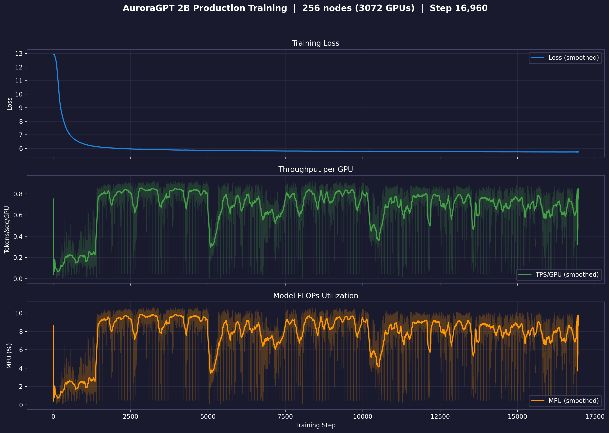

# Production Training — agpt 2B

> **2026-04-29 — known issue affecting steps 1–33,740 of the 256N
> SophiaG run:** training was launched with `training.dtype = bfloat16`
> (default at the time), which silently freezes every RMSNorm.weight
> at its 1.0 init because per-step updates are sub-ulp at bf16 scale.
> Loss curves are real but the model has no trainable normalization.
> Default flipped to `float32` going forward; existing checkpoints
> are tainted but resumable (norms will start updating from this point
> on). See
> [`docs/guides/training-dtype-bf16-norm-freeze.md`](../../../guides/training-dtype-bf16-norm-freeze.md).

## 2B @ 256N — SophiaG LR=2.28e-5

| Field | Value |
|-------|-------|
| Model | agpt_2b (1.99B params) |
| Nodes / GPUs | 256 / 3,072 |
| Parallelism | TP=1, FSDP=3072 |
| Compile | on |
| Optimizer | SophiaG, LR=2.28e-5 |
| GBS | 3,072 (LBS=1) |
| Total steps | 185,718 |
| Total tokens | 4.67T |
| Seq len | 8,192 |
| Checkpoint dir | `outputs/checkpoints/agpt-2b-sophiag-olmo-mix-1124-n256-gbs3072` |
| Checkpoint interval | 100 steps |

### Loss / Throughput / MFU



### Diagnostics (grad_norm / lr / max_loss)


### Tokens vs Wall Clock


> Diagnostic and tokens-vs-time figures are pulled from W&B by
> `torchtitan/experiments/ezpz/utils/plot_production_wandb.py`.

### Progress

| Job ID | Steps | Loss (start → end) | TPS/GPU | MFU | Memory | Status |
|--------|-------|---------------------|---------|-----|--------|--------|
| 8444122 | 1–1431 | 12.94 → 6.13 | 489 | 1.8% | 47.12 GiB | Complete (walltime) |
| 8446337 | 1401–9876 | 6.13 → 5.78 | 1,794 | 6.7% | — | Complete (walltime) |
| 8446338 | 9876–17424 | 5.78 → 5.73 | 2,280 | 8.6% | 47.02 GiB | Complete (walltime) |
| 8446339 | 17401–17518+ | 5.73 → 5.73 | 761 | 2.9% | 47.02 GiB | **Running** |

**W&B:** [pjanidnw](https://wandb.ai/aurora_gpt/torchtitan.ezpz.train/runs/pjanidnw) (job 8444122), [4u9w23p9](https://wandb.ai/aurora_gpt/torchtitan.ezpz.train/runs/4u9w23p9) (job 8446337)

**Latest checkpoint:** step-17400

**Tokens consumed:** 17518 × 3072 × 8192 = **441.1B tokens** (9.4% of target)

**Note:** TPS degraded significantly (2,400 → 40-700) during 8446338/8446339 due to
concurrent 512N yeet-env copies saturating the flare filesystem. 512N venv jobs were
killed; throughput is recovering.

---

## 2B @ 512N — SophiaG LR=2.28e-5 (no compile)

| Field | Value |
|-------|-------|
| Model | agpt_2b (1.99B params) |
| Nodes / GPUs | 512 / 6,144 |
| Parallelism | TP=1, FSDP=6144 |
| Compile | **off** (OOM at 512N) |
| Optimizer | SophiaG, LR=2.28e-5 |
| GBS | 6,144 (LBS=1) |
| Total steps | 92,859 |
| Total tokens | 4.67T |
| Checkpoint dir | `outputs/checkpoints/agpt-2b-sophiag-olmo-mix-1124-n512-gbs6144` |

### Progress

| Job ID | Steps | Loss | TPS/GPU | MFU | Memory | Status |
|--------|-------|------|---------|-----|--------|--------|
| 8443818 | 0 | — | — | — | — | OOM (compile) |
| 8446349 | 0 | — | — | — | — | Segfault (signal 11) |
| 8446350 | — | — | — | — | — | Queued |

### Job Chains

```
2B-256N (torch 2.10, LBS=1): 8446337 → 8446338 → 8446339 → 8451750 → 8451752
2B-512N (torch 2.10, LBS=1): 8446349 → 8446350
2B-512N (torch 2.13, LBS=2): 8451723 → 8451724 (killed — yeet-env saturated flare)
```
