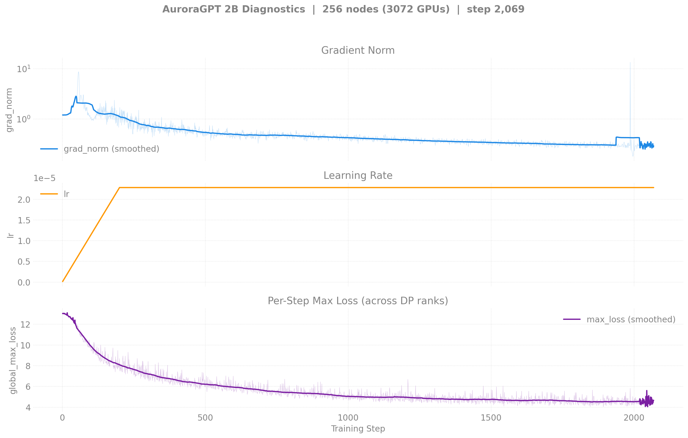
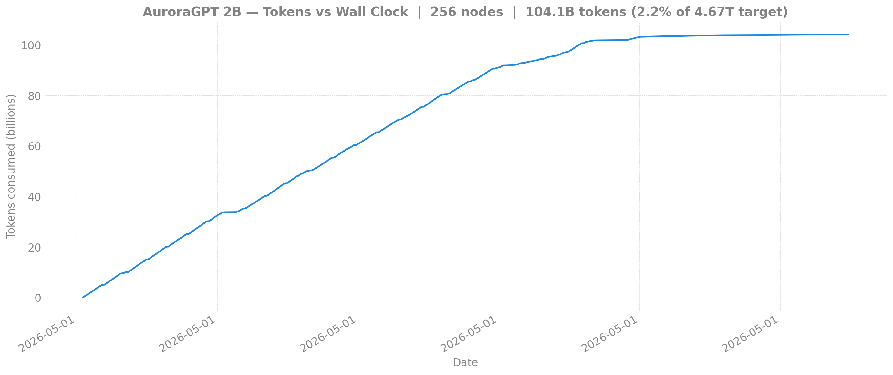
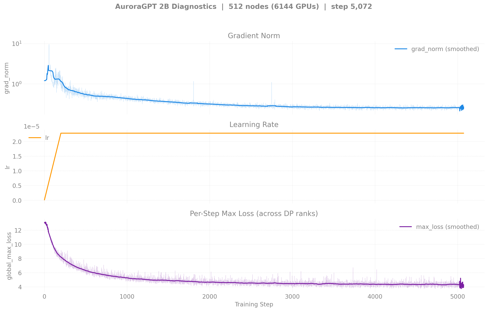
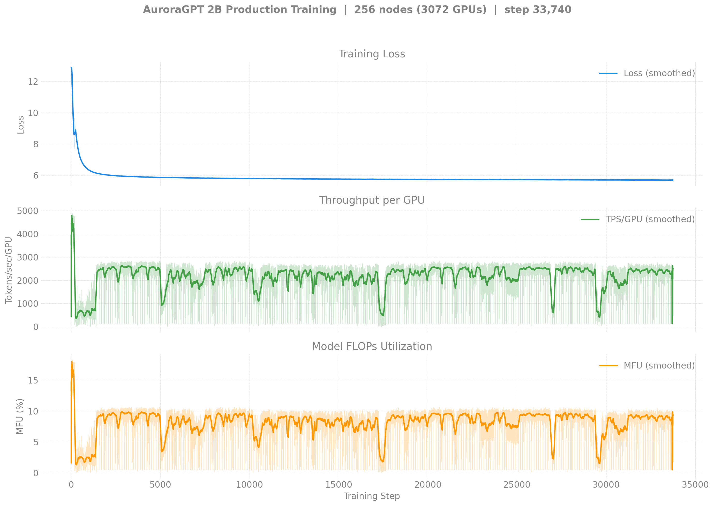

# Production Training — agpt 2B

> **2026-04-30 — restarted from scratch in `agpt-2b-v2/` clone.** The
> original 2B 256N run (and its 80B/20B siblings) was found to have a
> silent `training.dtype = bfloat16` master-weight bug that freezes
> every RMSNorm.weight at its 1.0 init (per-step updates are sub-ULP
> at bf16). Loss curves looked plausible but the model had no
> trainable normalization. Default flipped to `float32`; v2 runs
> below are clean restarts on the new clone. See
> [`docs/guides/training-dtype-bf16-norm-freeze.md`](../../../guides/training-dtype-bf16-norm-freeze.md)
> for the diagnosis.

## v1 vs v2 — overlay

v1 (gray, bf16 master, broken) ran for 33,713 steps; v2 (blue, fp32
master, current) is in early training. Both descend on the *training*
loss because attention/FFN weights are unfrozen — the difference shows
up at eval time, since v1's RMSNorm weights stayed at their 1.0 init.
v2 256N visibly descends faster per-step than v1, consistent with the
v2 stack also using LBS=2 (vs LBS=1 in v1) so each step covers 2× the
tokens.


Generated by:
```bash
python3 torchtitan/experiments/ezpz/utils/plot_production_wandb.py --overlay 2b
```

## v2 — 2B @ 256N — SophiaG LR=2.28e-5 (fp32 master, **no continuation**)

> Status: ran one job (8459818, 6h, NODE_FAIL after step 2070, 20 ckpts
> saved). No continuation chained — production is currently
> consolidated on the **2B 512N** chain below. Resumable from
> `outputs/checkpoints/.../n256-gbs6144/step-2000` if we want to revisit.

| Field | Value |
|-------|-------|
| Clone | `/flare/AuroraGPT/foremans/runs/agpt-2b-v2/torchtitan-ezpz/` |
| Stack | torch 2.13 venv (yeet-env tarball mode) |
| Optimizer | SophiaG, LR=2.28e-5 |
| Compile | off |
| GBS | 6,144 (LBS=2) |
| Total steps | 92,859 |
| Total tokens | 4.67T |
| Checkpoint dir | `outputs/checkpoints/agpt-2b-sophiag-olmo-mix-1124-n256-gbs6144` |
| Checkpoint interval | 100 steps, keep_latest_k=0 (keep all) |
| W&B | [lytjeegk](https://wandb.ai/aurora_gpt/torchtitan.ezpz.train/runs/lytjeegk) |

### Loss / Throughput / MFU


### Diagnostics



### Tokens vs Wall Clock



### Progress

| Job ID | Steps | Loss (start → end) | TPS/GPU | MFU | Status |
|--------|-------|---------------------|---------|-----|--------|
| 8459818 | 1–2070 | 12.93 → 3.33 | ~3,500 | ~13% | NODE_FAIL after step 2070 (single bad node dragged TPS to ~30 then killed). 20 ckpts saved (every 100 steps). |

**Latest checkpoint:** step-2000

**Tokens consumed:** 2070 × 6144 × 8192 = **104B tokens** (2.2% of target)

---

## v2 — 2B @ 512N — SophiaG LR=2.28e-5 (fp32 master)

| Field | Value |
|-------|-------|
| Clone | `/flare/AuroraGPT/foremans/runs/agpt-2b-v2/torchtitan-ezpz/` |
| Stack | torch 2.13 venv (yeet-env tarball mode) |
| Compile | off |
| GBS | 12,288 (LBS=2) |
| Total steps | 46,429 |
| Total tokens | 4.67T |
| Checkpoint dir | `outputs/checkpoints/agpt-2b-sophiag-olmo-mix-1124-n512-gbs12288` |
| W&B chain | [i252kps9](https://wandb.ai/aurora_gpt/torchtitan.ezpz.train/runs/i252kps9) → [d4hlr8qe](https://wandb.ai/aurora_gpt/torchtitan.ezpz.train/runs/d4hlr8qe) |

### Loss / Throughput / MFU


### Diagnostics



### Progress (chain)

| Job ID | Walltime | Steps | Loss (start → end) | TPS/GPU | MFU | Status |
|--------|---------:|------:|-------------------:|--------:|----:|--------|
| 8460301 | 6h | 1–1387 | 12.65 → 3.59 | ~2,700 | ~10% | NODE_FAIL after step 1387. 13 ckpts saved. |
| 8463626 | 12h | 1300–5073 | 3.59 → 2.97 | ~2,700 | ~10% | Walltime hit (NODE_FAIL at end). **50 ckpts saved (every 100 steps).** |
| 8463627 | 12h | 5000+ | — | — | — | **Queued** (will auto-resume from step-5000) |

**Latest checkpoint:** step-5000

**Cumulative steps:** 5,073

**Tokens consumed:** 5,073 × 12,288 × 8,192 = **510B tokens** (10.9% of 4.67T target)

---

<details>
<summary><strong>v1 — Historical (bf16-tainted, superseded by v2) — click to expand</strong></summary>

The runs below are kept for the record. They use `--training.dtype=bfloat16`
and have **frozen RMSNorm weights** — see the warning at the top of this
file. Don't draw conclusions from these loss curves.

### v1 — 2B @ 256N — SophiaG LR=2.28e-5 (bf16 master, BROKEN)

| Field | Value |
|-------|-------|
| Model | agpt_2b (1.99B params) |
| Nodes / GPUs | 256 / 3,072 |
| Parallelism | TP=1, FSDP=3072 |
| Compile | on |
| Optimizer | SophiaG, LR=2.28e-5 |
| GBS | 3,072 (LBS=1) |
| Total steps | 185,718 |
| Total tokens | 4.67T |
| Seq len | 8,192 |
| Checkpoint dir | `outputs/checkpoints/agpt-2b-sophiag-olmo-mix-1124-n256-gbs3072` |
| Checkpoint interval | 100 steps |

#### Loss / Throughput / MFU



#### Diagnostics (grad_norm / lr / max_loss)


#### Tokens vs Wall Clock


> Diagnostic and tokens-vs-time figures are pulled from W&B by
> `torchtitan/experiments/ezpz/utils/plot_production_wandb.py`.

#### Progress

| Job ID | Steps | Loss (start → end) | TPS/GPU | MFU | Memory | Status |
|--------|-------|---------------------|---------|-----|--------|--------|
| 8444122 | 1–1431 | 12.94 → 6.13 | 489 | 1.8% | 47.12 GiB | Complete (walltime) |
| 8446337 | 1401–9876 | 6.13 → 5.78 | 1,794 | 6.7% | — | Complete (walltime) |
| 8446338 | 9876–17424 | 5.78 → 5.73 | 2,280 | 8.6% | 47.02 GiB | Complete (walltime) |
| 8446339 | 17401–17518+ | 5.73 → 5.73 | 761 | 2.9% | 47.02 GiB | **Running** |

**W&B:** [pjanidnw](https://wandb.ai/aurora_gpt/torchtitan.ezpz.train/runs/pjanidnw) (job 8444122), [4u9w23p9](https://wandb.ai/aurora_gpt/torchtitan.ezpz.train/runs/4u9w23p9) (job 8446337)

**Latest checkpoint:** step-17400

**Tokens consumed:** 17518 × 3072 × 8192 = **441.1B tokens** (9.4% of target)

**Note:** TPS degraded significantly (2,400 → 40-700) during 8446338/8446339 due to
concurrent 512N yeet-env copies saturating the flare filesystem. 512N venv jobs were
killed; throughput is recovering.

---

### v1 — 2B @ 512N — SophiaG LR=2.28e-5 (bf16 master, BROKEN)

| Field | Value |
|-------|-------|
| Model | agpt_2b (1.99B params) |
| Nodes / GPUs | 512 / 6,144 |
| Parallelism | TP=1, FSDP=6144 |
| Compile | **off** (OOM at 512N) |
| Optimizer | SophiaG, LR=2.28e-5 |
| GBS | 6,144 (LBS=1) |
| Total steps | 92,859 |
| Total tokens | 4.67T |
| Checkpoint dir | `outputs/checkpoints/agpt-2b-sophiag-olmo-mix-1124-n512-gbs6144` |

#### Progress

| Job ID | Steps | Loss | TPS/GPU | MFU | Memory | Status |
|--------|-------|------|---------|-----|--------|--------|
| 8443818 | 0 | — | — | — | — | OOM (compile) |
| 8446349 | 0 | — | — | — | — | Segfault (signal 11) |
| 8446350 | — | — | — | — | — | Queued |

#### Job Chains

```
2B-256N (torch 2.10, LBS=1): 8446337 → 8446338 → 8446339 → 8451750 → 8451752
2B-512N (torch 2.10, LBS=1): 8446349 → 8446350
2B-512N (torch 2.13, LBS=2): 8451723 → 8451724 (killed — yeet-env saturated flare)
```

</details>
