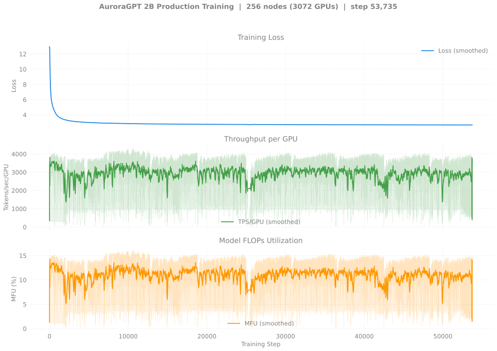
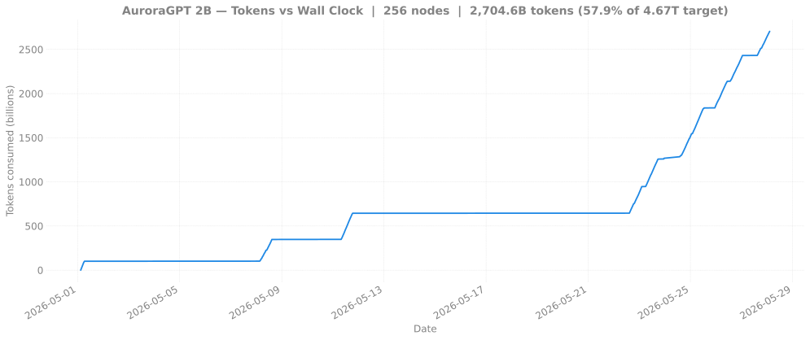

# Production Training — agpt 2B @ 256 nodes

> **Eval scores:** see [`docs/evals/agpt/2b/`](../../../../evals/agpt/2b/README.md)
> for the v2 lm-eval results.

## v2 — 2B @ 256N — SophiaG LR=2.28e-5 (fp32 master)

> Status: at step **49,666+ (8508020 R as of 2026-05-27 12:37)**, loss 2.68.
> Chain advanced +13,138 steps across 3 more dispatches on
> 2026-05-25 → 2026-05-27 (`8507195` + `8507198` + still-running
> `8508020`, all 12h walltime, async mode), persisting ~114 more
> ckpts (step-36800..step-48300, plus the live 8508020 run since
> step-48400). Async-mode remains stable at 256N — only 512N+ hits
> the async-save cluster cascade documented on the 2B/20B 512N pages.
>
> Earlier runs: 8459818 (initial, NODE_FAIL @ 2070), 8470100 / 8470101
> (chain1/chain2 walltime to step ~10,723). Loss tracking the
> canonical 512N chain closely — at matched step counts the per-token
> under-training pattern documented in
> [`docs/evals/agpt/2b/`](../../../../evals/agpt/2b/README.md) is
> visible (256N learns more per token, 512N learns more per wall
> clock).

| Field | Value |
|-------|-------|
| Clone | `/flare/AuroraGPT/foremans/runs/agpt-2b-v2/torchtitan-ezpz/` |
| Submit script | [`scripts/submit_agpt_2b_aurora_venv.sh`](../../../../../scripts/submit_agpt_2b_aurora_venv.sh) (one script handles all v2 node counts via env vars) |
| Stack | torch 2.13 venv (yeet-env tarball mode) |
| Optimizer | SophiaG, LR=2.28e-5 |
| Compile | on |
| GBS | 6,144 (LBS=2) |
| Total steps | 92,859 |
| Total tokens | 4.67T |
| Checkpoint dir | `outputs/checkpoints/agpt-2b-sophiag-olmo-mix-1124-n256-gbs6144` |
| Checkpoint interval | 100 steps, keep_latest_k=0 (keep all) |
| W&B | [lytjeegk](https://wandb.ai/aurora_gpt/torchtitan.ezpz.train/runs/lytjeegk) |

### Loss / Throughput / MFU

### Diagnostics

### Tokens vs Wall Clock

### Progress

| Job ID | Date | Steps | Loss (start → end) | TPS/GPU | MFU | Status |
|--------|------|-------|---------------------|---------|-----|--------|
| [`8459818`](#log-8459818) | 2026-05-01 | 1–2070 | 12.93 → 3.33 | ~3,500 | ~13% | NODE_FAIL after step 2070 (single bad node dragged TPS to ~30 then killed). 20 ckpts saved (every 100 steps). |
| [`8470100`](#log-8470100) | 2026-05-08 | 2000–~10000 | 3.33 → ~2.85 | ~1,000 | ~3.8% | Done (walltime, 12h02m). Resumed from step-2000. |
| [`8470101`](#log-8470101) | 2026-05-11 | 10000–12889 | 2.85 → 2.81 | ~1,000 | ~3.8% | Done (walltime, 12h00m20s; cleanly walltime-finished). |
| [`8505175`](#log-8505175) | 2026-05-23 | 12h | ~25,500 → 30,791 | ~1,000 | ~3.8% | Done (walltime, exit -29). Async mode. Resumed from step ~25,500, persisted **8 ckpts** step-30000..step-30700, ended at loss **2.72**. |
| [`8505252`](#log-8505252) | 2026-05-24 | 12h | 30,700 → 36,528 | ~1,000 | ~3.8% | Done (walltime, exit -29). Async mode. `afterany` continuation of 8505175. Persisted **57 ckpts** step-30800..step-36500, ended at loss **2.71**. |
| [`8507195`](#log-8507195) | 2026-05-25 → 2026-05-26 | 12h | ~36,528 → **42,515** | ~1,000 | ~3.8% | Done (walltime, exit -29). Async mode. `afterany` continuation of 8505252 (22:41 → 10:35). Persisted **~57 ckpts** step-36800..step-42500, ended at loss **2.69**. |
| [`8507198`](#log-8507198) | 2026-05-26 | 12h | 42,500 → **48,329** | ~1,000 | ~3.8% | Done (walltime, exit -29). Async mode. `afterany` continuation of 8507195 (08:02 → 20:02). Persisted **~57 ckpts** step-42600..step-48300, ended at loss **2.68**. |
| [`8508020`](#log-8508020) | 2026-05-27 (R) | 12h | 48,300 → **49,666+** | ~1,000 | ~3.8% | **Running** (started 09:32, expected end 21:32). Async mode. `afterany` continuation of 8507198. At 12:37 snapshot: step **49,666**, loss **2.68**. |

**Latest checkpoint:** step-48300 (8507198 last persisted; 8508020 R still in first ckpt interval at snapshot)

**Cumulative steps:** 49,666+ (8508020 R as of 2026-05-27 12:37)

**Tokens consumed:** 49,666 × 6,144 × 8,192 = **2.50T tokens** (53.5% of 4.67T target)

> **Note:** 2026-05-24 → 2026-05-27 chain has now advanced step 25,500
> → **49,666+** (+24,166+ steps) across 5 dispatches; **~179 ckpts
> persisted** in async mode (no cascade failures at 256N across any
> dispatch). Compare to 2B/20B 512N pages where the async-save cluster
> cascade forced a switch to sync mode at 6,144 ranks.

### Logs

| Job ID | Path |
|--------|------|
| `8459818` | `/flare/AuroraGPT/foremans/runs/agpt-2b-v2/torchtitan-ezpz/agpt-2b-n256.o8459818` |
| `8470100` | `/flare/AuroraGPT/foremans/runs/agpt-2b-v2/torchtitan-ezpz/agpt-2b-n256-v2-chain1.o8470100` |
| `8470101` | `/flare/AuroraGPT/foremans/runs/agpt-2b-v2/torchtitan-ezpz/agpt-2b-n256-v2-chain2.o8470101` |
| `8505175` | `/flare/AuroraGPT/foremans/runs/agpt-2b-v2/torchtitan-ezpz/agpt-2b-n256-v2-chain3.o8505175` |
| `8505252` | `/flare/AuroraGPT/foremans/runs/agpt-2b-v2/torchtitan-ezpz/agpt-2b-n256-v2-chain4.o8505252` |
| `8507195` | `/flare/AuroraGPT/foremans/runs/agpt-2b-v2/torchtitan-ezpz/agpt-2b-n256-v2-failover-cont.o8507195` |
| `8507198` | `/flare/AuroraGPT/foremans/runs/agpt-2b-v2/torchtitan-ezpz/agpt-2b-n256-v2-failover-cont2.o8507198` |
| `8508020` | `/flare/AuroraGPT/foremans/runs/agpt-2b-v2/torchtitan-ezpz/agpt-2b-n256-v2-failover-cont3.o8508020` |
