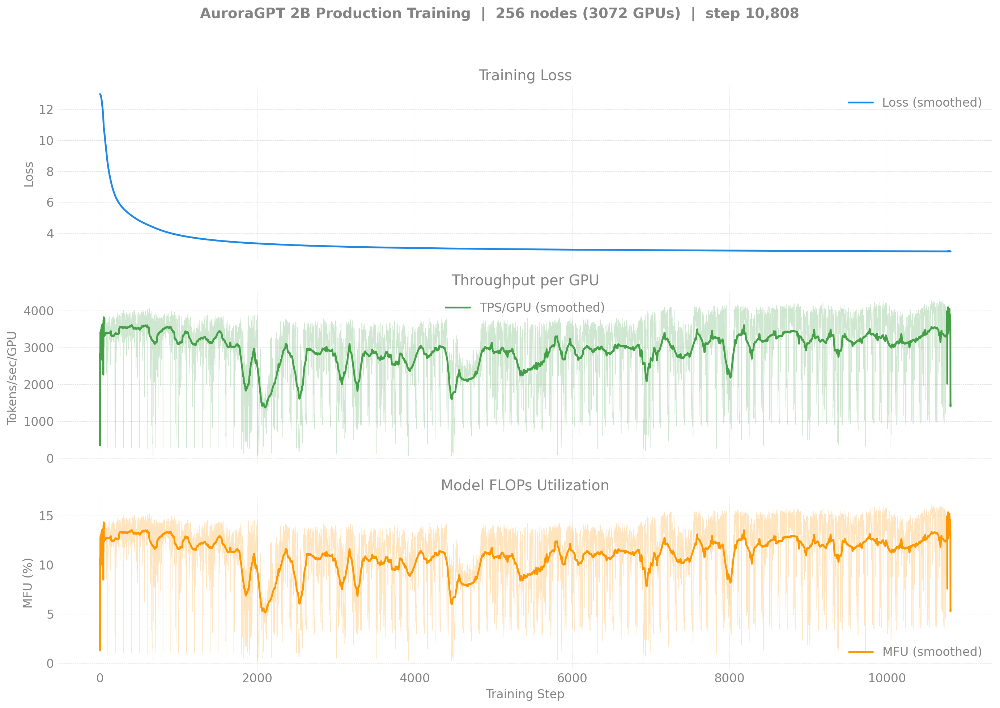
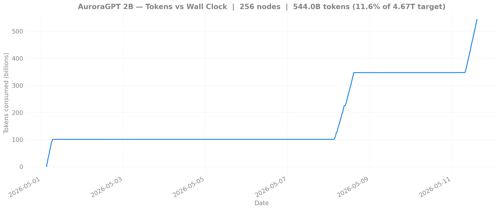
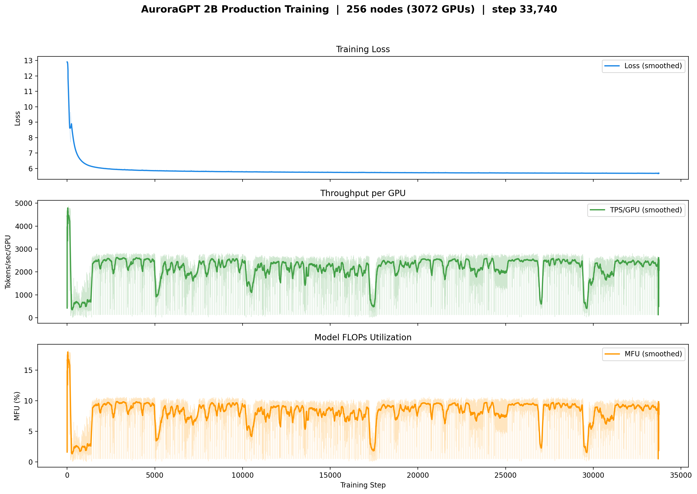
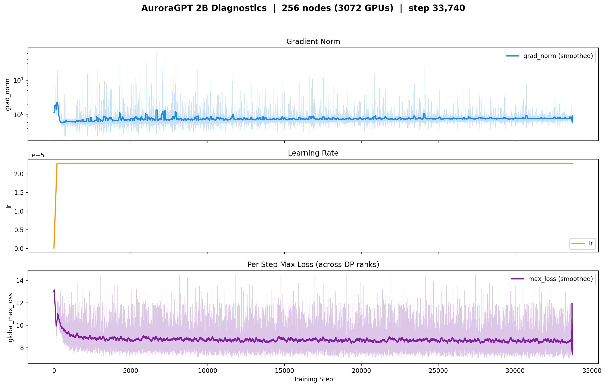
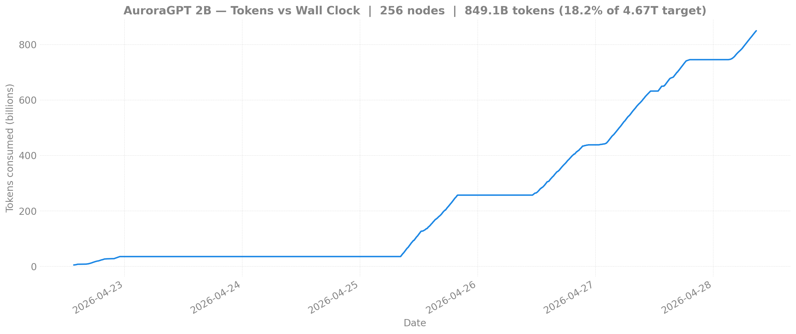

# Production Training — agpt 2B @ 256 nodes

> **Eval scores:** see [`docs/evals/agpt/2b/`](../../../../evals/agpt/2b/README.md)
> for the v1-vs-v2 lm-eval comparison (covers all 2B trajectories on
> shared axes).

## v2 — 2B @ 256N — SophiaG LR=2.28e-5 (fp32 master)

> Status: at step **10,723, loss 2.84, 540B tokens (11.5% of 4.67T)**.
> Three runs: 8459818 (initial, NODE_FAIL @ 2070), 8470100 (chain1,
> walltime), 8470101 (chain2, **currently running**). Loss tracking
> the canonical 512N chain closely (256N: 2.84 @ step 10,723; 512N:
> 2.81 @ step 11,700) — at matched step counts the per-token
> under-training pattern documented in
> [`docs/evals/agpt/2b/`](../../../../evals/agpt/2b/README.md) is
> visible (256N learns more per token, 512N learns more per wall
> clock).

| Field | Value |
|-------|-------|
| Clone | `/flare/AuroraGPT/foremans/runs/agpt-2b-v2/torchtitan-ezpz/` |
| Submit script | [`scripts/submit_agpt_2b_aurora_venv.sh`](../../../../../scripts/submit_agpt_2b_aurora_venv.sh) (one script handles all v2 node counts via env vars) |
| Stack | torch 2.13 venv (yeet-env tarball mode) |
| Optimizer | SophiaG, LR=2.28e-5 |
| Compile | on |
| GBS | 6,144 (LBS=2) |
| Total steps | 92,859 |
| Total tokens | 4.67T |
| Checkpoint dir | `outputs/checkpoints/agpt-2b-sophiag-olmo-mix-1124-n256-gbs6144` |
| Checkpoint interval | 100 steps, keep_latest_k=0 (keep all) |
| W&B | [lytjeegk](https://wandb.ai/aurora_gpt/torchtitan.ezpz.train/runs/lytjeegk) |

### Loss / Throughput / MFU

### Diagnostics

### Tokens vs Wall Clock

### Progress

| Job ID | Steps | Loss (start → end) | TPS/GPU | MFU | Status |
|--------|-------|---------------------|---------|-----|--------|
| 8459818 | 1–2070 | 12.93 → 3.33 | ~3,500 | ~13% | NODE_FAIL after step 2070 (single bad node dragged TPS to ~30 then killed). 20 ckpts saved (every 100 steps). |
| 8470100 | 2000–~10000 | 3.33 → ~2.85 | ~1,000 | ~3.8% | Done (walltime, 12h02m). Resumed from step-2000. |
| 8470101 | 10000–10723+ | 2.85 → **2.84** | ~1,000 | ~3.8% | **Running** (~7h21m elapsed; chained continuation) |

**Latest checkpoint:** step-10700 (8470101 saving every 100 steps)

**Cumulative steps:** ~10,723

**Tokens consumed:** 10,723 × 6,144 × 8,192 = **540B tokens** (11.5% of 4.67T target)

**Logs:**

- `8459818`: `/flare/AuroraGPT/foremans/runs/agpt-2b-v2/torchtitan-ezpz/agpt-2b-n256.o8459818`
- `8470100`: `/flare/AuroraGPT/foremans/runs/agpt-2b-v2/torchtitan-ezpz/agpt-2b-n256-v2-chain1.o8470100`
- `8470101`: `/flare/AuroraGPT/foremans/runs/agpt-2b-v2/torchtitan-ezpz/agpt-2b-n256-v2-chain2.o8470101`

---

<strong>v1 — 2B @ 256N — SophiaG LR=2.28e-5 (bf16 master, BROKEN) — click to expand</strong>

This run is kept for the record. It uses `--training.dtype=bfloat16`
and has **frozen RMSNorm weights** — see
[`docs/guides/training-dtype-bf16-norm-freeze.md`](../../../../guides/training-dtype-bf16-norm-freeze.md).
Don't draw conclusions from these loss curves.

| Field | Value |
|-------|-------|
| Model | agpt_2b (1.99B params) |
| Submit script | [`submit/aurora/submit_agpt_2b.sh`](../../../../../submit/aurora/submit_agpt_2b.sh) (v1 torch 2.10 layout) |
| Nodes / GPUs | 256 / 3,072 |
| Parallelism | TP=1, FSDP=3072 |
| Compile | on |
| Optimizer | SophiaG, LR=2.28e-5 |
| GBS | 3,072 (LBS=1) |
| Total steps | 185,718 |
| Total tokens | 4.67T |
| Seq len | 8,192 |
| Checkpoint dir | `outputs/checkpoints/agpt-2b-sophiag-olmo-mix-1124-n256-gbs3072` |
| Checkpoint interval | 100 steps |

### Loss / Throughput / MFU

### Diagnostics (grad_norm / lr / max_loss)

### Tokens vs Wall Clock

> Diagnostic and tokens-vs-time figures are pulled from W&B by
> `torchtitan/experiments/ezpz/utils/plot_production_wandb.py`.

### Progress

| Job ID | Steps | Loss (start → end) | TPS/GPU | MFU | Memory | Status |
|--------|-------|---------------------|---------|-----|--------|--------|
| 8444122 | 1–1431 | 12.94 → 6.13 | 489 | 1.8% | 47.12 GiB | Complete (walltime) |
| 8446337 | 1401–9876 | 6.13 → 5.78 | 1,794 | 6.7% | — | Complete (walltime) |
| 8446338 | 9876–17424 | 5.78 → 5.73 | 2,280 | 8.6% | 47.02 GiB | Complete (walltime) |
| 8446339 | 17401–17518+ | 5.73 → 5.73 | 761 | 2.9% | 47.02 GiB | Walltime |

**W&B:** [pjanidnw](https://wandb.ai/aurora_gpt/torchtitan.ezpz.train/runs/pjanidnw) (job 8444122), [4u9w23p9](https://wandb.ai/aurora_gpt/torchtitan.ezpz.train/runs/4u9w23p9) (job 8446337)

**Latest checkpoint:** step-17400

**Tokens consumed:** 17518 × 3072 × 8192 = **441.1B tokens** (9.4% of target)

**Note:** TPS degraded significantly (2,400 → 40-700) during 8446338/8446339 due to
concurrent 512N yeet-env copies saturating the flare filesystem. 512N venv jobs were
killed; throughput is recovering.

**Logs:**

- `8444122`: `/lus/flare/projects/AuroraGPT/foremans/projects/saforem2/torchtitan-ezpz/agpt-2b-sophiag-n256.o8444122`
- `8446337`: `/lus/flare/projects/AuroraGPT/foremans/projects/saforem2/torchtitan-ezpz/agpt-2b-sophiag-n256.o8446337`
- `8446338`: `/lus/flare/projects/AuroraGPT/foremans/projects/saforem2/torchtitan-ezpz/agpt-2b-sophiag-n256.o8446338`
- `8446339`: `/lus/flare/projects/AuroraGPT/foremans/projects/saforem2/torchtitan-ezpz/agpt-2b-sophiag-n256.o8446339`

