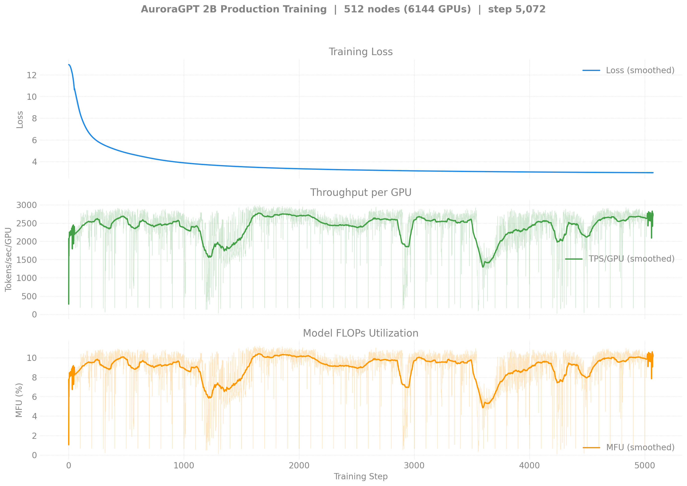
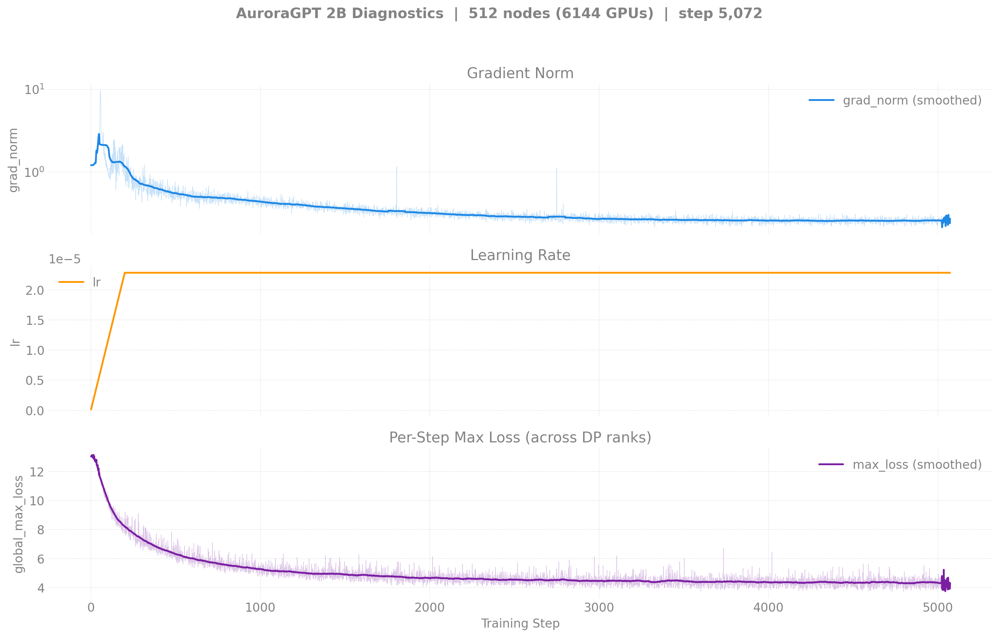
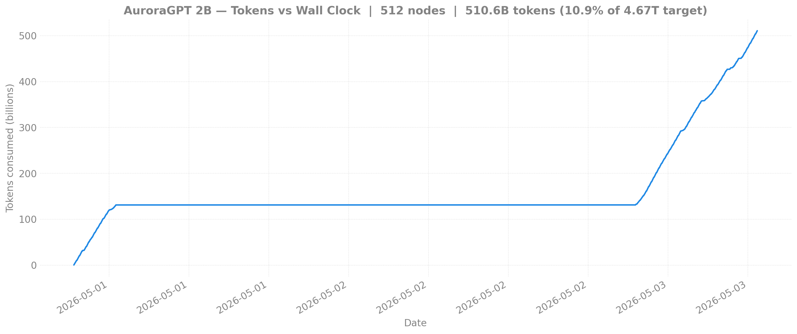

# Production Training — agpt 2B @ 512 nodes

> **This is the canonical 2B production chain.** The 256N v2 ran once
> (no continuation chained); 1024N is queued but not yet started.

## v2 — 2B @ 512N — SophiaG LR=2.28e-5 (fp32 master)

| Field | Value |
|-------|-------|
| Clone | `/flare/AuroraGPT/foremans/runs/agpt-2b-v2/torchtitan-ezpz/` |
| Stack | torch 2.13 venv (yeet-env tarball mode) |
| Compile | off |
| GBS | 12,288 (LBS=2) |
| Total steps | 46,429 |
| Total tokens | 4.67T |
| Checkpoint dir | `outputs/checkpoints/agpt-2b-sophiag-olmo-mix-1124-n512-gbs12288` |
| W&B chain | [i252kps9](https://wandb.ai/aurora_gpt/torchtitan.ezpz.train/runs/i252kps9) → [d4hlr8qe](https://wandb.ai/aurora_gpt/torchtitan.ezpz.train/runs/d4hlr8qe) |

### Loss / Throughput / MFU



### Diagnostics



### Tokens vs Wall Clock



### Progress (chain)

| Job ID | Walltime | Steps | Loss (start → end) | TPS/GPU | MFU | Status |
|--------|---------:|------:|-------------------:|--------:|----:|--------|
| 8460301 | 6h | 1–1387 | 12.65 → 3.59 | ~2,700 | ~10% | NODE_FAIL after step 1387. 13 ckpts saved. |
| 8463626 | 12h | 1300–5073 | 3.59 → 2.97 | ~2,700 | ~10% | Walltime hit (NODE_FAIL at end). **50 ckpts saved (every 100 steps).** |
| 8463627 | 12h | 5000+ | — | — | — | **Queued** (will auto-resume from step-5000) |
| 8466847 | 12h | (cont.) | — | — | — | Held (`afterany:8463627`) |

**Latest checkpoint:** step-5000

**Cumulative steps:** 5,073

**Tokens consumed:** 5,073 × 12,288 × 8,192 = **510B tokens** (10.9% of 4.67T target)

---

<details>
<summary><strong>v1 — 2B @ 512N — SophiaG LR=2.28e-5 (bf16 master, BROKEN) — click to expand</strong></summary>

This run is kept for the record. It uses `--training.dtype=bfloat16`
and has **frozen RMSNorm weights** — see
[`docs/guides/training-dtype-bf16-norm-freeze.md`](../../../../guides/training-dtype-bf16-norm-freeze.md).
Don't draw conclusions from these loss curves.

| Field | Value |
|-------|-------|
| Model | agpt_2b (1.99B params) |
| Nodes / GPUs | 512 / 6,144 |
| Parallelism | TP=1, FSDP=6144 |
| Compile | **off** (OOM at 512N) |
| Optimizer | SophiaG, LR=2.28e-5 |
| GBS | 6,144 (LBS=1) |
| Total steps | 92,859 |
| Total tokens | 4.67T |
| Checkpoint dir | `outputs/checkpoints/agpt-2b-sophiag-olmo-mix-1124-n512-gbs6144` |

### Progress

| Job ID | Steps | Loss | TPS/GPU | MFU | Memory | Status |
|--------|-------|------|---------|-----|--------|--------|
| 8443818 | 0 | — | — | — | — | OOM (compile) |
| 8446349 | 0 | — | — | — | — | Segfault (signal 11) |
| 8446350 | — | — | — | — | — | Queued |

(No v1 512N training-curve figures were ever generated — the run never
got past the first step.)

### Job Chains (historical)

```
2B-256N (torch 2.10, LBS=1): 8446337 → 8446338 → 8446339 → 8451750 → 8451752
2B-512N (torch 2.10, LBS=1): 8446349 → 8446350
2B-512N (torch 2.13, LBS=2): 8451723 → 8451724 (killed — yeet-env saturated flare)
```

</details>
