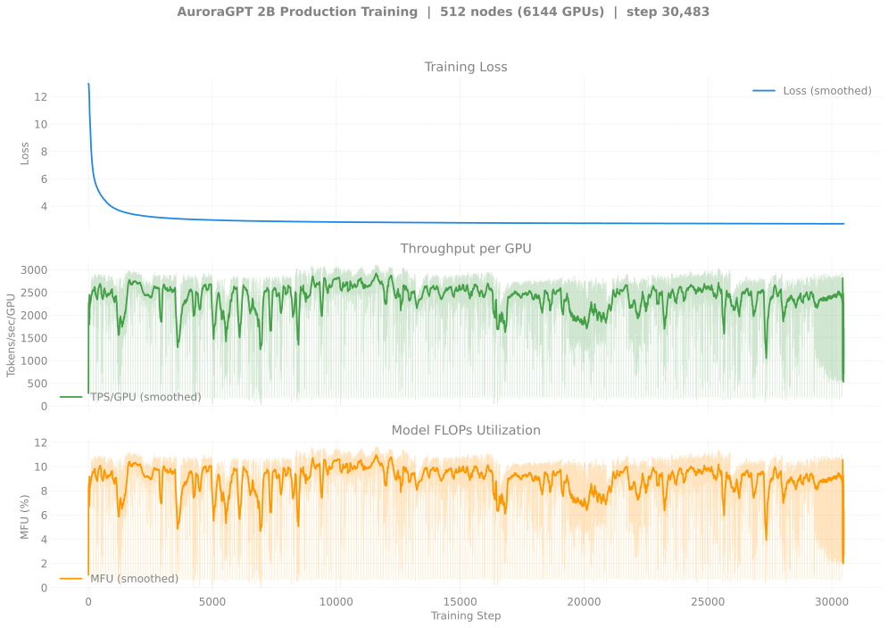
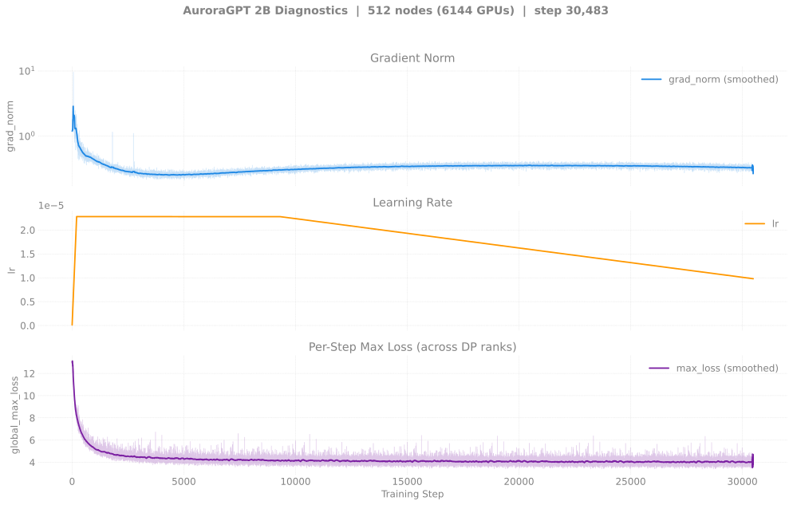
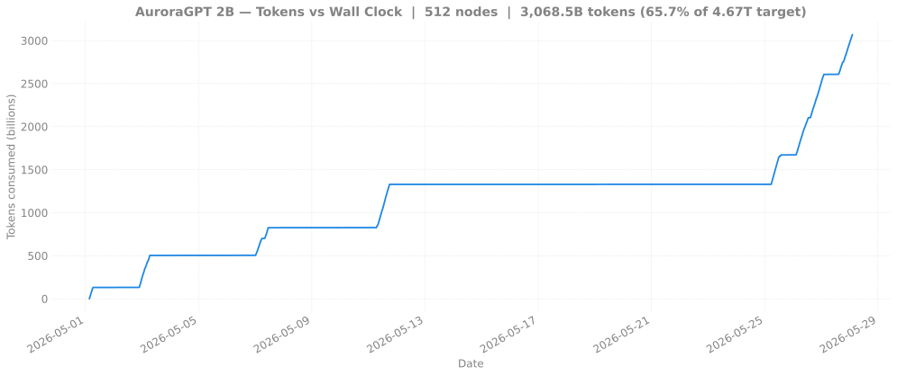
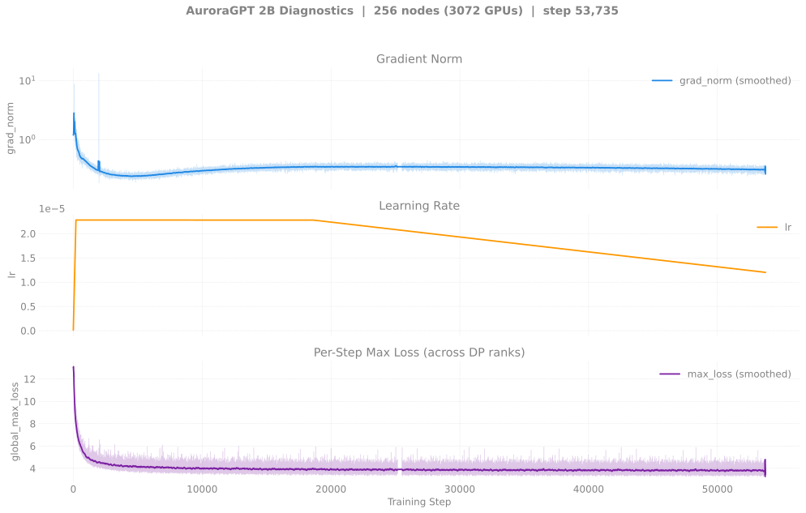
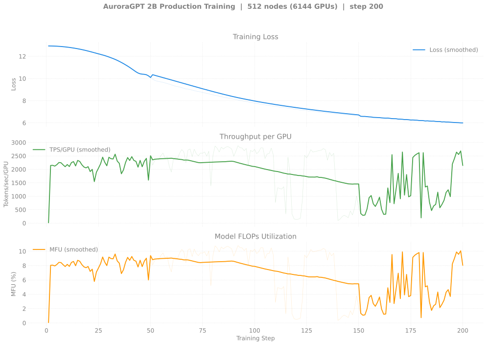

# Production Training — Dense (agpt) Models

> Last updated: 2026-05-30
>
> **Restarted in v2 clones on 2026-04-30** after the bf16-master
> RMSNorm-freeze regression. All current production training is on
> `dtype=float32` master weights. Historical bf16-tainted runs:
> [`historical/v1-bf16/`](historical/v1-bf16/README.md).

## Headline (2026-05-30)

- **2B 256N async chain** at step **55,000** (loss ~2.67, ~2.77T tokens, **59.3%** of target) — chain idle since 8508977 pals-RPC exit 127. +1 continuation `8513544` Q for 256N slot >24h (Fri/weekend Aurora congestion).
- **2B 512N sync chain** at step **30,400** (loss **2.71**, ~3.07T tokens, **65.7%** of target) — chain idle since 8509042 `set_determinism std::bad_alloc` crash. +1 continuation `8513545` Q for 512N slot >24h.
- **20B 512N sync chain** at step **4,400** (loss **2.51**, ~442B tokens, **9.5%** of target) — `8509393` walltimed cleanly 2026-05-29 12:01 with step-4,400 ckpt durable (+11 ckpts since step-3,300). +1 `8513546` auto-released H→Q, +2 `8514610` H behind. Both Q for 512N slot >12h.
- **🏁 20B 512N now beats 2B 256N async on every benchmark per token.** Latest evals (step-4,400, ~442B tokens): HellaSwag `acc_norm` **0.6346** (+34pp vs step-900 0.296), ARC-Easy `acc` **0.6641**, ARC-C `acc_norm` **0.3797** (+1.5pp jump at step-4,400). Monotonic lift across 35+ consecutive ckpts.
- **80B 256N still completely blocked.** 11+ dispatches since 2026-05-11, zero ckpts persisted. The latest
  (8505222 on 2026-05-24) cascaded through 5 wrapper retries — every attempt hit SIGSEGV on a different bad node, 3 of them
  from the x4101c5/c6 rack cluster. No new 80B dispatches since 5/24. See
  [`20260524-80b-256n-sigsegv-cascade-8505222.md`](../../experiments/agpt/aurora/20260524-80b-256n-sigsegv-cascade-8505222.md).
  Distinct from the 80B 8N smoke failure (data-pipeline race), documented in
  [`blendcorpus-eoferror-race.md`](../../guides/known-bugs/blendcorpus-eoferror-race.md).

## Single canonical chain per model

Per-model production training is consolidated on **one** chain to
avoid divergent trajectories. Other queued jobs at different node
counts share the model but write to *different* checkpoint dirs (keyed
on `gbs`), so they're independent trajectories — they're not joining
the canonical chain. Treat them as scaling experiments, not as
extensions.

### 2B canonical chain (512N, sync-mode)

| Job ID | Date | Walltime | Steps | Loss | Status |
|--------|------|---------:|------:|-----:|--------|
| [`8460301`](2b/n512/README.md#log-8460301) | 2026-05-01 | 6h | 1–1387 | 12.65 → 3.59 | Done (NODE_FAIL @ end) |
| [`8463626`](2b/n512/README.md#log-8463626) | 2026-05-03 | 12h | 1300–5073 | 3.59 → 2.97 | Done (NODE_FAIL @ end). 50 ckpts saved. |
| [`8463627`](2b/n512/README.md#log-8463627) | 2026-05-07 | 12h | 5000–6955 | 2.97 → 2.90 | Done (walltime). |
| [`8466847`](2b/n512/README.md#log-8466847) | 2026-05-11 | 12h | 6900–13279 | 2.90 → 2.79 | Done (walltime). step-13200 ckpt saved. |
| [`8479988`](2b/n512/README.md#log-8479988) | 2026-05-11 | 12h | 13200+ | — | Done. |
| `8505121` | 2026-05-23 | 12h | — | — | **Failed** (pre-fix, async-cascade regression). |
| [`8505176`](2b/n512/README.md#log-8505176) | 2026-05-23 | 12h | — | — | **Failed** (async-cascade regression). |
| [`8506215`](2b/n512/README.md#log-8506215) | 2026-05-24 | 12h | — | — | **Failed** (preflight bug). |
| **[`8506221`](2b/n512/README.md#log-8506221)** | 2026-05-24 | 12h | 13200–~14000 | 2.79 → ~2.77 | **🏁 sync-mode breakthrough** (CHECKPOINT_ASYNC_MODE=disabled). +21 ckpts. |
| [`8507196`](2b/n512/README.md#log-8507196) | 2026-05-25 | 12h | ~14000–~17500 | ~2.77 → ~2.75 | Aurora pals-RPC launcher infra fail mid-run (exit 127), +76 ckpts still persisted. See [pals-RPC writeup](../../experiments/agpt/aurora/). |
| **[`8507199`](2b/n512/README.md#log-8507199)** | 2026-05-25 | 12h | ~17500–~22500 | ~2.75 → ~2.73 | Sync-mode, +50 ckpts. |
| **[`8508753`](2b/n512/README.md#log-8508753)** | 2026-05-26 → 2026-05-27 | 12h | ~22500–**30,484** | ~2.73 → **2.71** | Done (walltime exit -29). +80 ckpts step-22600..step-30400 persisted. |
| `8509042` | 2026-05-27 | 12h | — | — | **Crashed** in `set_determinism std::bad_alloc` at 6,144 ranks (documented intermittent). |
| `8513545` | 2026-05-28 | 12h | (cont.) | — | **Queued** (>24h, capacity-blocked in `small` queue; `afterany:8509042`). |

**Latest cumulative**: step **30,400** · loss **2.71** · **~3.07T tokens** (65.7% of 4.67T target).

### 2B per-token comparator chain (256N, async-mode)

| Job ID | Date | Walltime | Steps | Loss | Status |
|--------|------|---------:|------:|-----:|--------|
| `8505118` / `8505119` | 2026-05-23 | 12h | (post-fix dispatches) | — | Done. |
| **[`8505175`](2b/n256/README.md#log-8505175)** | 2026-05-23 | 12h | (cont.) | — | Done. +57 ckpts. |
| **[`8505252`](2b/n256/README.md#log-8505252)** | 2026-05-24 | 12h | (cont.) | — | Done. +57 ckpts. |
| **[`8507195`](2b/n256/README.md#log-8507195)** | 2026-05-25 | 12h | (cont.) | — | Done. +57 ckpts. |
| **[`8507198`](2b/n256/README.md#log-8507198)** | 2026-05-26 | 12h | (cont.) | — | Done. +57 ckpts. |
| **[`8508020`](2b/n256/README.md#log-8508020)** | 2026-05-26 → 2026-05-27 | 12h | ~48,300–**~52,500** | ~2.69 → **2.68** | Done (walltime exit 2026-05-27 21:33). |
| `8508977` | 2026-05-27 | 12h | (cont.) | — | **Failed** (Aurora pals-RPC infra exit 127, not failover-recoverable). |
| `8513544` | 2026-05-28 | 12h | (cont.) | — | **Queued** (>24h, capacity-blocked in `small` queue; `afterany:8508977`). |

**Latest cumulative (256N)**: step **55,000** · loss **2.67** · **~2.77T tokens** (59.3% of 4.67T target). Eval plateau:
ARC-Easy ~0.645, HellaSwag acc_norm ~0.547.

### 20B canonical chain (512N, sync-mode)

| Job ID | Date | Walltime | Steps | Loss | Status |
|--------|------|---------:|------:|-----:|--------|
| [`8460302`](20b/n512/README.md#log-8460302) | 2026-05-01 | 6h | 1–300 | 12.94 → 4.95 | Done (NODE_FAIL @ end). 3 ckpts saved. |
| [`8463628`](20b/n512/README.md#log-8463628) | 2026-05-03 | 12h | 200–863 | 5.62 → 3.46 | Done (walltime hit). step-100..800 ckpts saved. |
| [`8466848`](20b/n512/README.md#log-8466848) | 2026-05-07 | — | — | — | **Crashed @ startup** (127s) — `set_determinism` `std::bad_alloc`. Intermittent. |
| [`8479579`](20b/n512/README.md#log-8479579) | 2026-05-11 | 12h | 800–803 | 3.46 → 3.53 | Killed by qdel @ 5h56m — silent hang after step 803. See [hang report](../../experiments/agpt/aurora/20260511-20b-n512-hang-8479579.md). |
| [`8479580`](20b/n512/README.md#log-8479580) | 2026-05-11 | 12h | 800+ | — | Done. |
| `8505124` | 2026-05-23 | 12h | — | — | **Failed** (pre-fix, async-cascade regression). |
| `8505256` | 2026-05-24 | 12h | — | — | qdel-dup. |
| **[`8505258`](20b/n512/README.md#log-8505258)** | 2026-05-24 | 12h | (cont.) | — | **🏁 sync-mode breakthrough**. +6 ckpts. |
| **[`8505259`](20b/n512/README.md#log-8505259)** | 2026-05-24 | 12h | (cont.) | — | Sync-mode, +6 ckpts. |
| **[`8507197`](20b/n512/README.md#log-8507197)** | 2026-05-25 | 12h | (cont.) | — | Sync-mode, +6 ckpts. |
| **[`8507200`](20b/n512/README.md#log-8507200)** | 2026-05-26 | 12h | ~2700–**3,270** | ~2.70 → **2.65** | Done (12h walltime end at 2026-05-27 03:43). +6 ckpts. |
| **[`8508214`](20b/n512/README.md#log-8508214)** | 2026-05-28 | 12h | 3,270–~3,800 | 2.65 → **2.60** | Done (walltime). Sync-mode, ~5 ckpts. |
| **[`8509393`](20b/n512/README.md#log-8509393)** | 2026-05-29 | 12h | 3,800–**4,419** | 2.60 → **2.51** | Done (walltime exit at 12:01). +6 ckpts (step-3,900..step-4,400). |
| `8513546` | 2026-05-29 | 12h | (cont.) | — | **Queued** (>12h, capacity-blocked in `small` queue; auto-released from H when 8509393 exited). |
| `8514610` | 2026-05-29 | 12h | (cont.) | — | Held (`afterany:8513546`). |

**Latest cumulative**: step **4,400** · loss **2.51** · **~442B tokens** (9.5% of 4.67T target).

**🏁 Eval headline (35+ ckpts, step-900 → step-4,400)**: ARC-Easy `acc` 0.463 → **0.664** (+20pp), HellaSwag `acc_norm`
0.296 → **0.635** (+34pp), ARC-C `acc_norm` 0.224 → **0.380** (+16pp), Winogrande 0.493 → 0.586 (+9pp).
**20B 512N sync now beats 2B 256N async on every benchmark per token.** Monotonic across 35+ consecutive ckpts. See
[`evals/agpt/20b/`](../../evals/agpt/20b/README.md).

## Other jobs (independent ckpt trajectories)

| Job ID | Date | Model | Nodes | Walltime | Status | Notes |
|--------|------|-------|------:|---------:|--------|-------|
| [`8463182`](2b/n1024/README.md#log-8463182) | 2026-05-04 | 2B | 1024 | 12h | **Crashed @ startup (211s, std::bad_alloc)** | Fresh start, separate ckpt dir (`n1024-gbs24576`) |
| [`8463183`](20b/n1024/README.md#log-8463183) | 2026-05-04 | 20B | 1024 | 12h | **Crashed @ startup (211s, SIGSEGV)** | Fresh start, separate ckpt dir (`n1024-gbs24576`) |
| [`8463659`](20b/n256/README.md#log-8463659) | 2026-05-04 | 20B | 256 | 12h | **NODE_FAIL** after step 364 (loss 4.61) | Fresh start, separate ckpt dir (`n256-gbs6144`). step-300 ckpt saved. |
| [`8470100`](2b/n256/README.md#log-8470100) | 2026-05-08 | 2B  | 256 | 12h | Done | Resumed from step-2000 → step ~10000 in 12h. |
| [`8470101`](2b/n256/README.md#log-8470101) | 2026-05-11 | 2B  | 256 | 12h | Done (12h00m20s; 12,889/2.81) | step **12,889**, loss **2.81** — caught up to canonical 512N per-step. |
| [`8470102`](20b/n256/README.md#log-8470102) | 2026-05-08 | 20B | 256 | 12h | **Crashed** (gloo TCP timeout @ 3h15m) | Resumed step-300 → step-400 saved before crash |
| [`8470103`](20b/n256/README.md#log-8470103) | 2026-05-08 | 20B | 256 | 12h | **Crashed** (gloo TCP timeout @ 2h59m) | Chained continuation, also bad-node |
| [`8467141`](2b/n512/README.md#log-8467141) | 2026-05-07 | 2B  | 512 | 12h | Done | √2-LR fork (LR=3.22e-5) chain1, separate ckpt dir |
| [`8467142`](2b/n512/README.md#log-8467142) | 2026-05-11 | 2B  | 512 | 12h | Done | √2-LR fork chain2 |
| [`8479581`](20b/n256/README.md#log-8479581) | 2026-05-11 | 20B | 256 | 12h | **Crashed** (gloo TCP timeout @ 3h39m) — step-500 ckpt saved | step **500**, loss **4.08** |
| [`8479582`](20b/n256/README.md#log-8479582) | 2026-05-11 | 20B | 256 | 12h | Done | resumed from step-500 |
| **`8505255`** | 2026-05-24 | 20B | 256 | 12h | Done (12h walltime end on 2026-05-26 20:35) — step **1,125** | 256N is per-token comparator; canonical 20B chain is 512N. **No chain continuation queued.** |

### 80B 256N production status (2026-05-27)

**Still completely blocked.** 11+ dispatches since 2026-05-11; zero ckpts persisted. Latest dispatch `8505222`
(2026-05-24) failed after **5 wrapper retries** — every attempt hit SIGSEGV on a different bad node, 3 of them from
the x4101c5/c6 rack cluster. Canonical writeup:
[`20260524-80b-256n-sigsegv-cascade-8505222.md`](../../experiments/agpt/aurora/20260524-80b-256n-sigsegv-cascade-8505222.md).
Distinct from the 80B 8N smoke (8505326), which surfaced a separate `blendcorpus` EOFError race documented in
[`blendcorpus-eoferror-race.md`](../../guides/known-bugs/blendcorpus-eoferror-race.md). The 4N smoke 12466025
(2026-05-05) remains the only successful 80B training to date (20 steps). See [`80b/`](80b/README.md) for full
status + next steps.

## Reference: pre-torchtitan MDS run (2B SophiaG, ~7.77T tokens)

The Megatron-DeepSpeed AuroraGPT-2B SophiaG continuation predates the
torchtitan migration but is the natural "what does a healthy 2B
SophiaG trajectory look like?" baseline. Training curves (loss /
grad_norm / TFLOPS / TPS) and eval scores live at:

- [`production/agpt/2b-mds/`](2b-mds/README.md) — training curves
- [`evals/agpt/2b-mds/`](../../evals/agpt/2b-mds/README.md) — lm-eval scores

## Historical v1 (bf16-tainted) runs

All pre-2026-04-30 production runs used `--training.dtype=bfloat16`,
which silently froze RMSNorm.weight at its 1.0 init. v2 is the clean
restart on `--training.dtype=float32`. v1 archive (training curves,
v1-vs-v2 overlays, job tables, log paths):
[`historical/v1-bf16/`](historical/v1-bf16/README.md). Root-cause
diagnosis: [`guides/training-dtype-bf16-norm-freeze.md`](../../guides/training-dtype-bf16-norm-freeze.md).

## Canonical chain dashboards (v2)

### 2B 512N — Loss / Throughput / MFU

### 2B 512N — Diagnostics

### 2B 512N — Tokens vs Wall Clock

### 20B 512N — Loss / Throughput / MFU

### 20B 512N — Diagnostics

### 20B 512N — Tokens vs Wall Clock

<strong>2B 256N v2 (active async chain at step 49,900+) — click to expand</strong>

Separate ckpt trajectory at 256 nodes (`gbs6144`, independent from
the canonical 512N `gbs12288` chain). Now the **per-token comparator** for
the 20B 512N sync chain. Running async-mode at step **49,900+, loss 2.68,
~2.50T tokens (53.5% of target)**. Eval plateau: ARC-Easy ~0.645,
HellaSwag acc_norm ~0.547 — now beaten by 20B 512N sync on every benchmark
per token.

<strong>20B 256N v2 (one-shot, ended at step 1,125) — click to expand</strong>

Separate ckpt trajectory at 256 nodes (`gbs6144`, independent from
the canonical 512N `gbs12288` chain). History: 8463659 (NODE_FAIL after
step 364), 8470102 + 8470103 (gloo TCP timeouts ~3h), 8479581 + 8479582,
and most recently **8505255** which ran out the 12h walltime ending
2026-05-26 20:35 at step **1,125**. **No chain continuation queued** —
256N is the per-token comparator; the canonical 20B chain is 512N.

<strong>2B 512N √2-LR fork (LR=3.22e-5, 200 steps) — click to expand</strong>

Experimental fork that scaled LR by √2 (3.22e-5 vs canonical
2.28e-5) at the doubled GBS=12,288 — tests whether closing the
per-token gap to 256N is achievable with LR scaling. Two short runs:
8467141 (4h) and 8467142 (1h53m). Writes to its own ckpt dir
`gbs12288-lr3.22e-5`.

