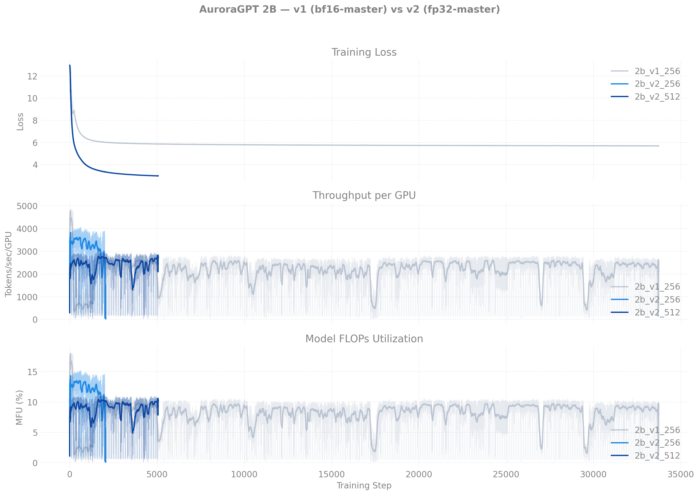
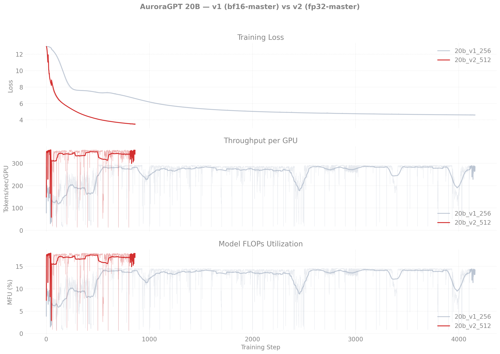
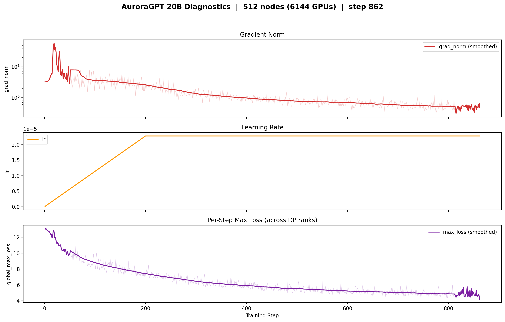
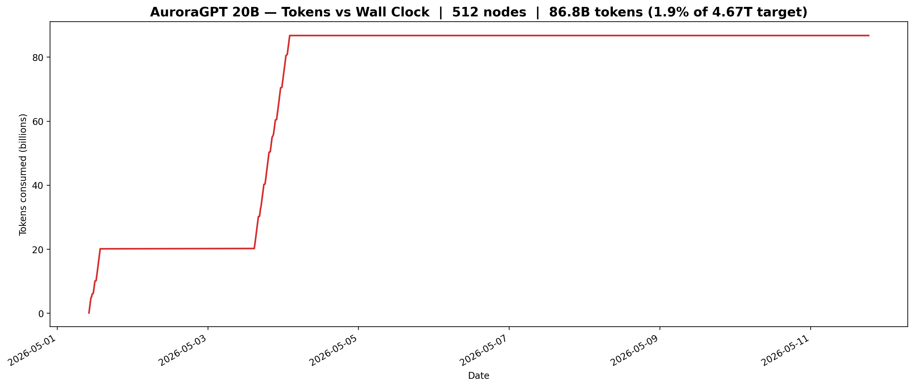
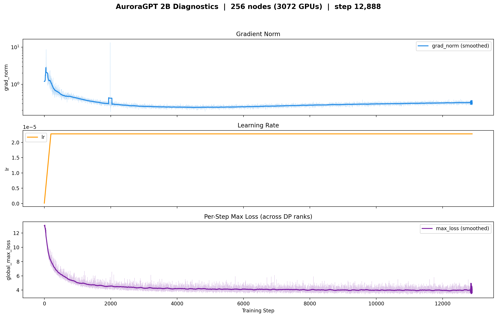
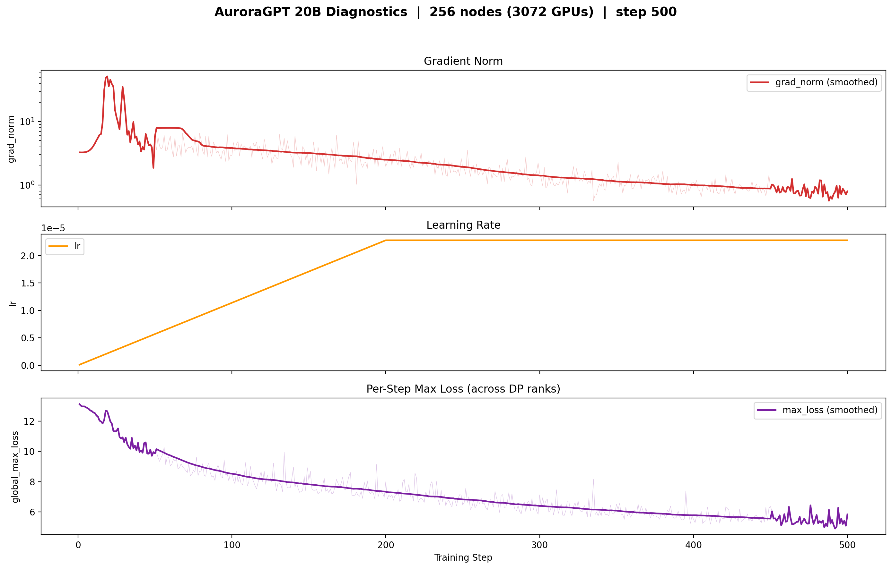
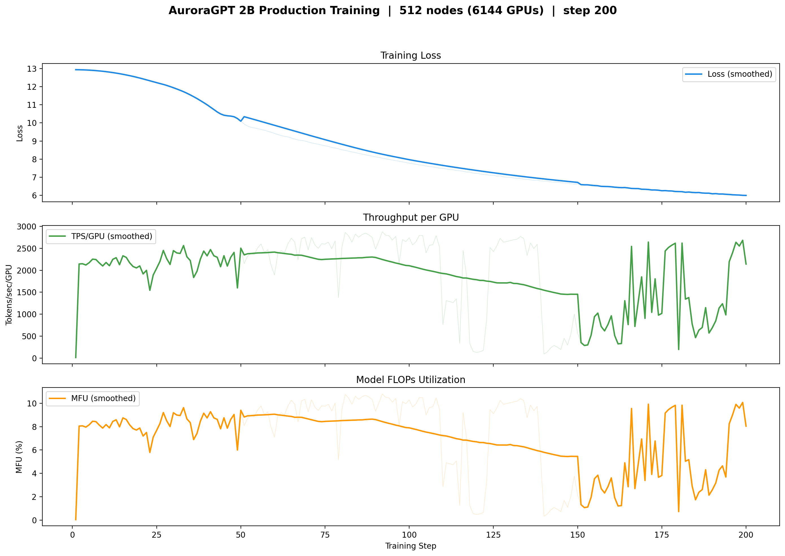

# Production Training — Dense (agpt) Models

> Last updated: 2026-05-11
>
> **Restarted in v2 clones on 2026-04-30** after the bf16-master
> RMSNorm-freeze regression. All current production training is on
> `dtype=float32` master weights. Historical bf16-tainted runs are
> retained inside each per-model README under "Historical".

## Single canonical chain per model

Per-model production training is consolidated on **one** chain to
avoid divergent trajectories. Other queued jobs at different node
counts share the model but write to *different* checkpoint dirs (keyed
on `gbs`), so they're independent trajectories — they're not joining
the canonical chain. Treat them as scaling experiments, not as
extensions.

### 2B canonical chain (512N)

| Job ID | Walltime | Steps | Loss | Status |
|--------|---------:|------:|-----:|--------|
| 8460301 | 6h | 1–1387 | 12.65 → 3.59 | Done (NODE_FAIL @ end) |
| 8463626 | 12h | 1300–5073 | 3.59 → 2.97 | Done (NODE_FAIL @ end). 50 ckpts saved. |
| 8463627 | 12h | 5000–6955 | 2.97 → 2.90 | Done (walltime). |
| 8466847 | 12h | 6900–13279 | 2.90 → **2.79** | Done (walltime). step-13200 ckpt saved. |
| 8479988 | 12h | 13200+ | — | **Queued** — resubmit (2026-05-11 evening), auto-resumes from step-13200 |
| 8479989 | 12h | (cont.) | — | Held (`afterany:8479988`) |

**Latest cumulative**: step **13,279** · loss **2.79** · **1.34T tokens** (28.7% of 4.67T target — past the quarter mark).

### 20B canonical chain (512N)

| Job ID | Walltime | Steps | Loss | Status |
|--------|---------:|------:|-----:|--------|
| 8460302 | 6h | 1–300 | 12.94 → 4.95 | Done (NODE_FAIL @ end). 3 ckpts saved. |
| 8463628 | 12h | 200–863 | 5.62 → 3.46 | Done (walltime hit). step-100..800 ckpts saved. |
| 8466848 | — | — | — | **Crashed @ startup** (127s) — `set_determinism` `std::bad_alloc`. Intermittent: didn't reproduce on retry. |
| 8479579 | 12h | 800–803+ | 3.46 → **3.53** | **Running** (~1h42m elapsed; resumed from step-800; canonical chain training again after 7 days stuck). |
| 8479580 | 12h | (cont.) | — | Held (`afterany:8479579`) |

**Latest cumulative**: step **803** · loss **3.53** · **81B tokens** (1.7% of 4.67T target).

## Other jobs (independent ckpt trajectories)

| Job ID | Model | Nodes | Walltime | Status | Notes |
|--------|-------|------:|---------:|--------|-------|
| 8463182 | 2B | 1024 | 12h | **Crashed @ startup (211s, std::bad_alloc)** | Fresh start, separate ckpt dir (`n1024-gbs24576`) |
| 8463183 | 20B | 1024 | 12h | **Crashed @ startup (211s, SIGSEGV)** | Fresh start, separate ckpt dir (`n1024-gbs24576`) |
| 8463659 | 20B | 256 | 12h | **NODE_FAIL** after step 364 (loss 4.61) | Fresh start, separate ckpt dir (`n256-gbs6144`). step-300 ckpt saved. |
| 8470100 | 2B  | 256 | 12h | Done (walltime), step ~10000 | Resumed from step-2000 → step ~10000 in 12h. |
| 8470101 | 2B  | 256 | 12h | **Running** (~11h50m elapsed; near walltime) | step **12,888**, loss **2.82** — **caught up to and slightly passed canonical 512N per-step** |
| 8470102 | 20B | 256 | 12h | **Crashed** (gloo TCP timeout @ 3h15m) | Resumed step-300 → step-400 saved before crash |
| 8470103 | 20B | 256 | 12h | **Crashed** (gloo TCP timeout @ 2h59m) | Chained continuation, also bad-node |
| 8467141 | 2B  | 512 | 12h | Done | √2-LR fork (LR=3.22e-5) chain1, separate ckpt dir |
| 8467142 | 2B  | 512 | 12h | Done | √2-LR fork chain2 |
| 8479581 | 20B | 256 | 12h | **Running** (~2h22m elapsed) | step **441**, loss **4.30**, MFU 1.6-9.6% (variable) — gloo timeout didn't reproduce |
| 8479582 | 20B | 256 | 12h | Held (`afterany:8479581`) | 2nd 256N continuation in chain |

**80B**: working v2 path identified 2026-05-05 (4N smoke `compile=OFF`, loss 12.98→10.46, MFU ~17.8%). Not yet productionized — needs warmup added + long-running script. See [`80b/`](80b/README.md) (still has v1 history) and the `compile=OFF` Known-Bug entry in `.claude/CLAUDE.md`.

## Reference: pre-torchtitan MDS run (2B SophiaG, ~7.77T tokens)

The Megatron-DeepSpeed AuroraGPT-2B SophiaG continuation predates the
torchtitan migration but is the natural "what does a healthy 2B
SophiaG trajectory look like?" baseline. Training curves (loss /
grad_norm / TFLOPS / TPS) and eval scores live at:

- [`production/agpt/2b-mds/`](2b-mds/README.md) — training curves
- [`evals/agpt/2b-mds/`](../../evals/agpt/2b-mds/README.md) — lm-eval scores

## v1 (bf16-master, broken) vs v2 (fp32-master, current)

The original 2026-04-{14..29} runs were trained with
`--training.dtype=bfloat16`, which silently froze every RMSNorm.weight
at 1.0 (sub-ULP master-weight updates). v2 is the clean restart on
`--training.dtype=float32`. See
[`guides/training-dtype-bf16-norm-freeze.md`](../../guides/training-dtype-bf16-norm-freeze.md)
for the full diagnosis. Per-model overlays:

| 2B (v1 256N vs v2 256N + 512N) | 20B (v1 256N vs v2 512N) |
|--------------------------------|--------------------------|
|  |  |

Reproduce:
```bash
python3 torchtitan/experiments/ezpz/utils/plot_production_wandb.py --overlay 2b
python3 torchtitan/experiments/ezpz/utils/plot_production_wandb.py --overlay 20b
```

## Canonical chain dashboards (v2)

### 2B 512N — Loss / Throughput / MFU


### 2B 512N — Diagnostics


### 2B 512N — Tokens vs Wall Clock


### 20B 512N — Loss / Throughput / MFU


### 20B 512N — Diagnostics



### 20B 512N — Tokens vs Wall Clock



<details>
<summary><strong>2B 256N v2 (active continuation chain at step 10,723) — click to expand</strong></summary>

Separate ckpt trajectory at 256 nodes (`gbs6144`, independent from
the canonical 512N `gbs12288` chain). Three runs so far: 8459818
(NODE_FAIL after step 2070), 8470100 (chain1 walltime), 8470101
(chain2, **currently running**). Step **10,723, loss 2.84, 540B
tokens (11.5% of target)**. Useful as the per-token comparator for
the 512N chain.



</details>

<details>
<summary><strong>20B 256N v2 (struggling — 3 crashes, at step 400) — click to expand</strong></summary>

Separate ckpt trajectory at 256 nodes (`gbs6144`, independent from
the canonical 512N `gbs12288` chain). Three runs: 8463659 (NODE_FAIL
after step 364), 8470102 + 8470103 (both crashed with gloo TCP
timeouts at ~3h elapsed). step-400 ckpt saved before the chain
crashes. **8479581 + 8479582 just submitted (2026-05-11)** to retry.



</details>

<details>
<summary><strong>2B 512N √2-LR fork (LR=3.22e-5, 200 steps) — click to expand</strong></summary>

Experimental fork that scaled LR by √2 (3.22e-5 vs canonical
2.28e-5) at the doubled GBS=12,288 — tests whether closing the
per-token gap to 256N is achievable with LR scaling. Two short runs:
8467141 (4h) and 8467142 (1h53m). Writes to its own ckpt dir
`gbs12288-lr3.22e-5`.



</details>
