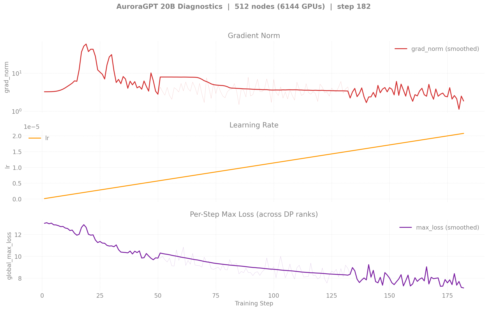

# Production Training — Dense (agpt) Models

> Last updated: 2026-05-01
>
> **Restarted in v2 clones on 2026-04-30** after the bf16-master
> RMSNorm-freeze regression. All current production training is on
> `dtype=float32` master weights. Historical bf16-tainted runs are
> retained inside each per-model README under "Historical".

## Active runs (v2 — torch 2.13 venv, fp32 master)

| Run | Report | Nodes | Walltime | Steps Done | Loss | Tokens | Status |
|-----|--------|------:|---------:|-----------:|-----:|-------:|--------|
| 2B-256N v2 | [details](2b/) | 256 | 6h | 2,070 | 3.33 | 104B | NODE_FAIL after step 2070 (resumable from step-2000 ckpt) |
| 2B-512N v2 | [details](2b/) | 512 | 6h+12h+12h | 1,387 | 3.59 | 140B | NODE_FAIL; chained 12h continuation queued (8463626→8463627) |
| 2B-1024N v2 | [details](2b/) | 1024 | 12h | — | — | — | **Queued** (8463182) |
| 20B-512N v2 | [details](20b/) | 512 | 6h+12h | 148+ | 6.13 | 15B | **Running** (8460302); 12h continuation held (8463628) |
| 20B-1024N v2 | [details](20b/) | 1024 | 12h | — | — | — | **Queued** (8463183) |
| 80B-256N | [details](80b/) | 256 | — | — | — | — | Not yet restarted in v2 |

## v1 (bf16-master, broken) vs v2 (fp32-master, current)

The original 2026-04-{14..29} runs were trained with
`--training.dtype=bfloat16`, which silently froze every RMSNorm.weight
at 1.0 (sub-ULP master-weight updates). v2 is the clean restart on
`--training.dtype=float32`. See
[`guides/training-dtype-bf16-norm-freeze.md`](../../guides/training-dtype-bf16-norm-freeze.md)
for the full diagnosis. Per-model overlays:

| 2B (v1 256N vs v2 256N + 512N) | 20B (v1 256N vs v2 512N) |
|--------------------------------|--------------------------|
|  |  |

Reproduce:
```bash
python3 torchtitan/experiments/ezpz/utils/plot_production_wandb.py --overlay 2b
python3 torchtitan/experiments/ezpz/utils/plot_production_wandb.py --overlay 20b
```

## Diagnostics

### 2B v2 256N


### 20B v2 512N


