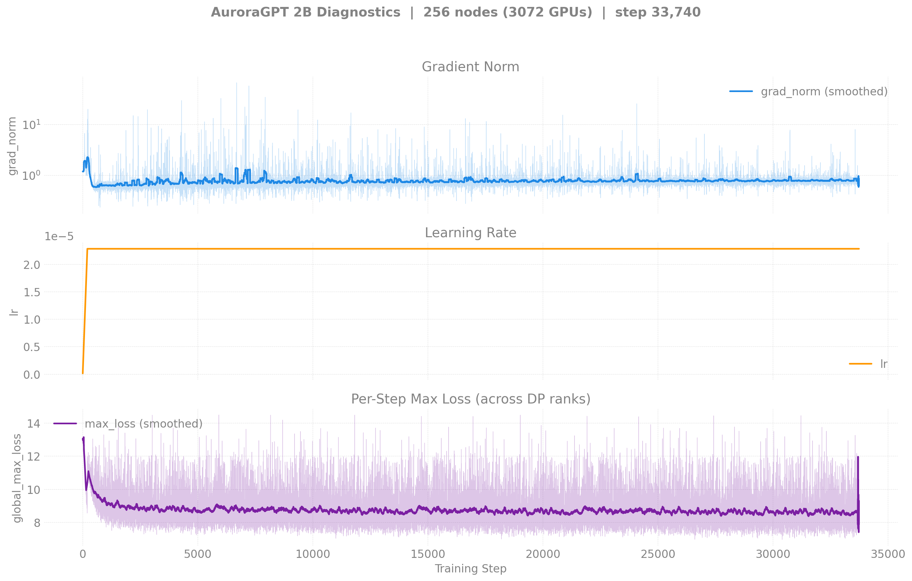

# Production Training — Dense (agpt) Models

> Last updated: 2026-04-28

| Run | Report | Nodes | Optimizer | Steps Done | Loss | Tokens | Status |
|-----|--------|-------|-----------|------------|------|--------|--------|
| 2B-256N | [details](2b/) | 256 | SophiaG | 33,740+ | 5.69 | 849.1B | **Running** |
| 2B-512N | [details](2b/) | 512 | SophiaG | 0 | — | — | Queued (no-compile) |
| 20B-256N | [details](20b/) | 256 | SophiaG | 4,159+ | 4.59 | 104.7B | **Running** |
| 20B-512N | [details](20b/) | 512 | SophiaG | 458 | 7.09 | 23.1B | Continuing |
| 80B-256N | [details](80b/) | 256 | AdamW | 0 | — | — | Retry queued |
| 80B-512N | [details](80b/) | 512 | AdamW | 0 | — | — | Queued (no-compile) |

## Diagnostics (256N)

| 2B | 20B |
|----|-----|
|  |  |
|  |  |
